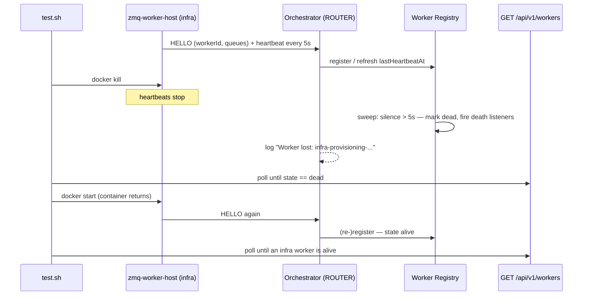

# SE-33: zmq heartbeat loss

## Setpoint Eval Metadata

**Category**: recovery · **Duration**: ~60s (silence window + worker restart) · **Timeout**: 240s · **Isolation**: destructive

Mixed mode up (`QUEUE_TRANSPORT=zmq` + the `zmq-tasks` profile) with a tight
silence window (`ZMQ_WORKER_SILENCE_MS=5000`, swept every 1000ms). An
infra-provisioning worker-host is `docker kill`ed; the worker registry must
mark it dead within the window (observed via `GET /api/v1/workers` and the
orchestrator log), and after the container restarts a HELLO must
(re-)register an infra-provisioning worker as alive. Everything (.env,
orchestrator, worker hosts) is restored in an EXIT trap.

## Scenario
```gherkin
Feature: the worker registry detects heartbeat loss and accepts re-registration
  Scenario: a killed worker goes dead within the silence window, then revives on HELLO
    Given mixed mode is up with a 5 second worker silence window
    And an infra-provisioning worker is registered and alive
    When its worker-host container is killed
    Then the registry marks the worker dead within the silence window
    And the orchestrator logs the worker loss
    When the container restarts
    Then an infra-provisioning worker is alive again after its HELLO
```

## Architecture


## Test Data
No workflow data involved — this SE never starts a job; it exercises only the
registration/liveness plane of the zmq task transport.

## Payload

### Orchestrator env flip (restored by trap)
```bash
QUEUE_TRANSPORT=zmq
ZMQ_WORKER_SILENCE_MS=5000
ZMQ_WORKER_SWEEP_INTERVAL_MS=1000
```

### Registry probes
```bash
curl -s "${ORCHESTRATOR_HOST}/api/${API_VERSION}/workers" \
  | jq '.[] | select(.workerId | startswith("infra-provisioning")) | {workerId, state}'
```

## Artifacts

### Expected output (registry row transitions)
```json
{ "workerId": "infra-provisioning-<host>-<pid>", "state": "alive" }
{ "workerId": "infra-provisioning-<host>-<pid>", "state": "dead" }
```

### Orchestrator log lines
```text
WARN Worker lost: infra-provisioning-<host>-<pid> (silent for 6002ms > 5000ms) — unrouted; in-flight tasks fall to the redelivery engine on lease expiry
LOG  Worker re-registered after death: infra-provisioning-<host>-<pid> serving [infra-apply-certificate, ...]
```

## Assertions
<!-- one checkbox per ck_* gate in test.sh, in execution order -->
- [ ] the orchestrator booted the ZeroMQ ROUTER transport
- [ ] the target worker was registered alive before the kill
- [ ] the registry marked the silent worker dead within the silence window
- [ ] the orchestrator logged the worker loss
- [ ] an infra-provisioning worker HELLO-(re-)registered after the restart
- [ ] the orchestrator logged a registration after the loss

## Run
```bash
bash setpoint-evals/run-all.sh --se 33
```

## Troubleshooting

**Worker never marked dead** — the orchestrator was not recreated with the
silence env (the SE force-recreates it after the .env flip), or the worker's
heartbeats still arrive (the kill missed the container — the SE resolves the
container by name filter at kill time).

**Worker never alive again** — the container's restart failed (image missing
or workspace dists not built on the host); check
`docker ps -a --filter name=zmq-worker-host-infra-provisioning` and its logs.

**Dead window missed (worker alive at first poll, never seen dead)** — the
container's `restart: unless-stopped` policy revived the worker faster than
the 5s silence window; that is a PASS-equivalent outcome for liveness but
this SE asserts the death transition, so it polls every 1s from the kill.

Related: `services/orchestrator/src/transport/zmq-worker-registry.service.ts`,
`services/orchestrator/src/transport/zmq-workers.controller.ts`.
