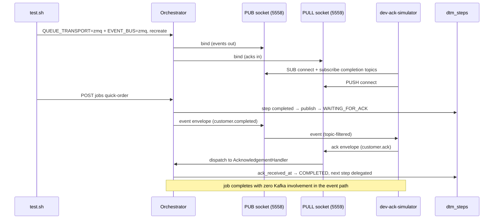

# SE-34: zmq events e2e

## Setpoint Eval Metadata

**Category**: transport · **Duration**: ~90s (fleet registration + ACK roundtrips) · **Timeout**: 300s · **Isolation**: destructive

Flips `QUEUE_TRANSPORT=zmq` + `EVENT_BUS=zmq` in `.env` (the full-zmq
profile), force-recreates the orchestrator AND the dev-ack-simulator with
`docker-compose.zmq.yml` merged in, brings the `zmq-tasks` worker hosts up,
and restores all of it (.env, orchestrator, simulator, worker hosts) in an
EXIT trap — mirrors SE-31..33. SE-31..33 cover zmq tasks + Kafka events;
this SE covers the events leg: the acknowledgement roundtrip flows through
ZmqEventBus instead of Kafka.

## Scenario
```gherkin
Feature: the zmq event bus carries the ACK roundtrip end-to-end
  Scenario: a quick-order job completes with acks over ZmqEventBus
    Given the full-zmq profile is up (zmq tasks + zmq events)
    And the dev-ack-simulator is subscribed to completion topics over zmq
    When a quick-order job is started
    Then the job completes
    And a submit step carries the publish marker
    And a submit step carries the ack marker received via ZmqEventBus
```

## Architecture


## Test Data
Reads (does not own) order-processing's seeded rows — `customer_id=1` (Ada Lovelace)
and `order_id=1`, owned by workflow suite `SE-01-happy-path`
(`workflows/order-processing/source-db/SEED-REGISTRY.md`). `entityId` is a fresh
`uuidgen` per run.

## Payload

### Orchestrator env flip (restored by trap)
```bash
QUEUE_TRANSPORT=zmq
EVENT_BUS=zmq
```

### Job payload
```json
{
  "variant": "quick-order",
  "payload": { "customerId": 1, "orderId": 1, "entityId": "<uuidgen per run>" },
  "enableDeduplication": false,
  "testOptions": {
    "ValidateCustomer": { "simDelay": 500 },
    "ValidateProduct": { "simDelay": 500 },
    "SubmitCustomer": { "simDelay": 500, "ackDelay": 500 },
    "SubmitOrder": { "simDelay": 500, "ackDelay": 500 }
  }
}
```

## Artifacts

### Expected output (orchestrator + simulator logs)
```text
ZmqEventBus bound: PUB tcp://0.0.0.0:5558 (events out), PULL tcp://0.0.0.0:5559 (acks in) — droppedPublishRecovery: orchestrator
🔌 ZmqEventBusClient connected: SUB tcp://orchestrator:5558 (15 topic(s)), PUSH tcp://orchestrator:5559
```

### DB probes
```sql
SELECT COUNT(*) FROM dtm_steps WHERE job_id='<JOB_ID>' AND kafka_published_at IS NOT NULL;  -- >= 1
SELECT COUNT(*) FROM dtm_steps WHERE job_id='<JOB_ID>' AND ack_received_at IS NOT NULL;     -- >= 1
```

## Assertions
<!-- one checkbox per ck_* gate in test.sh, in execution order -->
- [ ] the orchestrator booted the ZeroMQ event bus (PUB + PULL bound)
- [ ] the dev-ack-simulator connected over zmq (SUB + PUSH)
- [ ] the zmq worker fleet is alive under the full-zmq profile
- [ ] the quick-order job completed over zmq events (ACK roundtrip included)
- [ ] a submit step carries the publish marker (kafka_published_at)
- [ ] a submit step carries the ack marker (ack_received_at via ZmqEventBus)

## Run
```bash
bash setpoint-evals/run-all.sh --se 34
```

## Troubleshooting

**Job stalls in WAITING_FOR_ACK** — the simulator came up after the first
publish fired (PUB/SUB slow joiner); the SE sleeps 5s after recreate before
submitting. If it recurs, the EventRepublishScanTask (SE-35) is the recovery
net — check `docker logs dtm-orchestrator` for `event-republish-scan` lines.

**Simulator log shows the Kafka consumer instead of ZmqEventBusClient** —
`EVENT_BUS` did not reach the simulator (it reads `.env` via env_file; the SE
recreates it with `--force-recreate`). Verify with
`docker exec dtm-dev-ack-simulator printenv EVENT_BUS`.

Related: `services/orchestrator/src/event-bus/zmq-event-bus.service.ts`,
`tools/dev-ack-simulator/src/event-bus/zmq-event-bus.client.ts`,
`docker-compose.zmq.yml`.
