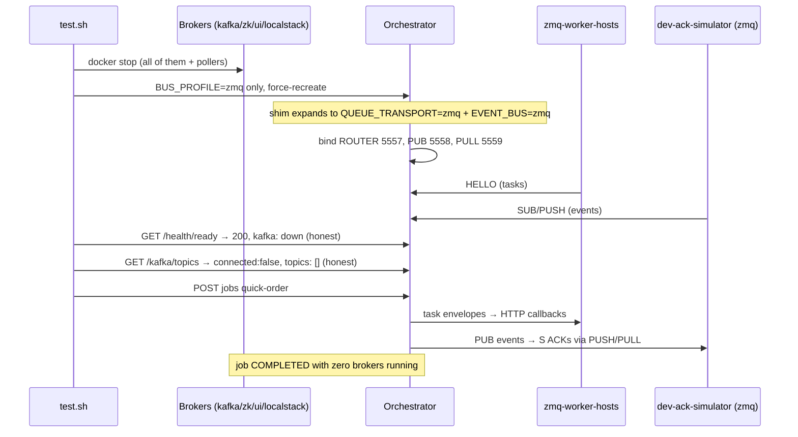

# SE-36: full-zmq bus profile

## Setpoint Eval Metadata

**Category**: transport · **Duration**: ~120s (fleet registration + broker shutdown + job) · **Timeout**: 360s · **Isolation**: destructive

> ⚠️ **zmq-profile-only eval** (gated via `se_skip_if_aws` in preflight): under
> the aws profile this SE SKIPs. Stopping `dtm-localstack` mid-suite wipes
> every deployed Lambda function (`PERSISTENCE=0`), which poisons any
> Lambda-dependent SE running later in an aws-leg wave (invoke 404s). Run it
> under `BUS_PROFILE=zmq` — the profile it exists to prove.

The Phase 4 acceptance eval: `BUS_PROFILE=zmq` (the umbrella — NO explicit
`QUEUE_TRANSPORT`/`EVENT_BUS` anywhere) with every broker container
**stopped** (`dtm-kafka`, `dtm-zookeeper`, `dtm-kafka-ui`, `dtm-localstack`)
and zero sqs-pollers. Proves the umbrella expands to both zmq transports,
health/readiness degrade honestly with Kafka down, and a quick-order job
completes end-to-end on a single docker network with zero brokers. All of it
(.env, broker containers, orchestrator, simulator, worker hosts) is restored
in an EXIT trap — SE-29..35's env-flip + restore discipline.

## Scenario
```gherkin
Feature: the full-zmq bus profile runs with zero brokers
  Scenario: umbrella expansion + honest health + job e2e on one docker network
    Given BUS_PROFILE=zmq and no explicit QUEUE_TRANSPORT/EVENT_BUS env
    And kafka, zookeeper, kafka-ui, localstack and every sqs-poller are stopped
    When the orchestrator and simulator are recreated from the zmq compose files
    Then the orchestrator binds BOTH the zmq task ROUTER and the zmq event bus
    And readiness stays 200 while reporting Kafka honestly as down
    And the kafka topics endpoint reports connected:false with zero topics
    And a quick-order job completes
```

## Architecture


## Test Data
Reads (does not own) order-processing's seeded rows — `customer_id=1` (Ada Lovelace)
and `order_id=1`, owned by workflow suite `SE-01-happy-path`
(`workflows/order-processing/source-db/SEED-REGISTRY.md`). `entityId` is a fresh
`uuidgen` per run.

## Payload

### Orchestrator env flip (restored by trap) — the umbrella ONLY
```bash
BUS_PROFILE=zmq
```

### Job payload
```json
{
  "variant": "quick-order",
  "payload": { "customerId": 1, "orderId": 1, "entityId": "<uuidgen per run>" },
  "enableDeduplication": false,
  "testOptions": {
    "ValidateCustomer": { "simDelay": 500 },
    "ValidateProduct": { "simDelay": 500 },
    "SubmitCustomer": { "simDelay": 500, "ackDelay": 500 },
    "SubmitOrder": { "simDelay": 500, "ackDelay": 500 }
  }
}
```

## Artifacts

### Expected output (health endpoints with Kafka down)
```json
// GET /api/v1/health/ready → HTTP 200
{ "status": "ok", "info": { "database": { "status": "up" }, "kafka": { "status": "down", "message": "..." } } }
// GET /api/v1/kafka/topics → HTTP 200
{ "topics": [], "connected": false }
```

### Expected orchestrator boot lines (umbrella proof)
```text
ZmqTransport ROUTER bound at tcp://0.0.0.0:5557 (redelivery: orchestrator, attemptCounter: synthetic, dlq: table)
ZmqEventBus bound: PUB tcp://0.0.0.0:5558 (events out), PULL tcp://0.0.0.0:5559 (acks in) — droppedPublishRecovery: orchestrator
```

## Assertions
<!-- one checkbox per ck_* gate in test.sh, in execution order -->
- [ ] zero broker containers running (kafka, zookeeper, kafka-ui, localstack)
- [ ] zero sqs-poller containers running
- [ ] the umbrella expanded with NO explicit per-var env (ROUTER bound)
- [ ] the umbrella expanded with NO explicit per-var env (event bus bound)
- [ ] the zmq worker fleet is alive on a broker-less network
- [ ] readiness stays 200 with Kafka down (graceful degradation)
- [ ] readiness reports Kafka honestly as down (no fabricated 'up')
- [ ] kafka topics endpoint degrades honestly (connected: false)
- [ ] kafka topics endpoint fabricates no topics
- [ ] the quick-order job completed on a single docker network with zero brokers

## Run
```bash
bash setpoint-evals/run-all.sh --se 36
```

## Troubleshooting

**Orchestrator unhealthy after the flip with brokers down** — the Kafka
producer/service still constructed under KafkaModule (topics controller)
degrades gracefully by design; if boot actually fails, check
`docker logs dtm-orchestrator` for the first ERROR line.

**Readiness slow to answer** — the Kafka admin probe retries before
reporting down (bounded, a few seconds); the SE allows 15s per probe.

**Job stalls in WAITING_FOR_ACK with the simulator up** — simulator SUB
slow-joiner: the SE settles 5s after fleet registration; the
event-republish scan (SE-35) is the recovery net.

Related: `services/orchestrator/src/config/bus-profile.ts`,
`services/orchestrator/src/health/health.controller.ts` (graceful Kafka
degradation), `docker-compose.zmq.yml`.
