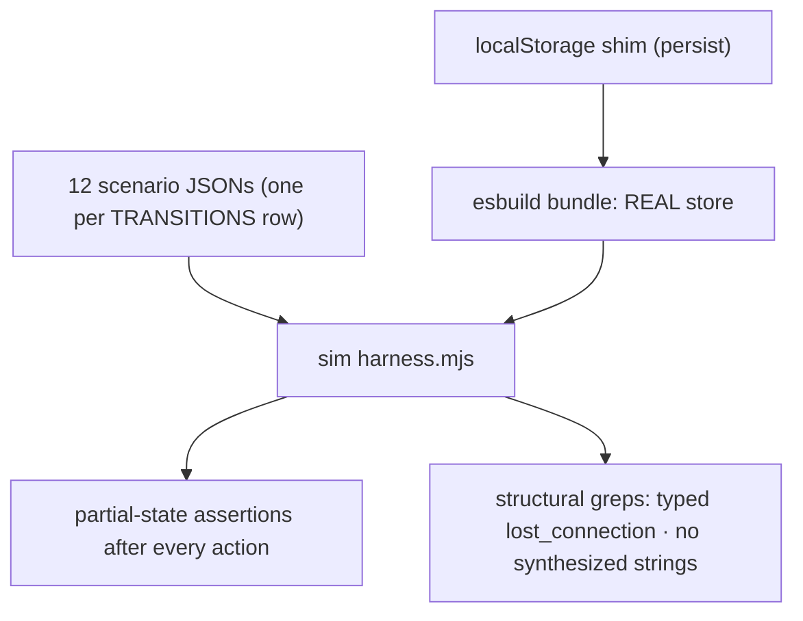

# SE-37 — agent-forest store sim: real-store FSM replay + reconcile-no-synth

**Timeout**: 120s
**Expected outcome:** GREEN — the REAL `agent-forest.store.ts` (esbuild-bundled, never a
copy) replays one scenario per TRANSITIONS row: lifecycle FSM moves apply only through the
exported matrix (done is terminal), the pending-parent bucket absorbs transient orphans, a
reconcile-lost node surfaces `error_reason: 'lost_connection'` (typed), and no synthesized
condition string exists anywhere in the store.

## Scenario

```gherkin
Feature: the agent-forest store is an FSM with server-authoritative reconcile

  Scenario: every transition replays against the real store
    Given the esbuild-bundled production store
    When each of the 12 scenario JSONs replays
    Then the store endpoint matches the expected partial state after every step

  Scenario: pending-parent absorption (SPEC invariant 1)
    Given a child whose spawn arrives before its parent's only event
    When the parent later arrives
    Then the child's pendingParent flips false — never an orphan render

  Scenario: reconcile-lost (SE-RECONCILE-NO-SYNTH)
    Given a locally-known node the server no longer reports
    When reconcileForest runs
    Then the node is error with error_reason 'lost_connection' — never "crashed"
```

## Architecture



## Artifacts

- `sim/harness.mjs` (copied from ops-panel-next frontend-skeleton — the canonical shape)
- `sim/localstorage-shim.mjs`, `sim/scenarios/01..12-*.json`

## Assertions

- [ ] all 12 scenarios green against the real store
- [ ] pending-parent absorbed and cleared on parent arrival (scenario 01)
- [ ] done terminal — later AGENT_ACTIVE rejected by the guard (scenario 04)
- [ ] reconcile-lost = typed `lost_connection` (scenarios 10–12)
- [ ] terminal nodes survive reconcile untouched (scenario 10)
- [ ] authoritative snapshot supersedes local state (scenario 11)
- [ ] structural: `error_reason: 'lost_connection'` present; no other literal reason; no synthesized claim strings
