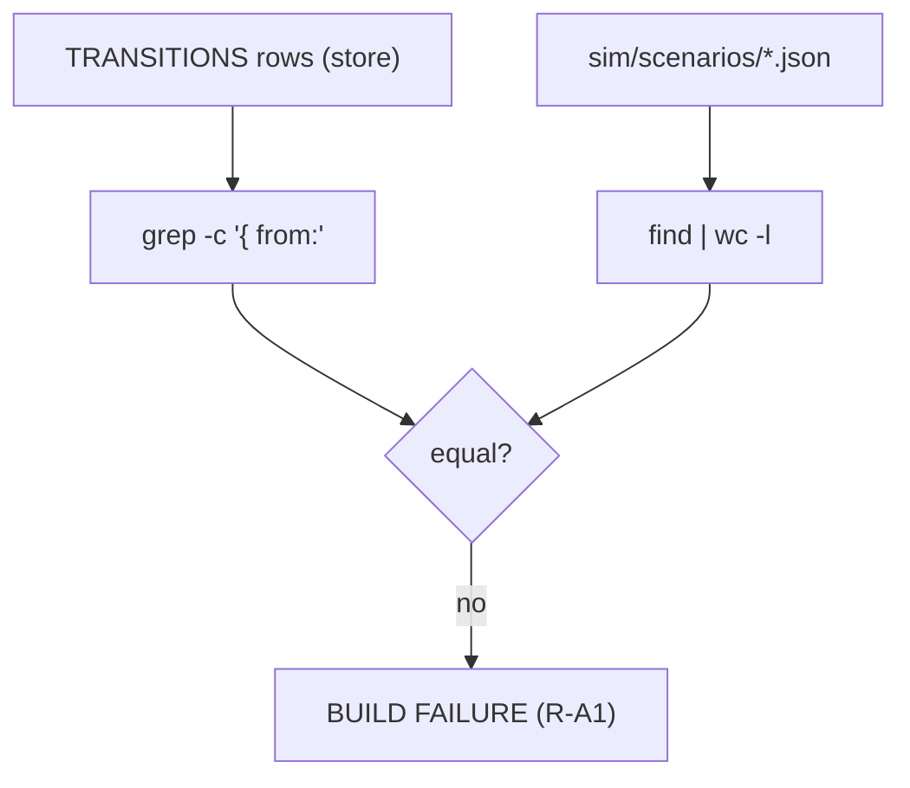

# SE-38 — agent-forest transitions-count: the R-A1 count-drift gate

**Timeout**: 30s
**Expected outcome:** GREEN — `TRANSITIONS` rows in `agent-forest.store.ts` == scenario JSON
count in SE-37's `sim/scenarios/`. Drift in either direction fails the build.

## Scenario

```gherkin
Feature: the transition matrix is data, locked to the sim

  Scenario: matrix and scenarios stay in lockstep
    Given the exported TRANSITIONS constant
    When rows are grep-counted against scenario files
    Then the counts are equal (12 == 12)
```

## Architecture



## Artifacts

Matrix: `apps/monitor/src/state/agent-forest.store.ts` · scenarios: `setpoint-evals/SE-37-agent-forest-store-sim/sim/scenarios/`

## Assertions

- [ ] TRANSITIONS row count == scenario file count, both ≥ 1
