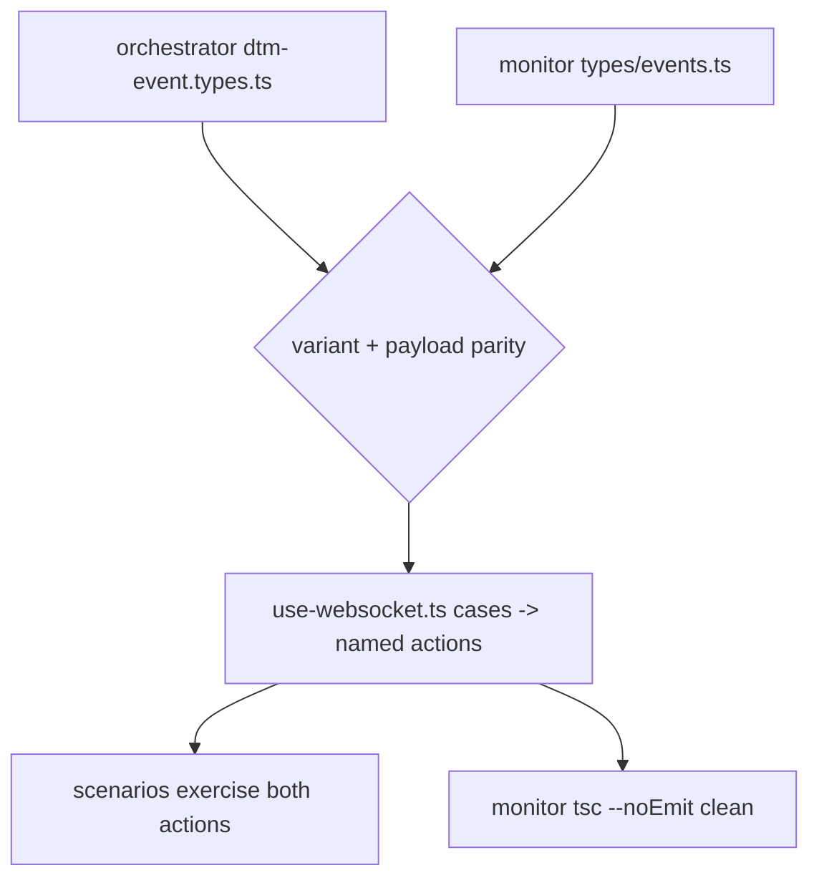

# SE-39 — agent-forest wire-drift: the R-A5 meta-SE for the agent-tree plane

**Timeout**: 120s
**Expected outcome:** GREEN — `agent_event`/`agent_forest` variants exist with matching
payload fields on both wire sides (orchestrator `dtm-event.types.ts`, monitor
`types/events.ts`), the monitor's WS handler routes both to named store actions (no
CustomEvent — R-A2), sim scenarios exercise both routed actions, and the monitor typechecks
against the shared `@dtm/core` mirror.

## Scenario

```gherkin
Feature: a wire change cannot forget a leg

  Scenario: variant parity across the relay
    Given the two new DtmEvent variants
    Then both sides declare them with identical payload fields

  Scenario: routing parity
    Then use-websocket.ts has a case per variant, routed to ingestEvent/reconcileForest
    And no CustomEvent carries state

  Scenario: compile parity
    Then apps/monitor tsc --noEmit is clean against the shared mirror
```

## Architecture



## Artifacts

Wire: `services/orchestrator/src/websocket/dtm-event.types.ts` · `apps/monitor/src/types/events.ts` · handler: `apps/monitor/src/hooks/use-websocket.ts`

## Assertions

- [ ] both variants on both sides, payload fields identical
- [ ] WS handler routes both to named store actions; zero CustomEvent
- [ ] scenarios exercise ingestEvent and reconcileForest
- [ ] monitor typechecks
