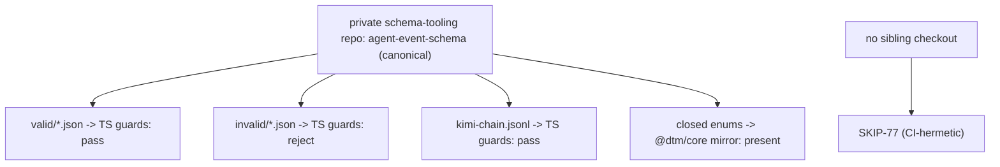

# SE-40 — agent-forest schema-conformance (both ways) vs the canonical server-config schema

**Timeout**: 120s
**Isolation**: parallel-safe
**Expected outcome:** GREEN when a sibling private schema-tooling checkout exists — every
canonical `fixtures/valid/*.json` passes the orchestrator's REAL `validateAgentEvent` guards,
every `fixtures/invalid/*.json` is rejected, a recorded real-world event stream
(`kimi-chain.jsonl`) passes, and every schema closed-enum value (lifecycle, error_reason) is
mirrored in `@dtm/core`. **SKIP-77 hermetic in CI** (no sibling checkout) — never fake-green.

> **Disclaimer:** this SE validates conformance against a canonical schema maintained in a
> private tooling repo; without that sibling checkout it SKIPs by design in this public repo.

## Scenario

```gherkin
Feature: the TS mirror and the runtime guards conform to the canonical schema, both ways

  Scenario: canonical fixtures vs TS guards
    Given the canonical fixture corpus from the private schema-tooling repo
    Then all valid fixtures pass and all invalid fixtures reject

  Scenario: schema enums vs @dtm/core mirror
    Given the schema's closed enums
    Then every value appears in the mirror interface
```

## Architecture



## Artifacts

Canonical (private tooling repo, sibling checkout): `../server-config/setpoint-evals/agent-event-schema/` · guards: `services/orchestrator/src/agent-events/agent-event.guards.ts` · mirror: `packages/core/src/interfaces/agent-event.interface.ts`

## Assertions

- [ ] valid fixtures all pass the real guards
- [ ] invalid fixtures all rejected
- [ ] kimi-chain stream passes (recorded real-world event stream, validated cross-repo)
- [ ] lifecycle + error_reason enums mirrored in @dtm/core
- [ ] ULID pattern enforced
- [ ] SKIP-77 when the canonical checkout is absent
