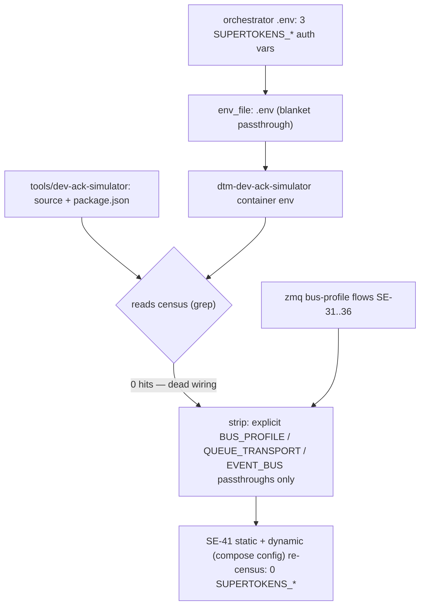

# SE-41 — dev-ack-simulator dead-env census: SUPERTOKENS_* presence without reads

**Category**: infra-hygiene · **Duration**: ~5s · **Timeout**: 120s
**Expected outcome:** GREEN — a reads-census over `tools/dev-ack-simulator` finds zero
`SUPERTOKENS_*` consumers (source + entrypoint + Dockerfile + dependency manifest), and the
`dev-ack-simulator` service block in `docker-compose.yml` carries no `SUPERTOKENS_*` var and no
blanket `env_file: .env` passthrough — the orchestrator's auth env (`SUPERTOKENS_CONNECTION_URI`,
`SUPERTOKENS_API_DOMAIN`, `SUPERTOKENS_WEBSITE_DOMAIN`) no longer leaks into a container that
reads none of it. The legitimate `.env` consumers (the bus-profile trio `BUS_PROFILE` /
`QUEUE_TRANSPORT` / `EVENT_BUS`) arrive via explicit per-var passthroughs, so the zmq
bus-profile flows (SE-31..SE-36) keep working.

## Scenario

```gherkin
Feature: a presence-census must not be mistaken for a reads-census

  Scenario: the ack simulator reads no orchestrator auth env
    Given the dtm-dev-ack-simulator container's env carried 3 SUPERTOKENS_* vars
    When a reads-census greps the simulator's source and dependency manifest
    Then 0 references exist — the wiring was dead

  Scenario: the wiring carries no SUPERTOKENS_* var after the strip
    Given the dev-ack-simulator service block in docker-compose.yml
    Then no SUPERTOKENS_* var appears in it
    And no blanket env_file passthrough leaks the orchestrator's .env
    But the bus-profile trio still arrives via explicit per-var passthroughs

  Scenario: the resolved container env agrees (local-only dynamic leg)
    Given a local .env and docker compose
    When the original census method re-runs (docker compose config)
    Then the resolved dev-ack-simulator env contains 0 SUPERTOKENS_* keys
```

## Architecture



## Artifacts

Wiring: `docker-compose.yml` service `dev-ack-simulator` · zmq merge: `docker-compose.zmq.yml`
(service `dev-ack-simulator` block) · read-set: `tools/dev-ack-simulator/src/bus-profile.ts`
(`BUS_PROFILE` expansion, `""` treated as aws), `src/event-bus/event-bus.module.ts`
(`EVENT_BUS || "kafka"`), `src/kafka/kafka.consumer.ts` · manifest:
`tools/dev-ack-simulator/package.json` (no supertokens dependency)

### Input / payload

```yaml
# the strip, in docker-compose.yml — explicit per-var passthrough replaces the blanket env_file:
- BUS_PROFILE=${BUS_PROFILE:-aws}
- QUEUE_TRANSPORT=${QUEUE_TRANSPORT:-}
- EVENT_BUS=${EVENT_BUS:-}
```

### Expected output

```text
✓ (a) reads census: ack-simulator dir has 0 supertokens references (source+manifest)
✓ (b) service block has no blanket env_file passthrough (.env = the orchestrator's)
✓ dynamic: resolved container env carries 0 SUPERTOKENS_* vars (docker compose config census)
── assertions: 9 pass, 0 fail
```

## Assertions

- [ ] (a) reads census over the ack-simulator dir is 0 (case-insensitive, node_modules excluded)
- [ ] (a) package.json declares no supertokens dependency
- [ ] (b) service-block sanity: dev-ack-simulator block found in docker-compose.yml
- [ ] (b) service block names no SUPERTOKENS_* var
- [ ] (b) service block has no blanket `env_file` passthrough
- [ ] (b) BUS_PROFILE arrives via explicit per-var passthrough
- [ ] (b) QUEUE_TRANSPORT arrives via explicit per-var passthrough
- [ ] (b) EVENT_BUS arrives via explicit per-var passthrough
- [ ] dynamic leg: resolved container env (docker compose config) carries 0 SUPERTOKENS_* vars, or is honestly warn-skipped when no local .env/docker

## Run

```bash
bash setpoint-evals/SE-41-ack-sim-dead-env-census/test.sh
```

A blanket `env_file: .env` on a service that reads a handful of vars leaks every other var in
that `.env` — here the orchestrator's Supertokens auth config — into a container whose source
never references them. Presence in `docker inspect` is not use; only this SE's reads-census is.
