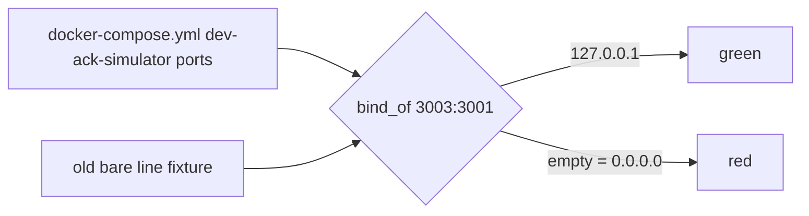

# SE-42 — dev-ack-simulator loopback-only bind

**Category**: infra-hygiene · **Duration**: ~1s · **Timeout**: 30s · **Isolation**: parallel-safe
**Expected outcome:** GREEN — `docker-compose.yml` publishes the dev-ack-simulator as `127.0.0.1:3003:3001`, matching `registry/services.yaml` (`expose: localhost`).

## Scenario

```gherkin
Feature: a localhost-declared port is not published on all interfaces
  Scenario: the ack simulator publishes loopback only
    Given registry/services.yaml declares :3003 expose: localhost
    When docker-compose.yml's dev-ack-simulator publish is read
    Then it is "127.0.0.1:3003:3001"
    And no compose file publishes a bare "3003:*"
  Scenario: must-fail control
    Given the old line "3003:3001" (0.0.0.0)
    Then the same predicate rejects it
```

## Architecture



## Artifacts

`docker-compose.yml` (service `dev-ack-simulator`) · `scripts/se-lib.sh`

## Assertions

- [ ] dev-ack-simulator block found and publishes 3003:3001 exactly once
- [ ] the publish is bound to 127.0.0.1
- [ ] no compose file publishes a bare 3003:*
- [ ] control: the old bare line is rejected by the predicate

## Run

```bash
bash setpoint-evals/SE-42-ack-sim-loopback-bind/test.sh
```
