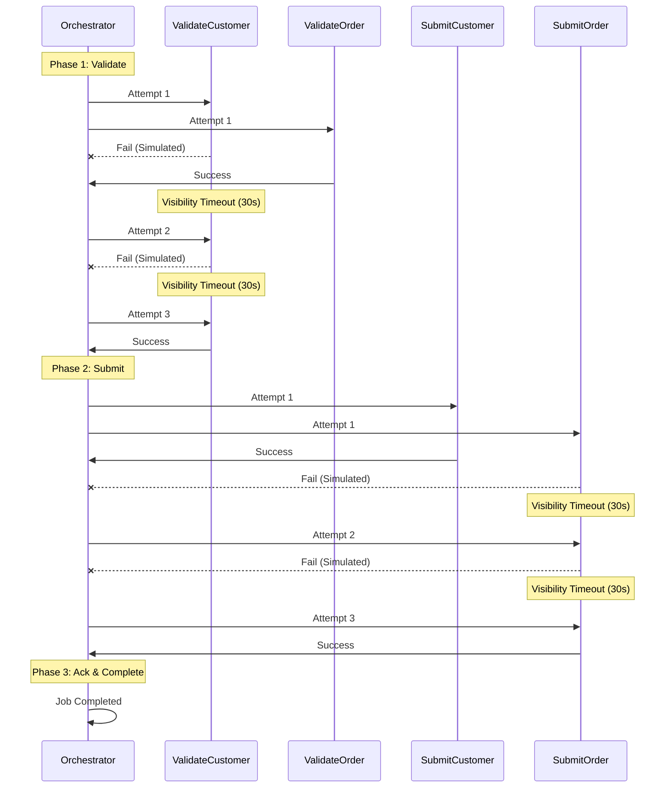

# E2E Eval 02: Transient Failure Recovery

## 📋 Overview

**Category**: Retry & Resilience  
**Priority**: High  
**Duration**: ~90 seconds  
**Complexity**: Medium

Tests the system's ability to recover from transient failures by retrying failed steps. This is a critical production scenario where temporary issues (network glitches, service unavailability, rate limits) should not cause permanent failures.

---

## 🎯 Test Objectives

### 🌊 Flow Diagram



### Primary Goals

1. Verify SQS retry mechanism works correctly
2. Validate `failOnAttempts` configuration honors specific attempt numbers
3. Ensure `retry_count` is tracked accurately
4. Confirm `IN_PROGRESS_RETRYING` status is used during retries
5. Validate successful completion after transient failures

### What This Tests

- ✅ SQS visibility timeout and retry behavior
- ✅ Lambda worker failure simulation with attempt awareness
- ✅ Orchestrator's retry handling (doesn't abort prematurely)
- ✅ Database `retry_count` and `execution_history` tracking
- ✅ Error messages include attempt numbers
- ✅ Final success after multiple failures

---

## 📊 Test Scenario

### Configuration

```json
{
  "customerId": 1,
  "testOptions": {
    "ValidateCustomer": { "simDelay": 2000, "failOnAttempts": [1, 2] },
    "ValidateOrder": { "simDelay": 2000 },
    "SubmitCustomer": { "simDelay": 2000, "ackDelay": 2000 },
    "SubmitOrder": { "simDelay": 2000, "failOnAttempts": [1, 2], "ackDelay": 2000 }
  }
}
```

### Expected Flow

```
┌─────────────────────────────────────────────────────────────┐
│ Phase 1: Validate Steps (Parallel)                         │
└─────────────────────────────────────────────────────────────┘

t=0s     ValidateCustomer (Att 1) + ValidateOrder (Att 1) start
t=2s     ValidateCustomer FAILS (Attempt 1) -> status: IN_PROGRESS_RETRYING
         ValidateOrder succeeds

t=~32s   ValidateCustomer (Att 2) starts (30s visibility timeout)
t=~34s   ValidateCustomer FAILS (Attempt 2) -> status: IN_PROGRESS_RETRYING

t=~64s   ValidateCustomer (Att 3) starts (30s visibility timeout)
t=~66s   ValidateCustomer succeeds -> status: COMPLETED
         retry_count = 2 (failed 2 times, succeeded on 3rd)

┌─────────────────────────────────────────────────────────────┐
│ Phase 2: Submit Steps (Parallel)                           │
└─────────────────────────────────────────────────────────────┘

t=~66s   SubmitCustomer (Att 1) + SubmitOrder (Att 1) start
t=~68s   SubmitCustomer succeeds
         SubmitOrder FAILS (Attempt 1) -> status: IN_PROGRESS_RETRYING

t=~68s   SubmitCustomer publishes to Kafka -> status: WAITING_FOR_ACK
t=~70s   SubmitCustomer ack received -> status: COMPLETED

t=~98s   SubmitOrder (Att 2) starts (30s visibility timeout)
t=~100s  SubmitOrder FAILS (Attempt 2) -> status: IN_PROGRESS_RETRYING

t=~130s  SubmitOrder (Att 3) starts (30s visibility timeout)
t=~132s  SubmitOrder succeeds
         retry_count = 2 (failed 2 times, succeeded on 3rd)

t=~132s  SubmitOrder publishes to Kafka -> status: WAITING_FOR_ACK
t=~134s  SubmitOrder ack received -> status: COMPLETED

┌─────────────────────────────────────────────────────────────┐
│ Final Status: COMPLETED (all steps recovered)              │
└─────────────────────────────────────────────────────────────┘

Total Duration: ~134 seconds
```

---

## ✅ Success Criteria

### 1. Step Status Progression

```sql
-- ValidateCustomer
DELEGATED -> IN_PROGRESS_RETRYING -> IN_PROGRESS_RETRYING -> COMPLETED

-- ValidateOrder
DELEGATED -> COMPLETED

-- SubmitCustomer
DELEGATED -> WAITING_FOR_ACK -> COMPLETED

-- SubmitOrder
DELEGATED -> IN_PROGRESS_RETRYING -> IN_PROGRESS_RETRYING -> WAITING_FOR_ACK -> COMPLETED
```

### 2. Retry Counts

- ValidateCustomer: `retry_count = 2` (failed on attempts 1 & 2, succeeded on 3)
- ValidateOrder: `retry_count = 0` (succeeded on attempt 1)
- SubmitCustomer: `retry_count = 0` (succeeded on attempt 1)
- SubmitOrder: `retry_count = 2` (failed on attempts 1 & 2, succeeded on 3)

### 3. Execution History

Each failed step should have 3 entries in `execution_history`:

```json
[
  {
    "attempt": 1,
    "status": "FAILED",
    "error": "Simulated failure on attempt 1 for ValidateCustomer"
  },
  {
    "attempt": 2,
    "status": "FAILED",
    "error": "Simulated failure on attempt 2 for ValidateCustomer"
  },
  {
    "attempt": 3,
    "status": "COMPLETED",
    "error": null
  }
]
```

### 4. Final Error Field

- ValidateCustomer: `error = NULL` (cleared after success)
- SubmitOrder: `error = NULL` (cleared after success)

### 5. Job Status

- Final status: `COMPLETED`
- All 4 steps: `status = 'completed'`

---

## 🔍 Verification Queries

### Check Retry Counts

```sql
SELECT
  step_value,
  status,
  retry_count,
  error
FROM dtm_steps
WHERE job_id = '{JOB_ID}'
ORDER BY order_index;
```

**Expected:**

```
 step_value          | status    | retry_count | error
---------------------+-----------+-------------+-------
 ValidateCustomer    | completed | 2           | NULL
 ValidateOrder       | completed | 0           | NULL
 SubmitCustomer      | completed | 0           | NULL
 SubmitOrder         | completed | 2           | NULL
```

### Check Execution History

```sql
SELECT
  step_value,
  jsonb_array_length(execution_history) as attempts,
  execution_history
FROM dtm_steps
WHERE job_id = '{JOB_ID}'
  AND retry_count > 0
ORDER BY order_index;
```

### Verify Error Clearing

```sql
-- Ensure error field is NULL after successful retry
SELECT step_value, error IS NULL as error_cleared
FROM dtm_steps
WHERE job_id = '{JOB_ID}'
  AND retry_count > 0;

-- Expected: error_cleared = true for both
```

---

## 🎬 Lambda Worker Logs

### ValidateCustomer (Attempt 1 - FAIL)

```
[ValidateCustomer] Attempt 1: Simulating failure (configured to fail on attempt 1)
[ValidateCustomer] Sending failure callback: Simulated failure on attempt 1 for ValidateCustomer
```

### ValidateCustomer (Attempt 2 - FAIL)

```
[ValidateCustomer] Attempt 2: Simulating failure (configured to fail on attempt 2)
[ValidateCustomer] Sending failure callback: Simulated failure on attempt 2 for ValidateCustomer
```

### ValidateCustomer (Attempt 3 - SUCCESS)

```
[ValidateCustomer] Attempt 3: Skipping simulated failure
[ValidateCustomer] Customer data validated
[ValidateCustomer] Callback sent successfully
```

---

## 🐛 Common Issues & Troubleshooting

### Issue: Jobs stuck at `in_progress_retrying`

**Cause**: SQS visibility timeout (30s) means retries happen slowly
**Solution**: Wait the full ~134 seconds for all retries to complete

### Issue: `retry_count = 0` for steps that should have retried

**Cause**: `ENABLE_REQUESTS_FOR_SIMULATED_DELAYS` not set in Lambda environment
**Solution**: Redeploy workers: `./scripts/local-env.sh deploy-workers`

### Issue: Job marked as `FAILED` prematurely

**Cause**: Bug in orchestrator (should wait for retries)  
**Solution**: This should be fixed in v2.1.2 (CallbackService retry handling)

### Issue: Error field not cleared after success

**Cause**: Bug in orchestrator (should clear error on success)  
**Solution**: This should be fixed in v2.1.3 (error clearing feature)

---

## 📚 Related Documentation

- [`CRITICAL-BUG-FIX-RETRY-HANDLING.md`](../../CRITICAL-BUG-FIX-RETRY-HANDLING.md) - Retry handling bug fix
- [`docs/FEATURES.md`](../../docs/FEATURES.md#retry-aware-failure-simulation) - Retry-aware simulation
- [`SQS-POLLER-FIXES.md`](../../SQS-POLLER-FIXES.md) - SQS retry mechanism
- [`RETRY-TESTING-EXAMPLES.md`](../../RETRY-TESTING-EXAMPLES.md) - More retry scenarios

---

## 🔗 Monitoring During Test

### Monitor jobs Progress

```bash
./scripts/local-env.sh monitor api
```

### Monitor SQS Queues

```bash
./scripts/local-env.sh monitor sqs
```

### Check Lambda Logs (ValidateCustomer)

```bash
./scripts/local-env.sh logs validate-customer-worker
```

### Check Lambda Logs (SubmitOrder)

```bash
./scripts/local-env.sh logs submit-order-worker
```

---

## 🏁 Running This Eval

```bash
cd ste/01-retry-transient-failure
./test.sh
```

**Expected Output:**

```
✅ Job initiated
⏳ Monitoring progress (max 150 seconds)...
✅ Job completed successfully
Retry counts verified (ValidateCustomer: 2, SubmitOrder: 2)
✅ Error fields cleared
✅ Execution history validated
🎉 Eval 02: Transient Failure Recovery PASSED
```
