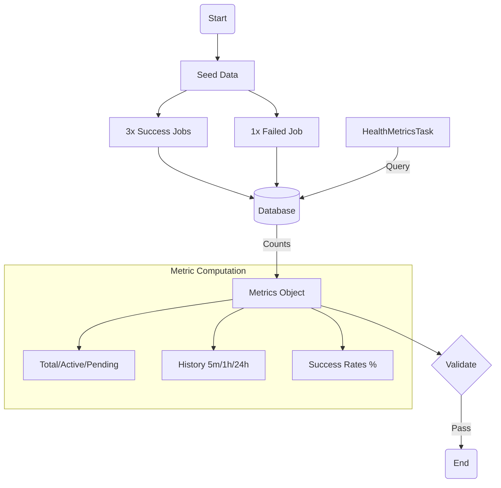

# Eval 14: Health Metrics

## 🎯 Purpose

### 🌊 Flow Diagram



Tests the **HealthMetricsTask** maintenance task, which generates operational health metrics for monitoring dashboards and alerting systems.

## 📋 Scenario

1. **Clean Environment**: Purge existing data for clean test
2. **Create Successes**: Run 3 successful jobs
3. **Create Failure**: Run 1 failed job
4. **Collect Metrics**: Trigger health-metrics task
5. **Validate Data**: Verify metrics are accurate and complete
6. **Check API**: Validate maintenance health endpoint

## 🔍 What This Tests

### Primary Focus

- **HealthMetricsTask** execution and metric collection
- Accuracy of collected metrics (job counts, throughput, etc.)
- Completeness of metric data (all expected fields present)
- API endpoint availability

### Metrics Validated

- `totalJobs` - Total number of jobs in system
- `activeJobs` - Jobs currently processing
- `pendingJobs` - Jobs waiting to start
- `jobsCompletedLast5min` - Recently completed jobs
- `jobsFailedLast5min` - Recently failed jobs

## 📊 Test Data

Uses multiple memberships to create diverse job states:

- **Completed**: `1410001014`, `1410001015`, `1410001016` (Consumers: 1014-1016)
- **Failed**: `1410001017` (Consumer: 1017)
- **Source**: `02-data-example.sql`

## ⏱️ Expected Duration

- **Normal**: ~30 seconds
  - Environment cleanup: ~3s
  - 3 successful jobs: ~15s (3 × 5s)
  - 1 failed job: ~10s (with retries)
  - Metrics collection: ~1s
  - Validation: ~1s

## ✅ Success Criteria

1. ✅ 3 completed jobs created
2. ✅ 1 failed job created
3. ✅ Maintenance task executes successfully
4. ✅ Total jobs ≥ 4
5. ✅ All expected metric fields present
6. ✅ Maintenance health endpoint accessible

## 🔧 Configuration

### Environment Variables

```bash
# No special configuration needed
# Task runs every 5 minutes by default
```

## 🚀 Running

```bash
# Standalone
./ste/08-health-metrics/test.sh

# Via runner
./ste/run-all.sh
```

## 🏗️ Architecture

```
┌─────────────────────────────────────────────────────────────┐
│ STEP 1: Create Test Data                                    │
├─────────────────────────────────────────────────────────────┤
│                                                              │
│  3 Successful Jobs:                                    │
│    Job 1: 1410001014 → completed ✅                   │
│    Job 2: 1410001015 → completed ✅                   │
│    Job 3: 1410001016 → completed ✅                   │
│                                                              │
│  1 Failed Job:                                         │
│    Job 4: 1410001017 → failed ❌                      │
│                  (SubmitOrder: permanent failure)    │
│                                                              │
└─────────────────────────────────────────────────────────────┘

┌─────────────────────────────────────────────────────────────┐
│ STEP 2: Collect Metrics                                     │
├─────────────────────────────────────────────────────────────┤
│                                                              │
│  [HealthMetricsTask]                                         │
│       │                                                      │
│       ├─> Query: Count jobs by status                       │
│       │    • PROCESSING → activeJobs                        │
│       │    • PENDING → pendingJobs                          │
│       │    • COMPLETED → totalCompleted                     │
│       │    • FAILED → totalFailed                           │
│       │                                                      │
│       ├─> Query: Recent activity (last 5 minutes)           │
│       │    • Jobs completed in last 5min                    │
│       │    • Jobs failed in last 5min                       │
│       │                                                      │
│       ├─> Query: Recent activity (last hour)                │
│       │    • Jobs completed in last hour                    │
│       │    • Jobs failed in last hour                       │
│       │                                                      │
│       ├─> Query: Recent activity (last 24 hours)            │
│       │    • Jobs completed in last 24h                     │
│       │    • Jobs failed in last 24h                        │
│       │                                                      │
│       ├─> Calculate: Success rates                          │
│       │    • Hourly success rate                            │
│       │    • Daily success rate                             │
│       │                                                      │
│       └─> Return: Comprehensive metrics object              │
│                                                              │
└─────────────────────────────────────────────────────────────┘

┌─────────────────────────────────────────────────────────────┐
│ STEP 3: Validate Metrics                                    │
├─────────────────────────────────────────────────────────────┤
│                                                              │
│  Expected Results:                                           │
│    ✅ totalJobs ≥ 4                                         │
│    ✅ jobsCompletedLast5min ≥ 1 (lenient)                   │
│    ✅ All expected fields present:                          │
│       • activeJobs                                           │
│       • pendingJobs                                          │
│       • totalJobs                                            │
│       • jobsCompletedLast5min                               │
│       • jobsFailedLast5min                                  │
│       • (and many more...)                                   │
│                                                              │
└─────────────────────────────────────────────────────────────┘
```

## 📝 Notes

### Metric Categories

The HealthMetricsTask collects metrics in several categories:

1. **Current State**
   - `activeJobs`: Currently processing
   - `pendingJobs`: Waiting to start
   - Total counts by status

2. **Recent Activity** (5min, 1hr, 24hr)
   - Completed jobs
   - Failed jobs
   - Throughput indicators

3. **Success Rates**
   - Hourly success rate (%)
   - Daily success rate (%)
   - Helps identify trends

4. **Step Health**
   - Steps in retrying state
   - Steps waiting for ack
   - Potential bottlenecks

### Use Cases

These metrics support:

1. **Monitoring Dashboards**
   - Grafana: Real-time job status
   - Datadog: APM and metrics
   - CloudWatch: AWS-native monitoring

2. **Alerting**
   - Spike in failures
   - Drop in throughput
   - Stuck job detection

3. **SLO/SLA Tracking**
   - Success rate targets
   - Processing time SLOs
   - Capacity planning

4. **Operational Insights**
   - Peak usage times
   - Failure patterns
   - System health trends

### Lenient Validation

The test uses lenient validation for time-based metrics:

- ⚠️ `jobsCompletedLast5min ≥ 1` is a soft requirement
- ✅ Main validation: Task executes + expected fields present
- ⚠️ Timing variations acceptable (e.g., jobs took 6 minutes instead of 5)

**Why?**

- Docker container overhead varies
- LocalStack performance fluctuates
- E2E environment not production-like

**Focus**: Validate mechanism works, not exact values.

## 🐛 Troubleshooting

### Test Fails: "Expected at least 4 total jobs"

- **Cause**: Jobs failed to start or weren't persisted
- **Solutions**:
  1. Check orchestrator logs: `docker logs dtm-orchestrator`
  2. Check database: `docker exec dtm-db psql -U dtm_user -d dtm -c "SELECT COUNT(*) FROM dtm_jobs;"`
  3. Ensure workers are deployed: `./scripts/local-env.sh deploy-workers`

### Warning: "Expected at least 1 completed job in last 5 minutes, got: 0"

- **Not a failure**: This is a lenient check
- **Reason**: Jobs took longer than 5 minutes to complete
- **Impact**: None (test still passes)

### Test Fails: "Missing expected metric fields"

- **Cause**: HealthMetricsTask implementation changed
- **Solutions**:
  1. Check task source: `services/orchestrator/src/maintenance/tasks/health-metrics.task.ts`
  2. Update `EXPECTED_FIELDS` array in test script
  3. Verify task executed: Check logs

### Jobs Don't Complete

- **Cause**: Workers not deployed or dev-ack-simulator down
- **Solutions**:
  1. Deploy workers: `./scripts/local-env.sh deploy-workers --poller`
  2. Check dev-ack-simulator: `docker ps | grep dev-ack`
  3. Restart if needed: `docker restart dtm-dev-ack-simulator`

## 🔗 Related

- **Maintenance Task**: `services/orchestrator/src/maintenance/tasks/health-metrics.task.ts`
- **API Endpoint**: `POST /maintenance/tasks/health-metrics/execute`
- **Cron Schedule**: Every 5 minutes
- **Health Endpoint**: `GET /maintenance/health`
- **Task Listing**: `GET /maintenance/tasks`

## 💡 Production Integration

### Prometheus Example

```typescript
// Future enhancement: Prometheus metrics endpoint
import { Counter, Gauge } from "prom-client";

const activeJobsGauge = new Gauge({
  name: "job_active_jobs",
  help: "Number of jobs currently processing",
});

const completionCounter = new Counter({
  name: "job_completions_total",
  help: "Total number of completed jobs",
});

// In HealthMetricsTask:
activeJobsGauge.set(metrics.activeJobs);
completionCounter.inc(metrics.jobsCompletedLast5min);
```

### CloudWatch Example

```typescript
// Future enhancement: CloudWatch integration
import { CloudWatch } from "aws-sdk";

const cloudwatch = new CloudWatch();

await cloudwatch
  .putMetricData({
    Namespace: "JobService",
    MetricData: [
      {
        MetricName: "ActiveJobs",
        Value: metrics.activeJobs,
        Unit: "Count",
      },
      {
        MetricName: "SuccessRate",
        Value: metrics.successRateHourly,
        Unit: "Percent",
      },
    ],
  })
  .promise();
```

### Grafana Dashboard

```sql
-- Example Grafana query (PostgreSQL datasource)
SELECT
  date_trunc('minute', completed_at) as time,
  count(*) as completed_jobs
FROM dtm_jobs
WHERE
  status = 'completed' AND
  completed_at > NOW() - INTERVAL '1 hour'
GROUP BY time
ORDER BY time;
```

## 📈 Sample Output

```json
{
  "success": true,
  "message": "Health metrics collected successfully",
  "metrics": {
    "activeJobs": 0,
    "pendingJobs": 0,
    "totalJobs": 4,
    "jobsCompletedLast5min": 3,
    "jobsFailedLast5min": 1,
    "jobsCompletedLastHour": 3,
    "jobsFailedLastHour": 1,
    "jobsCompletedLast24h": 3,
    "jobsFailedLast24h": 1,
    "successRateHourly": 75.0,
    "successRateDaily": 75.0,
    "stepsRetrying": 0,
    "stepsWaitingForAck": 0
  }
}
```
