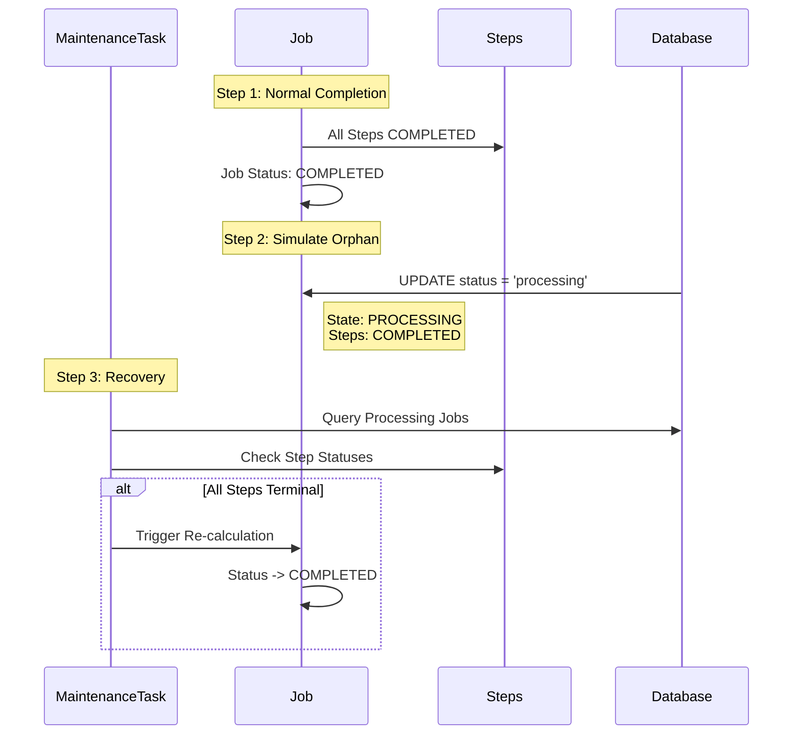

# Eval 15: Orphaned Job Recovery

## 🎯 Purpose

### 🌊 Flow Diagram



Tests the **OrphanedJobRecoveryTask** maintenance task, which recovers "zombie" jobs stuck in `PROCESSING` state despite all steps being in terminal states.

## 📋 Scenario

1. **start job with fast delays (1s per step)
2. **Complete Successfully**: Job completes normally
3. **Simulate Orphan**: Manually set job status back to `PROCESSING` (simulates crash)
4. **Verify Condition**: Confirm job is PROCESSING but all steps are terminal
5. **Trigger Recovery**: Run maintenance task
6. **Verify Fix**: Confirm job status corrected to `completed`

## 🔍 What This Tests

### Primary Focus

- **OrphanedJobRecoveryTask** execution and detection logic
- Recovery mechanism for orphaned jobs
- Re-triggering orchestration to recalculate job status

### Edge Cases Covered

- Orchestrator crashes after step completion
- Race conditions in concurrent step completions
- Database transaction failures during status update

## 📊 Test Data

- **Membership**: `1410001013`
- **Consumer**: `1013`
- **Source**: `02-data-example.sql`

## ⏱️ Expected Duration

- **Normal**: ~15 seconds
  - Job: ~8s (4 steps × 1s + acks)
  - Database manipulation: ~1s
  - Maintenance task: ~2s
  - Verification: ~1s

## ✅ Success Criteria

1. ✅ Job completes successfully
2. ✅ Job manually set to PROCESSING (orphaned)
3. ✅ All steps remain in terminal states
4. ✅ Maintenance task finds ≥1 orphaned job
5. ✅ Maintenance task recovers ≥1 job
6. ✅ Job status corrected to `completed`

## 🔧 Configuration

### Environment Variables

```bash
# No special configuration needed
# Task runs every 10 minutes by default
```

## 🚀 Running

```bash
# Standalone
./ste/09-orphaned-job-recovery/test.sh

# Via runner
./ste/run-all.sh --eval 09
```

## 🏗️ Architecture

```
┌─────────────────────────────────────────────────────────────┐
│ STEP 1: Normal Job Completion                         │
├─────────────────────────────────────────────────────────────┤
│                                                              │
│  [Job]                                             │
│    Status: processing → completed ✅                         │
│                                                              │
│  [Steps]                                                     │
│    ValidateCustomer: completed ✅                             │
│    ValidateOrder: completed ✅                           │
│    SubmitCustomer: completed ✅                           │
│    SubmitOrder: completed ✅                         │
│                                                              │
└─────────────────────────────────────────────────────────────┘

┌─────────────────────────────────────────────────────────────┐
│ STEP 2: Simulate Orphan (Manual Database Update)            │
├─────────────────────────────────────────────────────────────┤
│                                                              │
│  SQL: UPDATE dtm_jobs                                  │
│       SET status = 'processing'                              │
│       WHERE id = '<job_id>'                                  │
│                                                              │
│  Result:                                                     │
│    [Job]                                           │
│      Status: completed → processing ⚠️  (ORPHANED!)         │
│                                                              │
│    [Steps] (unchanged)                                       │
│      All steps: completed ✅                                 │
│                                                              │
│  This simulates:                                             │
│    • Orchestrator crashed before final status update        │
│    • Race condition in job completion logic                 │
│    • Database transaction rolled back                       │
│                                                              │
└─────────────────────────────────────────────────────────────┘

┌─────────────────────────────────────────────────────────────┐
│ STEP 3: Maintenance Task Detects & Recovers                 │
├─────────────────────────────────────────────────────────────┤
│                                                              │
│  [OrphanedJobRecoveryTask]                                   │
│       │                                                      │
│       ├─> Query: Jobs WHERE status = 'processing'           │
│       │                                                      │
│       ├─> For each job:                                     │
│       │    Check all steps                                  │
│       │    Are all steps terminal? (completed/failed)       │
│       │                                                      │
│       ├─> Found orphan: Job PROCESSING, Steps ALL terminal  │
│       │                                                      │
│       └─> Recovery:                                          │
│            Re-trigger orchestration                          │
│            → Orchestrator recalculates job status           │
│            → Job updated: processing → completed            │
│                                                              │
│  Result:                                                     │
│    • Job: completed ✅                                       │
│    • Steps: unchanged (completed ✅)                         │
│                                                              │
└─────────────────────────────────────────────────────────────┘
```

## 📝 Notes

### Why Orphans Happen

In a distributed system, orphaned jobs can occur due to:

1. **Orchestrator Crashes**:
   - Step completes and updates database
   - Orchestrator crashes before updating job status
   - Job stuck in PROCESSING forever

2. **Race Conditions**:
   - Multiple steps complete simultaneously
   - Job status update logic has race condition
   - Final update never happens

3. **Database Issues**:
   - Transaction fails or times out
   - Step updates committed, job update rolled back
   - Inconsistent state

### Recovery Mechanism

The task doesn't directly update job status. Instead:

1. **Detect**: Find orphaned jobs
2. **Trigger**: Call `orchestrationService.continueOrchestration()`
3. **Recalculate**: Orchestrator evaluates all step statuses
4. **Update**: Orchestrator sets correct job status (completed/failed)

This ensures:

- ✅ Recovery uses same logic as normal flow
- ✅ No duplicate status calculation code
- ✅ All business rules applied correctly

### Test Technique

This test uses **direct database manipulation** instead of killing processes:

- ✅ Reliable (no race conditions)
- ✅ Fast (no waiting for crashes)
- ✅ Repeatable (deterministic)
- ✅ Safe (only affects test job)

## 🐛 Troubleshooting

### Test Fails: "Failed to create orphaned job"

- **Cause**: Database update didn't apply
- **Solution**: Check PostgreSQL container is running:
  ```bash
  docker ps | grep dtm-db
  ```

### Test Fails: "Expected all steps to be terminal, found N non-terminal"

- **Cause**: Job didn't complete before orphaning
- **Solution**: Increase `MAX_ATTEMPTS` or check for job failures

### Test Fails: "Expected to find at least 1 orphaned job, found: 0"

- **Cause**: Task didn't detect the orphan (timing issue)
- **Solutions**:
  1. Verify job is truly orphaned: Check database directly
  2. Ensure all steps are terminal: Query dtm_steps table
  3. Check task logs: `docker logs dtm-orchestrator`

### Test Fails: "Job was not recovered to correct status"

- **Cause**: Recovery triggered but orchestration failed
- **Solutions**:
  1. Check orchestrator logs for errors
  2. Verify orchestration service is healthy
  3. Ensure database connectivity

## 🔗 Related

- **Maintenance Task**: `services/orchestrator/src/maintenance/tasks/orphaned-job-recovery.task.ts`
- **API Endpoint**: `POST /maintenance/tasks/orphaned-job-recovery/execute`
- **Cron Schedule**: Every 10 minutes
- **Orchestration Service**: `services/orchestrator/src/orchestration/orchestration.service.ts`
- **Similar Concepts**:
  - Eval 11 (stuck-ack-recovery) - Different type of stuck job
  - Eval 12 (stuck-in-progress) - Different type of stuck step

## 💡 Production Implications

In production, this task is critical for:

1. **Reliability**: Prevents jobs from appearing "stuck" forever
2. **Monitoring**: Ensures metrics reflect actual completion
3. **SLA Compliance**: Jobs complete even if orchestrator crashes
4. **Cost**: Avoids manual intervention for orphaned jobs

**Frequency**: Every 10 minutes strikes balance between:

- 🏃 Fast recovery (jobs don't stay orphaned long)
- 💰 Low overhead (not constantly scanning database)
