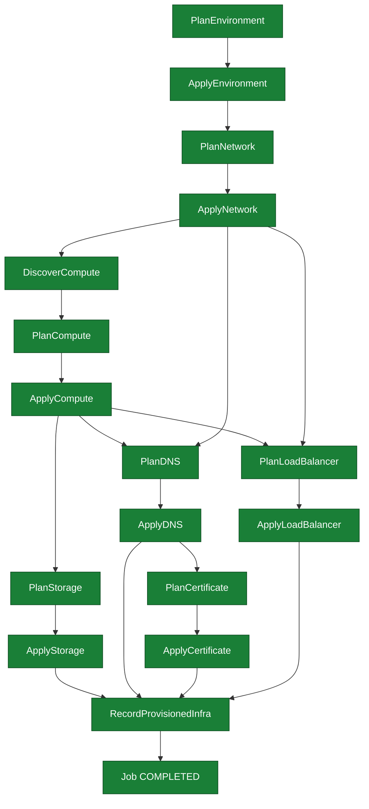

# SE-01: happy path

## Setpoint Eval Metadata

**Category**: happy-path
**Duration**: ~20s
**Timeout**: 660s
**Isolation**: parallel-safe

## Scenario
```gherkin
Feature: infra-provisioning happy path — full environment stand-up
  Scenario: an SRE stands up the staging-eu web tier end-to-end
    Given the staging-eu environment and its dedicated web instance chain
      (INST-STAGING-EU-1 — network, storage, DNS, certificate, load balancer)
      are registered in the infra CMDB
    When a provisioning job is submitted for entityId "staging-eu"
    Then Environment, Network, Compute, Storage, DNS, Certificate and
      LoadBalancer are all planned and applied successfully
    And the job reaches COMPLETED status
```

## Architecture


## Test Data
Dedicated staging-eu web chain (`source-db/SEED-REGISTRY.md`, owner: SE-01-happy-path),
from `source-db/init-scripts/01-schema-and-seed.sql`:
```sql
INSERT INTO dbo.environments (environment_id, name, type, region, account_id, status, created_at) VALUES
('staging-eu', 'Staging EU', 'staging', 'eu-west-1', 'aws-acct-111111111111', 'active', '2025-01-10 08:00:00');

INSERT INTO dbo.networks (network_id, environment_id, name, vpc_cidr, subnet_cidr, availability_zone, status, created_at) VALUES
('NET-STAGING-EU-1', 'staging-eu', 'staging-eu-vpc-primary', '10.0.0.0/16', '10.0.1.0/24', 'eu-west-1a', 'active', '2025-01-10 08:30:00');

INSERT INTO dbo.compute_instances (instance_id, network_id, name, instance_type, ami_id, status, public_ip, private_ip, created_at) VALUES
('INST-STAGING-EU-1', 'NET-STAGING-EU-1', 'web-staging-eu-1', 't3.medium', 'ami-0abcdef1234567890', 'running', '54.89.10.1', '10.0.1.10', '2025-01-10 09:00:00');

INSERT INTO dbo.storage_volumes (volume_id, instance_id, name, size_gb, volume_type, iops, status, attached_at) VALUES
('VOL-STAGING-EU-1', 'INST-STAGING-EU-1', 'web-staging-eu-1-root', 50, 'gp3', NULL, 'in-use', '2025-01-10 09:05:00');

INSERT INTO dbo.dns_records (record_id, network_id, instance_id, hostname, record_type, value, ttl, status, created_at) VALUES
('DNS-STAGING-EU-1', 'NET-STAGING-EU-1', 'INST-STAGING-EU-1', 'web-staging-eu.internal.example.com', 'A', '10.0.1.10', 300, 'active', '2025-01-10 09:30:00');

INSERT INTO dbo.certificates (certificate_id, dns_record_id, domain, issuer, status, issued_at, expires_at, created_at) VALUES
('CERT-STAGING-EU-1', 'DNS-STAGING-EU-1', 'web-staging-eu.internal.example.com', 'LetsEncrypt', 'issued', '2025-01-10 10:00:00', '2026-01-10 10:00:00', '2025-01-10 09:45:00');

INSERT INTO dbo.load_balancers (lb_id, network_id, instance_id, name, type, port, protocol, health_check_path, status, created_at) VALUES
('LB-STAGING-EU-1', 'NET-STAGING-EU-1', 'INST-STAGING-EU-1', 'web-alb-staging-eu', 'ALB', 443, 'HTTPS', '/health', 'active', '2025-01-10 10:00:00');
```

## Payload
Literal POST body to `/api/v1/workflows/infra-provisioning/jobs` (from `test.sh`):
```json
{
  "variant": "default",
  "payload": {
    "environmentId": "staging-eu",
    "networkId": "NET-STAGING-EU-1",
    "instanceId": "INST-STAGING-EU-1",
    "dnsRecordId": "DNS-STAGING-EU-1",
    "certificateId": "CERT-STAGING-EU-1",
    "loadBalancerId": "LB-STAGING-EU-1",
    "entityId": "staging-eu"
  },
  "testOptions": {
    "PlanEnvironment":    { "simDelay": 300 },
    "ApplyEnvironment":   { "simDelay": 300, "ackDelay": 1000 },
    "PlanNetwork":        { "simDelay": 300 },
    "ApplyNetwork":       { "simDelay": 300, "ackDelay": 1000 },
    "DiscoverCompute":    { "simDelay": 300 },
    "PlanCompute":        { "simDelay": 300 },
    "ApplyCompute":       { "simDelay": 300, "ackDelay": 1000 },
    "PlanStorage":        { "simDelay": 300 },
    "ApplyStorage":       { "simDelay": 300, "ackDelay": 1000 },
    "PlanDNS":            { "simDelay": 300 },
    "ApplyDNS":           { "simDelay": 300, "ackDelay": 1000 },
    "PlanCertificate":    { "simDelay": 300 },
    "ApplyCertificate":   { "simDelay": 300, "ackDelay": 1000 },
    "PlanLoadBalancer":   { "simDelay": 300 },
    "ApplyLoadBalancer":  { "simDelay": 300, "ackDelay": 1000 }
  }
}
```

## Artifacts

### Expected output
Derived from `verify_job_status`/`verify_step_status` targets in `test.sh` (job polled
via `poll_job "$JOB_ID" 600 5`):
```
Job status: COMPLETED
PlanEnvironment: COMPLETED
ApplyEnvironment: COMPLETED
PlanNetwork: COMPLETED
ApplyNetwork: COMPLETED
DiscoverCompute: COMPLETED
```

## Assertions
<!-- one checkbox per Test N verify_* call in test.sh — keep 1:1 -->
- [ ] Job status is COMPLETED
- [ ] PlanEnvironment step status is COMPLETED
- [ ] ApplyEnvironment step status is COMPLETED
- [ ] PlanNetwork step status is COMPLETED
- [ ] ApplyNetwork step status is COMPLETED
- [ ] DiscoverCompute step status is COMPLETED

## Run
```bash
bash workflows/infra-provisioning/setpoint-evals/run-all.sh --se 01
```
