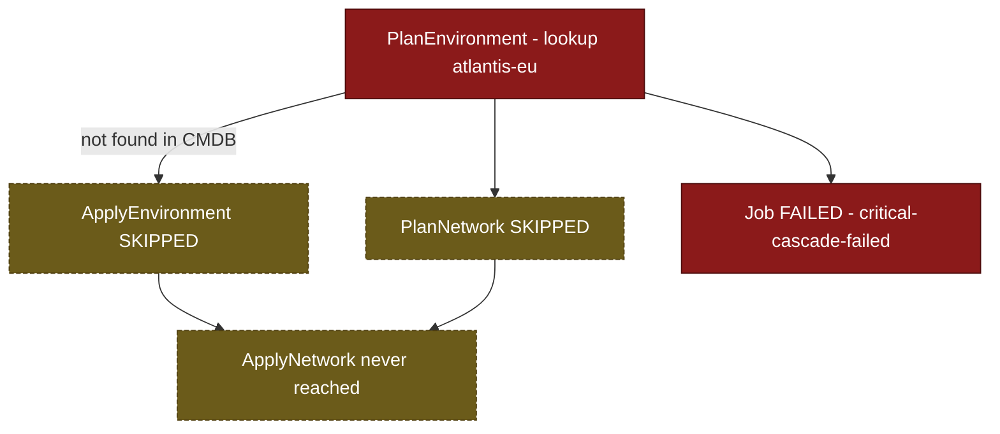

# SE-02: environment not found

## Setpoint Eval Metadata

**Category**: error-handling
**Duration**: ~10s
**Timeout**: 330s
**Isolation**: parallel-safe

## Scenario
```gherkin
Feature: infra-provisioning rejects an unregistered environment
  Scenario: a provisioning request targets a region that was never onboarded
    Given "atlantis-eu" is NOT registered in the infra CMDB (reserved not-found sentinel)
    When a provisioning job is submitted for entityId "atlantis-eu"
    Then PlanEnvironment fails because the environment cannot be found
    And Environment is a required, critical cascade
    And the job reaches FAILED status
    And ApplyEnvironment and PlanNetwork never complete
```

## Architecture


## Test Data
The not-found sentinel from `source-db/SEED-REGISTRY.md`:

| Entity | Sentinel value |
|---|---|
| environment_id | `atlantis-eu` |

`atlantis-eu` is **guaranteed absent** from `dbo.environments` — the only two seeded
environment rows are `staging-eu` and `prod-eu` (see SE-01/SE-05 and SE-03/SE-04 Test
Data respectively). `PlanEnvironment` looks the row up and fails when it isn't there.

## Payload
Literal POST body to `/api/v1/workflows/infra-provisioning/jobs` (from `test.sh`):
```json
{
  "variant": "default",
  "payload": {
    "environmentId": "atlantis-eu",
    "entityId": "atlantis-eu"
  },
  "testOptions": {
    "PlanEnvironment":    { "simDelay": 300, "maxRetries": 0 },
    "ApplyEnvironment":   { "simDelay": 300, "ackDelay": 1000 },
    "PlanNetwork":        { "simDelay": 300 },
    "ApplyNetwork":       { "simDelay": 300, "ackDelay": 1000 }
  }
}
```

## Artifacts

### Expected output
Derived from `verify_job_status`/`verify_step_status`/`extract_step_status` targets in
`test.sh` (job polled via `poll_job "$JOB_ID" 300 5`):
```
Job status: FAILED
PlanEnvironment: FAILED
ApplyEnvironment: not completed (dependency failed)
PlanNetwork: not completed (dependency failed)
```

## Assertions
<!-- one checkbox per Test N verify_*/extract_* check in test.sh — keep 1:1 -->
- [ ] Job status is FAILED
- [ ] PlanEnvironment step status is FAILED
- [ ] ApplyEnvironment is NOT completed (dependency PlanEnvironment failed)
- [ ] PlanNetwork is NOT completed (dependency PlanEnvironment failed)

## Run
```bash
bash workflows/infra-provisioning/setpoint-evals/run-all.sh --se 02
```
