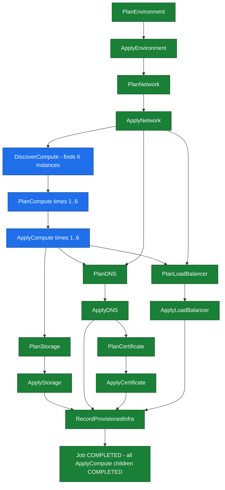

# SE-03: compute fan-out

## Setpoint Eval Metadata

**Category**: fan-out
**Duration**: ~30s
**Timeout**: 660s
**Isolation**: parallel-safe

## Scenario
```gherkin
Feature: infra-provisioning fans out compute discovery across a whole network
  Scenario: prod-eu's network has six compute instances to provision
    Given the prod-eu environment's network NET-PROD-EU-1 owns 6 compute instances
      (INST-PROD-EU-1..6)
    When a provisioning job is submitted for entityId "prod-eu"
    Then DiscoverCompute finds the instances and fans out
    And a PlanCompute/ApplyCompute child-step pair is created per instance
    And every ApplyCompute child step reaches COMPLETED
    And the job reaches COMPLETED status
```

## Architecture


## Test Data
prod-eu's network and its 6 fan-out compute instances (`source-db/SEED-REGISTRY.md`,
owner: SE-03-compute-fan-out for breadth, instance 1 shared read-only with SE-04), from
`source-db/init-scripts/01-schema-and-seed.sql`:
```sql
INSERT INTO dbo.environments (environment_id, name, type, region, account_id, status, created_at) VALUES
('prod-eu', 'Production EU', 'prod', 'eu-central-1', 'aws-acct-222222222222', 'active', '2025-01-15 10:00:00');

INSERT INTO dbo.networks (network_id, environment_id, name, vpc_cidr, subnet_cidr, availability_zone, status, created_at) VALUES
('NET-PROD-EU-1', 'prod-eu', 'prod-eu-vpc-primary', '10.1.0.0/16', '10.1.1.0/24', 'eu-central-1a', 'active', '2025-01-15 10:30:00');

INSERT INTO dbo.compute_instances (instance_id, network_id, name, instance_type, ami_id, status, public_ip, private_ip, created_at) VALUES
('INST-PROD-EU-1', 'NET-PROD-EU-1', 'web-prod-eu-1',    'm5.large',  'ami-0fedcba9876543210', 'running', '52.38.20.1', '10.1.1.10', '2025-01-15 11:00:00'),
('INST-PROD-EU-2', 'NET-PROD-EU-1', 'web-prod-eu-2',    'm5.large',  'ami-0fedcba9876543210', 'running', '52.38.20.2', '10.1.1.11', '2025-01-15 11:05:00'),
('INST-PROD-EU-3', 'NET-PROD-EU-1', 'api-prod-eu-1',    'm5.large',  'ami-0fedcba9876543210', 'running', NULL,         '10.1.1.12', '2025-01-15 11:10:00'),
('INST-PROD-EU-4', 'NET-PROD-EU-1', 'api-prod-eu-2',    'm5.large',  'ami-0fedcba9876543210', 'running', NULL,         '10.1.1.13', '2025-01-15 11:15:00'),
('INST-PROD-EU-5', 'NET-PROD-EU-1', 'worker-prod-eu-1', 'c5.xlarge', 'ami-0fedcba9876543210', 'running', NULL,         '10.1.1.14', '2025-01-15 11:20:00'),
('INST-PROD-EU-6', 'NET-PROD-EU-1', 'cache-prod-eu-1',  't3.medium', 'ami-0fedcba9876543210', 'running', NULL,         '10.1.1.15', '2025-01-15 11:25:00');
```
Only `INST-PROD-EU-1` carries a dedicated storage/dns/certificate/load_balancer chain —
the payload's explicit `instanceId`/`dnsRecordId`/`certificateId`/`loadBalancerId` all
target it (see SE-04's Test Data for that chain's literal rows). `INST-PROD-EU-2..6`
exist for fan-out breadth only.

## Payload
Literal POST body to `/api/v1/workflows/infra-provisioning/jobs` (from `test.sh`):
```json
{
  "enableDeduplication": false,
  "variant": "default",
  "payload": {
    "environmentId": "prod-eu",
    "networkId": "NET-PROD-EU-1",
    "instanceId": "INST-PROD-EU-1",
    "dnsRecordId": "DNS-PROD-EU-1",
    "certificateId": "CERT-PROD-EU-1",
    "loadBalancerId": "LB-PROD-EU-1",
    "entityId": "prod-eu"
  },
  "testOptions": {
    "PlanEnvironment":    { "simDelay": 300 },
    "ApplyEnvironment":   { "simDelay": 300, "ackDelay": 1000 },
    "PlanNetwork":        { "simDelay": 300 },
    "ApplyNetwork":       { "simDelay": 300, "ackDelay": 1000 },
    "DiscoverCompute":    { "simDelay": 300 },
    "PlanCompute":        { "simDelay": 300 },
    "ApplyCompute":       { "simDelay": 300, "ackDelay": 1000 },
    "PlanStorage":        { "simDelay": 300 },
    "ApplyStorage":       { "simDelay": 300, "ackDelay": 1000 },
    "PlanDNS":            { "simDelay": 300 },
    "ApplyDNS":           { "simDelay": 300, "ackDelay": 1000 },
    "PlanCertificate":    { "simDelay": 300 },
    "ApplyCertificate":   { "simDelay": 300, "ackDelay": 1000 },
    "PlanLoadBalancer":   { "simDelay": 300 },
    "ApplyLoadBalancer":  { "simDelay": 300, "ackDelay": 1000 }
  }
}
```

## Artifacts

### Expected output
Derived from the exact `jq` targets and thresholds in `test.sh` — note the fan-out
count checks are "at least one child step", not an exact count of 6 (the 6 seeded
instances bound the maximum, not the assertion):
```
Job status: COMPLETED
DiscoverCompute: COMPLETED
PlanCompute child steps (stepNumber == "PlanCompute"): > 0
ApplyCompute child steps (stepNumber == "ApplyCompute"): > 0
ApplyCompute children with status == "completed": >= total ApplyCompute child count
```

## Assertions
<!-- one checkbox per Test N verify_*/jq-derived check in test.sh — keep 1:1 -->
- [ ] Job status is COMPLETED
- [ ] DiscoverCompute step status is COMPLETED
- [ ] At least one PlanCompute child step exists (`PLAN_COMPUTE_COUNT -gt 0`)
- [ ] At least one ApplyCompute child step exists (`APPLY_COMPUTE_COUNT -gt 0`)
- [ ] All ApplyCompute child steps reach `completed` (retried up to 15x, 1s apart)

## Run
```bash
bash workflows/infra-provisioning/setpoint-evals/run-all.sh --se 03
```
