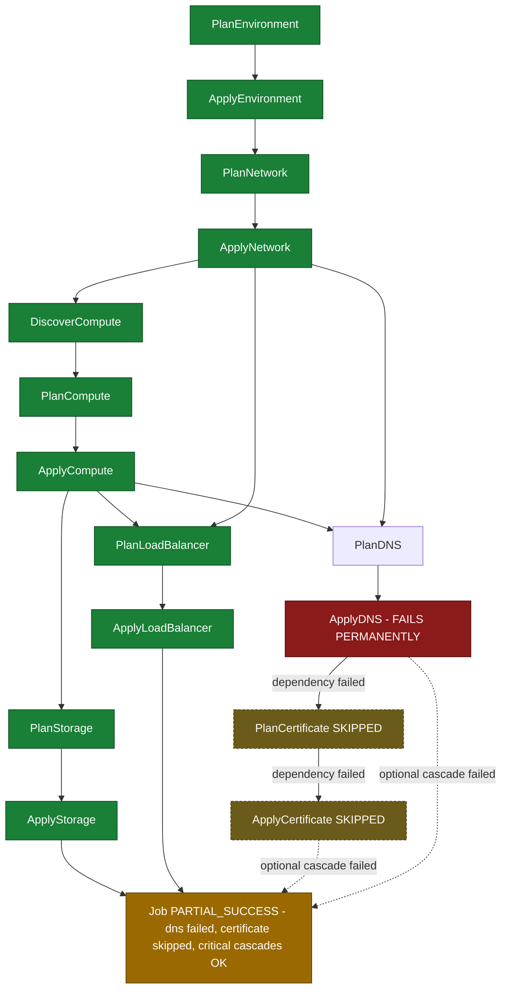

# SE-04: cascade failure propagation

## Setpoint Eval Metadata

**Category**: cascade-failure
**Duration**: ~60-90s
**Timeout**: 960s
**Isolation**: parallel-safe

Duration is bounded by `ApplyDNS`'s exhausted retry backoff (`failOnAttempts: [1, 2, 3]`)
before it fails permanently — see the `poll_job` budget in Artifacts below, which is why
Timeout is set well above the other SEs in this suite.

## Scenario
```gherkin
Feature: infra-provisioning cascade failure — a DNS failure skips only its dependents
  Scenario: prod-eu's DNS record apply fails permanently
    Given the prod-eu web instance chain (INST-PROD-EU-1) has a valid DNS record
      (DNS-PROD-EU-1) but ApplyDNS is configured to fail permanently for this run
    When a provisioning job is submitted for entityId "prod-eu"
    Then ApplyDNS fails after exhausting its retries
    And PlanCertificate is skipped because Certificate depends on DNS
    But Storage and LoadBalancer still complete
      (they depend on Compute and Network, not DNS)
    And DNS and Certificate are optional cascades while Environment, Network
      and Compute are required
    And the job reaches PARTIAL_SUCCESS status
```

## Architecture


## Test Data
The prod-eu web chain shared read-only with SE-03 (`source-db/SEED-REGISTRY.md` —
"both are read-only lookups; SE-04's failure is a `testOptions.ApplyDNS.failureAfter`
simulation, not a missing row"), from `source-db/init-scripts/01-schema-and-seed.sql`:
```sql
INSERT INTO dbo.compute_instances (instance_id, network_id, name, instance_type, ami_id, status, public_ip, private_ip, created_at) VALUES
('INST-PROD-EU-1', 'NET-PROD-EU-1', 'web-prod-eu-1', 'm5.large', 'ami-0fedcba9876543210', 'running', '52.38.20.1', '10.1.1.10', '2025-01-15 11:00:00');

INSERT INTO dbo.storage_volumes (volume_id, instance_id, name, size_gb, volume_type, iops, status, attached_at) VALUES
('VOL-PROD-EU-1', 'INST-PROD-EU-1', 'web-prod-eu-1-root', 100, 'gp3', NULL, 'in-use', '2025-01-15 11:05:00');

-- this record exists (PlanDNS must succeed) — ApplyDNS is what testOptions fails
INSERT INTO dbo.dns_records (record_id, network_id, instance_id, hostname, record_type, value, ttl, status, created_at) VALUES
('DNS-PROD-EU-1', 'NET-PROD-EU-1', 'INST-PROD-EU-1', 'web-prod-eu.example.com', 'A', '10.1.1.10', 300, 'active', '2025-01-15 12:00:00');

INSERT INTO dbo.certificates (certificate_id, dns_record_id, domain, issuer, status, issued_at, expires_at, created_at) VALUES
('CERT-PROD-EU-1', 'DNS-PROD-EU-1', 'web-prod-eu.example.com', 'Amazon', 'issued', '2025-01-15 13:00:00', '2026-01-15 13:00:00', '2025-01-15 12:45:00');

INSERT INTO dbo.load_balancers (lb_id, network_id, instance_id, name, type, port, protocol, health_check_path, status, created_at) VALUES
('LB-PROD-EU-1', 'NET-PROD-EU-1', 'INST-PROD-EU-1', 'web-alb-prod-eu', 'ALB', 443, 'HTTPS', '/health', 'active', '2025-01-15 13:30:00');
```

## Payload
Literal POST body to `/api/v1/workflows/infra-provisioning/jobs` (from `test.sh`) —
`ApplyDNS.failureAfter`/`failOnAttempts` is what actually drives the failure, not a
missing row:
```json
{
  "variant": "default",
  "enableDeduplication": false,
  "payload": {
    "environmentId": "prod-eu",
    "networkId": "NET-PROD-EU-1",
    "instanceId": "INST-PROD-EU-1",
    "dnsRecordId": "DNS-PROD-EU-1",
    "certificateId": "CERT-PROD-EU-1",
    "loadBalancerId": "LB-PROD-EU-1",
    "entityId": "prod-eu"
  },
  "testOptions": {
    "PlanEnvironment":    { "simDelay": 300 },
    "ApplyEnvironment":   { "simDelay": 300, "ackDelay": 1000 },
    "PlanNetwork":        { "simDelay": 300 },
    "ApplyNetwork":       { "simDelay": 300, "ackDelay": 1000 },
    "DiscoverCompute":    { "simDelay": 300 },
    "PlanCompute":        { "simDelay": 300 },
    "ApplyCompute":       { "simDelay": 300, "ackDelay": 1000 },
    "PlanStorage":        { "simDelay": 300 },
    "ApplyStorage":       { "simDelay": 300, "ackDelay": 1000 },
    "PlanDNS":            { "simDelay": 300 },
    "ApplyDNS":           { "simDelay": 300, "failureAfter": 1, "failOnAttempts": [1, 2, 3] },
    "PlanCertificate":    { "simDelay": 300 },
    "ApplyCertificate":   { "simDelay": 300, "ackDelay": 1000 },
    "PlanLoadBalancer":   { "simDelay": 300 },
    "ApplyLoadBalancer":  { "simDelay": 300, "ackDelay": 1000 }
  }
}
```

## Artifacts

### Expected output
Derived from `verify_job_status`/`verify_step_status`/`extract_step_status` targets in
`test.sh` (job polled via `poll_job "$JOB_ID" 900 5` — the 900s budget accounts for
`ApplyDNS` exhausting its configured retries before failing permanently):
```
Job status: PARTIAL_SUCCESS
PlanEnvironment: COMPLETED
ApplyEnvironment: COMPLETED
PlanNetwork: COMPLETED
ApplyNetwork: COMPLETED
ApplyDNS: FAILED
PlanCertificate: not completed (SKIPPED — dependency ApplyDNS failed)
```

## Assertions
<!-- one checkbox per Test N verify_*/extract_* check in test.sh — keep 1:1 -->
- [ ] Job status is PARTIAL_SUCCESS
- [ ] PlanEnvironment step status is COMPLETED
- [ ] ApplyEnvironment step status is COMPLETED
- [ ] PlanNetwork step status is COMPLETED
- [ ] ApplyNetwork step status is COMPLETED
- [ ] ApplyDNS step status is FAILED
- [ ] PlanCertificate is NOT completed (cascaded from the ApplyDNS failure)

## Run
```bash
bash workflows/infra-provisioning/setpoint-evals/run-all.sh --se 04
```
