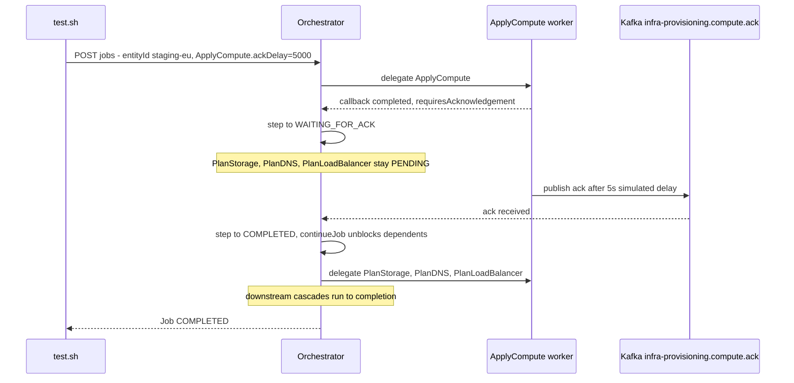

# SE-05: long ACK wait

**Category**: async-ack · **Duration**: ~25s · **Timeout**: 660s · **Isolation**: parallel-safe

## Scenario
```gherkin
Feature: infra-provisioning tolerates a slow compute-apply acknowledgement
  Scenario: the cloud provider takes its time to confirm a compute instance is ready
    Given the staging-eu api instance chain (INST-STAGING-EU-2) is registered,
      and ApplyCompute's real ceiling is a 10-minute ACK timeout (metadata.timeoutMs)
    When a provisioning job is submitted for entityId "staging-eu"
      with ApplyCompute's simulated ACK arriving after a 5-second delay
    Then ApplyCompute enters WAITING_FOR_ACK and later resolves to COMPLETED
      once the delayed acknowledgement arrives
    And downstream steps resume and the job reaches COMPLETED status
```

## Architecture


## Test Data
Dedicated staging-eu api chain (`source-db/SEED-REGISTRY.md`, owner:
SE-05-long-ack-wait), from `source-db/init-scripts/01-schema-and-seed.sql`:
```sql
INSERT INTO dbo.compute_instances (instance_id, network_id, name, instance_type, ami_id, status, public_ip, private_ip, created_at) VALUES
('INST-STAGING-EU-2', 'NET-STAGING-EU-1', 'api-staging-eu-1', 't3.medium', 'ami-0abcdef1234567890', 'running', NULL, '10.0.1.11', '2025-01-10 09:15:00');

INSERT INTO dbo.storage_volumes (volume_id, instance_id, name, size_gb, volume_type, iops, status, attached_at) VALUES
('VOL-STAGING-EU-2', 'INST-STAGING-EU-2', 'api-staging-eu-1-root', 50, 'gp3', NULL, 'in-use', '2025-01-10 09:20:00');

INSERT INTO dbo.dns_records (record_id, network_id, instance_id, hostname, record_type, value, ttl, status, created_at) VALUES
('DNS-STAGING-EU-2', 'NET-STAGING-EU-1', 'INST-STAGING-EU-2', 'api-staging-eu.internal.example.com', 'A', '10.0.1.11', 300, 'active', '2025-01-10 09:35:00');

INSERT INTO dbo.certificates (certificate_id, dns_record_id, domain, issuer, status, issued_at, expires_at, created_at) VALUES
('CERT-STAGING-EU-2', 'DNS-STAGING-EU-2', 'api-staging-eu.internal.example.com', 'LetsEncrypt', 'issued', '2025-01-10 10:15:00', '2026-01-10 10:15:00', '2025-01-10 10:00:00');

INSERT INTO dbo.load_balancers (lb_id, network_id, instance_id, name, type, port, protocol, health_check_path, status, created_at) VALUES
('LB-STAGING-EU-2', 'NET-STAGING-EU-1', 'INST-STAGING-EU-2', 'api-alb-staging-eu', 'ALB', 8443, 'HTTPS', '/api/health', 'active', '2025-01-10 10:05:00');
```
The environment (`staging-eu`) and network (`NET-STAGING-EU-1`) rows are shared with
SE-01 — `PlanNetwork` looks up by `environment_id`, so this is safe (see
SEED-REGISTRY.md "Worker behavior notes").

## Payload
Literal POST body to `/api/v1/workflows/infra-provisioning/jobs` (from `test.sh`) —
`ApplyCompute.ackDelay: 5000` is what this SE exists to exercise:
```json
{
  "enableDeduplication": false,
  "variant": "default",
  "payload": {
    "environmentId": "staging-eu",
    "networkId": "NET-STAGING-EU-1",
    "instanceId": "INST-STAGING-EU-2",
    "dnsRecordId": "DNS-STAGING-EU-2",
    "certificateId": "CERT-STAGING-EU-2",
    "loadBalancerId": "LB-STAGING-EU-2",
    "entityId": "staging-eu"
  },
  "testOptions": {
    "PlanEnvironment":    { "simDelay": 300 },
    "ApplyEnvironment":   { "simDelay": 300, "ackDelay": 1000 },
    "PlanNetwork":        { "simDelay": 300 },
    "ApplyNetwork":       { "simDelay": 300, "ackDelay": 1000 },
    "DiscoverCompute":    { "simDelay": 300 },
    "PlanCompute":        { "simDelay": 300 },
    "ApplyCompute":       { "simDelay": 300, "ackDelay": 5000 },
    "PlanStorage":        { "simDelay": 300 },
    "ApplyStorage":       { "simDelay": 300, "ackDelay": 1000 },
    "PlanDNS":            { "simDelay": 300 },
    "ApplyDNS":           { "simDelay": 300, "ackDelay": 1000 },
    "PlanCertificate":    { "simDelay": 300 },
    "ApplyCertificate":   { "simDelay": 300, "ackDelay": 1000 },
    "PlanLoadBalancer":   { "simDelay": 300 },
    "ApplyLoadBalancer":  { "simDelay": 300, "ackDelay": 1000 }
  }
}
```

## Artifacts

### Expected output
Derived from `verify_job_status`/`verify_step_status`/`jq`-derived targets in
`test.sh` (job polled via `poll_job "$JOB_ID" 600 5`):
```
Job status: COMPLETED
ApplyCompute child steps with status == "completed": >= total ApplyCompute child count
PlanNetwork: COMPLETED
DiscoverCompute: COMPLETED
```

## Assertions
<!-- one checkbox per Test N verify_*/jq-derived check in test.sh — keep 1:1 -->
- [ ] Job status is COMPLETED
- [ ] All ApplyCompute child steps reach `completed` (ACK received after the 5s delay)
- [ ] PlanNetwork step status is COMPLETED
- [ ] DiscoverCompute step status is COMPLETED

## Run
```bash
bash workflows/infra-provisioning/setpoint-evals/run-all.sh --se 05
```
