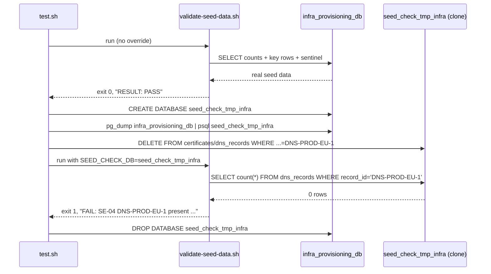

# SE-06: seed data integrity
**Category**: data-integrity · **Duration**: ~15s · **Timeout**: 120s

## Scenario
```gherkin
Feature: infra-provisioning seed data matches SEED-REGISTRY.md
  Scenario: the validator passes against the real seed and catches a deleted row
    Given the infra-provisioning source DB seeded from 01-schema-and-seed.sql
    When source-db/validate-seed-data.sh runs against the live database
    Then it exits 0 and reports RESULT: PASS
    And when the same validator is pointed at a throwaway clone with SE-04's
      DNS record (record_id='DNS-PROD-EU-1') deleted
    Then it exits 1 and names that exact row in a FAIL line
```

## Architecture


## Artifacts

### Seed / fixture
The row deleted for the negative control (from `01-schema-and-seed.sql`,
`SEED-REGISTRY.md` "SE-04-cascade-failure-propagation" ownership row —
its dependent certificate is deleted first to satisfy the FK):
```sql
INSERT INTO dbo.dns_records (record_id, network_id, instance_id, hostname, record_type, value, ttl, status, created_at) VALUES
('DNS-PROD-EU-1', 'NET-PROD-EU-1', 'INST-PROD-EU-1', 'web-prod-eu.example.com', 'A', '10.1.1.10', 300, 'active', '2025-01-15 12:00:00');
```

### Input / payload
The clone-targeting override the validator already supports (from
`source-db/validate-seed-data.sh`):
```bash
SEED_CHECK_DB=seed_check_tmp_infra bash source-db/validate-seed-data.sh
```

### Expected output
Real seed run (excerpt):
```
PASS: environments count = 2
...
RESULT: PASS — seed matches SEED-REGISTRY.md
```
Clone run after the delete (excerpt):
```
FAIL: SE-04 DNS-PROD-EU-1 present (PlanDNS must succeed; ApplyDNS fails via testOptions) = '0' (expected '1')
...
RESULT: FAIL — seed drifted from SEED-REGISTRY.md (see FAIL lines above)
```

## Assertions
<!-- one checkbox per ck/ck_eq/ck_has call in test.sh — keep 1:1 -->
- [ ] validator exits 0 against the real, untouched seed
- [ ] validator reports PASS against the real seed
- [ ] clone database created for the negative control
- [ ] validator exits 1 against the clone with a deleted row (RED-proof)
- [ ] validator names the deleted row's FAIL in its own output

## Run
```bash
bash workflows/infra-provisioning/setpoint-evals/run-all.sh --se 06
```

Guards against the failure mode this whole Phase 2b closes: seed rows
silently drifting out of sync with what each SE's `test.sh` assumes (shared/
renamed/deleted rows), which reads green right up until the row an SE depends
on disappears. This SE proves the validator itself would catch that — not
just that it exists.
