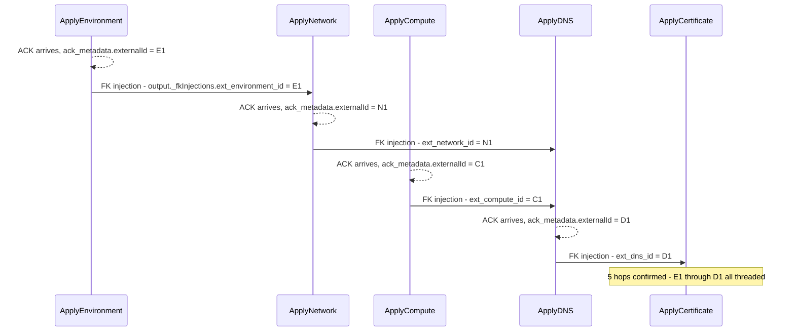

# SE-07: cascade FK every hop

## Setpoint Eval Metadata

**Category**: cascade-fk
**Duration**: ~40-60s
**Timeout**: 900s
**Isolation**: parallel-safe

## Scenario
```gherkin
Feature: infra-provisioning cascade FK injection — threaded through every hop
  Scenario: the deepest 5-hop chain propagates externalId end-to-end
    Given the prod-eu web instance chain (INST-PROD-EU-1) with healthy
      environment, network, compute, DNS and certificate rows
    When a provisioning job is submitted for entityId "prod-eu-fk-every-hop"
    Then ApplyEnvironment's ack_metadata.externalId is injected as
      ApplyNetwork's output._fkInjections.ext_environment_id
    And ApplyNetwork's externalId is injected as ApplyDNS's
      ext_network_id
    And one of the fanned-out ApplyCompute instances' externalId is
      injected as ApplyDNS's ext_compute_id
    And ApplyDNS's externalId is injected as ApplyCertificate's
      ext_dns_id
    And the job reaches COMPLETED status
```

## Architecture


## Test Data
The prod-eu web chain shared read-only with SE-01/03/04/08/09
(`source-db/SEED-REGISTRY.md`) — pure read-only lookup, distinguished by its
own `entityId`. No seed row drives the FK values; they're generated at
runtime by the dev-ack-simulator (random UUIDs per ACK) and captured live by
this SE's direct `dtm_steps` query.

## Payload
Same full-chain payload as SE-04/SE-08 (`entityId: "prod-eu-fk-every-hop"`);
see `test.sh` for the literal JSON.

## Artifacts
Live SQL query results captured while building this SE
(`docker exec dtm-db psql -U dtm_user -d dtm -c "SELECT step_value, ack_metadata->>'externalId' FROM dtm_steps WHERE job_id='...' ORDER BY step_value"`),
cross-referenced against `output->'_fkInjections'` on each dependent step:
```
ApplyEnvironment  externalId=7e4461ab-...   -> ApplyNetwork._fkInjections.ext_environment_id=7e4461ab-...     (MATCH)
ApplyNetwork      externalId=d1f872be-...   -> ApplyDNS._fkInjections.ext_network_id=d1f872be-...             (MATCH)
ApplyCompute(x6)  externalId=d2e045b0-...(one of six) -> ApplyDNS._fkInjections.ext_compute_id=d2e045b0-...   (MATCH)
ApplyDNS          externalId=de05b59a-...   -> ApplyCertificate._fkInjections.ext_dns_id=de05b59a-...         (MATCH)
```
`Plan*` steps have `ack_metadata=NULL` (no ACK phase) and are excluded from
this SE's queries — only `Apply*` steps go through `WAITING_FOR_ACK`.

## Assertions
<!-- one checkbox per verify/if call in test.sh — keep 1:1 -->
- [ ] Job status is COMPLETED
- [ ] Hop 1->2: ApplyEnvironment's externalId equals ApplyNetwork's `ext_environment_id`
- [ ] Hop 2->3: ApplyNetwork's externalId equals ApplyDNS's `ext_network_id`
- [ ] Hop compute->dns: ApplyDNS's `ext_compute_id` matches a real ApplyCompute externalId
- [ ] Hop 4->5: ApplyDNS's externalId equals ApplyCertificate's `ext_dns_id`

## Run
```bash
bash workflows/infra-provisioning/setpoint-evals/run-all.sh --se 07
```

No existing SE queries `ack_metadata`/`_fkInjections` directly via SQL — every
other SE only asserts on step STATUS via the HTTP API. This SE is the only
one that proves the FK VALUES themselves actually thread hop-to-hop (not
just that each step independently receives some ACK), which is the entire
point of `docs/diagrams/cascade-fk-flow.mermaid` — a regression that broke FK
injection (e.g. injecting the wrong parent's externalId, or a stale one)
would pass every status-only SE in the suite while silently corrupting the
provisioned infrastructure's referential integrity.
