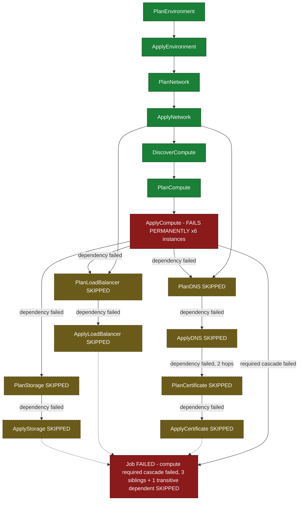

# SE-08: skipped propagation breadth

## Setpoint Eval Metadata

**Category**: cascade-failure
**Duration**: ~60-90s
**Timeout**: 960s
**Isolation**: parallel-safe

Duration is bounded by `ApplyCompute`'s exhausted retry backoff
(`failOnAttempts: [1, 2, 3]`), same as SE-04's `ApplyDNS` case — see the
`poll_job` budget in Artifacts below.

## Scenario
```gherkin
Feature: infra-provisioning cascade failure — breadth AND depth of SKIPPED propagation
  Scenario: prod-eu's compute apply fails permanently
    Given the prod-eu web instance chain (INST-PROD-EU-1) has healthy
      network, DNS, certificate and load balancer rows, but ApplyCompute is
      configured to fail permanently for every fanned-out compute instance
    When a provisioning job is submitted for entityId "prod-eu-compute-breadth"
    Then ApplyCompute fails after exhausting its retries, for every instance
    And dns, loadBalancer and storage are ALL skipped — three SIBLING
      cascades that each directly depend on compute (breadth)
    And certificate is ALSO skipped — it depends on dns, not compute
      directly, so its skip is a TRANSITIVE consequence, two hops deep
      (depth)
    But environment and network still complete — they are upstream of
      compute, unaffected by its failure
    And compute is a required cascade, so the job reaches FAILED status
```

## Architecture


## Test Data
The prod-eu web chain shared read-only with SE-01/03/04
(`source-db/SEED-REGISTRY.md`) — this SE is a pure read-only lookup against
those rows, distinguished only by its own `entityId`; the failure is a
`testOptions.ApplyCompute.failOnAttempts` simulation, not a missing row:
```sql
INSERT INTO dbo.compute_instances (instance_id, network_id, name, instance_type, ami_id, status, public_ip, private_ip, created_at) VALUES
('INST-PROD-EU-1', 'NET-PROD-EU-1', 'web-prod-eu-1', 'm5.large', 'ami-0fedcba9876543210', 'running', '52.38.20.1', '10.1.1.10', '2025-01-15 11:00:00');
```
`DiscoverCompute` fans this single seeded instance out to 6 `ApplyCompute`
children (one per discovered AZ/replica) — confirmed live: forcing
`ApplyCompute` to fail produced exactly 6 `failed` `ApplyCompute` steps.

## Payload
Literal POST body to `/api/v1/workflows/infra-provisioning/jobs` (from
`test.sh`) — `ApplyCompute.failOnAttempts` is what drives the failure:
```json
{
  "variant": "default",
  "enableDeduplication": false,
  "payload": {
    "environmentId": "prod-eu",
    "networkId": "NET-PROD-EU-1",
    "instanceId": "INST-PROD-EU-1",
    "dnsRecordId": "DNS-PROD-EU-1",
    "certificateId": "CERT-PROD-EU-1",
    "loadBalancerId": "LB-PROD-EU-1",
    "entityId": "prod-eu-compute-breadth"
  },
  "testOptions": {
    "ApplyCompute": { "simDelay": 300, "failOnAttempts": [1, 2, 3] }
  }
}
```

## Artifacts

### Expected output
Live final step snapshot captured while building this SE (`poll_job "$JOB_ID" 900 5`):
```json
{"status":"failed","type":"default","steps":[
  {"s":"ApplyEnvironment","status":"completed"},{"s":"ApplyNetwork","status":"completed"},
  {"s":"ApplyCompute","status":"failed"},{"s":"ApplyCompute","status":"failed"},
  {"s":"ApplyCompute","status":"failed"},{"s":"ApplyCompute","status":"failed"},
  {"s":"ApplyCompute","status":"failed"},{"s":"ApplyCompute","status":"failed"},
  {"s":"ApplyDNS","status":"skipped"},{"s":"ApplyLoadBalancer","status":"skipped"},
  {"s":"ApplyStorage","status":"skipped"},{"s":"ApplyCertificate","status":"skipped"},
  {"s":"RecordProvisionedInfra","status":"skipped"}
]}
```

## Assertions
<!-- one checkbox per verify_*/if call in test.sh — keep 1:1 -->
- [ ] Job status is FAILED
- [ ] At least one ApplyCompute step is FAILED (forced)
- [ ] ApplyDNS is SKIPPED (breadth — sibling 1)
- [ ] ApplyLoadBalancer is SKIPPED (breadth — sibling 2)
- [ ] ApplyStorage is SKIPPED (breadth — sibling 3)
- [ ] ApplyCertificate is SKIPPED (depth — transitive via dns)
- [ ] ApplyEnvironment and ApplyNetwork both still COMPLETED (siblings/upstream unaffected)

## Run
```bash
bash workflows/infra-provisioning/setpoint-evals/run-all.sh --se 08
```
