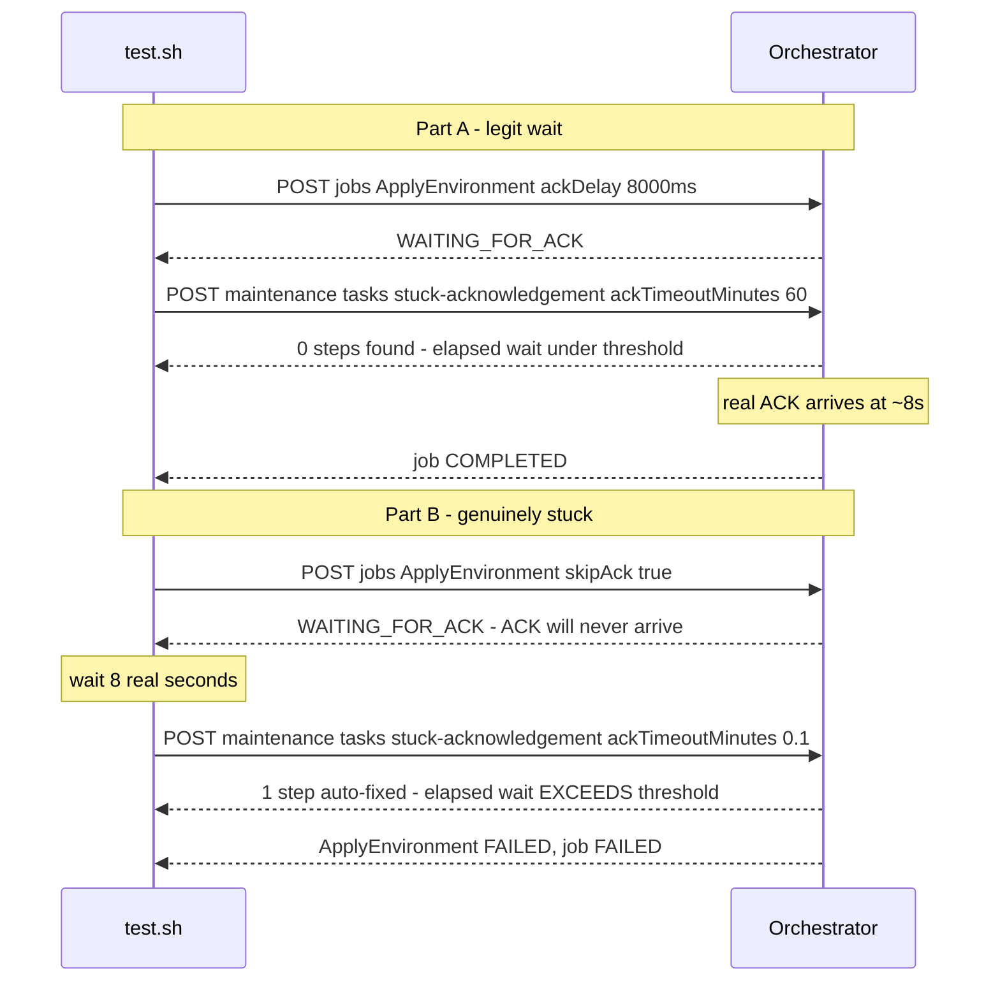

# SE-09: long-but-legit ACK wait vs genuinely stuck ACK

## Setpoint Eval Metadata

**Category**: async-ack
**Duration**: ~30-50s
**Timeout**: 500s
**Isolation**: parallel-safe

Non-destructive throughout (same `skipAck` simulation as core
`SE-07-stuck-ack-recovery` — no service is killed).

## Scenario
```gherkin
Feature: infra-provisioning stuck-acknowledgement maintenance task — threshold discrimination
  Scenario: a long-but-legit ACK wait is left alone (Part A)
    Given ApplyEnvironment's ACK is delayed 8 seconds (a real ACK, will arrive)
    When ApplyEnvironment reaches WAITING_FOR_ACK
    And the stuck-acknowledgement maintenance task is triggered with a
      60-minute threshold, only a few seconds after the wait began
    Then the maintenance task finds/fixes nothing for this job
    And ApplyEnvironment remains WAITING_FOR_ACK
    And the job completes normally once the legit ACK arrives

  Scenario: a genuinely stuck ACK is auto-failed (Part B)
    Given ApplyEnvironment uses skipAck=true (its ACK will NEVER arrive)
    When ApplyEnvironment reaches WAITING_FOR_ACK and 8 real seconds elapse
    And the stuck-acknowledgement maintenance task is triggered with a
      0.1-minute (6-second) threshold — which the elapsed wait EXCEEDS
    Then the maintenance task auto-fails ApplyEnvironment
    And the job reaches FAILED (environment is a required cascade)
```

## Architecture


## Test Data
The prod-eu web chain shared read-only with SE-01/03/04/08
(`source-db/SEED-REGISTRY.md`) — both parts are pure read-only lookups,
distinguished by their own `entityId`s. Neither part depends on any row
being missing or modified; the behavior is driven entirely by
`testOptions.ApplyEnvironment` (`ackDelay` in Part A, `skipAck` in Part B).

## Payload
Part A (legit, long ACK delay):
```json
{
  "variant": "default",
  "enableDeduplication": false,
  "payload": { "environmentId": "prod-eu", "networkId": "NET-PROD-EU-1", "instanceId": "INST-PROD-EU-1", "dnsRecordId": "DNS-PROD-EU-1", "certificateId": "CERT-PROD-EU-1", "loadBalancerId": "LB-PROD-EU-1", "entityId": "prod-eu-legit-ack-wait" },
  "testOptions": { "ApplyEnvironment": { "simDelay": 300, "ackDelay": 8000 } }
}
```

Part B (genuinely stuck, skipAck):
```json
{
  "variant": "default",
  "enableDeduplication": false,
  "payload": { "environmentId": "prod-eu", "networkId": "NET-PROD-EU-1", "instanceId": "INST-PROD-EU-1", "dnsRecordId": "DNS-PROD-EU-1", "certificateId": "CERT-PROD-EU-1", "loadBalancerId": "LB-PROD-EU-1", "entityId": "prod-eu-genuinely-stuck" },
  "testOptions": { "PlanEnvironment": { "simDelay": 300 }, "ApplyEnvironment": { "simDelay": 300, "skipAck": true } }
}
```

Maintenance trigger (`docs/guides/MAINTENANCE-TASKS.md`), Part B:
```bash
curl -X POST -H "Content-Type: application/json" \
  -d '{"ackTimeoutMinutes": 0.1}' \
  "$ORCHESTRATOR_HOST/api/$API_VERSION/maintenance/tasks/stuck-acknowledgement/execute"
```

## Artifacts
Real maintenance-task response shape (from core `SE-07-stuck-ack-recovery`,
same endpoint):
```json
{"success": true, "metrics": {"stuckStepsFound": 1, "autoFixed": 1, "alertsRaised": 0}}
```

## Assertions
<!-- one checkbox per verify_*/if call in test.sh — keep 1:1 -->
- [ ] Part A: ApplyEnvironment reaches WAITING_FOR_ACK
- [ ] Part A: maintenance task (60min threshold) responds HTTP 200
- [ ] Part A: ApplyEnvironment is STILL WAITING_FOR_ACK after maintenance runs (not reaped)
- [ ] Part A: job completes normally (COMPLETED) once the legit ACK lands
- [ ] Part B: ApplyEnvironment reaches WAITING_FOR_ACK
- [ ] Part B: maintenance task (0.1min threshold) responds HTTP 200
- [ ] Part B: maintenance task reports at least 1 auto-fixed step
- [ ] Part B: ApplyEnvironment is FAILED (auto-failed by maintenance)
- [ ] Part B: job is FAILED (required cascade)

## Run
```bash
bash workflows/infra-provisioning/setpoint-evals/run-all.sh --se 09
```

infra-provisioning's own `SE-05-long-ack-wait` only demonstrates a delayed
ACK eventually arriving — it never invokes the maintenance task. Core
`SE-07-stuck-ack-recovery` demonstrates the maintenance task but only against
order-processing's steps, and only the stuck case. This SE is the first to
pin BOTH sides of the threshold discriminator for infra-provisioning's own
steps in one scenario — the thing that would actually catch a regression
where the threshold check is inverted or missing (e.g. reaping every
WAITING_FOR_ACK step regardless of elapsed time).
