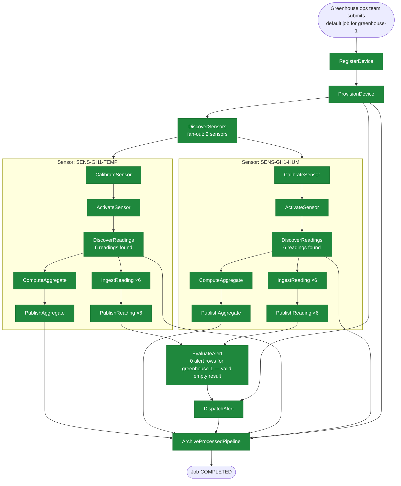

# SE-01: happy path

## Setpoint Eval Metadata
**Category**: happy-path · **Duration**: ~30-60s (typical — the Timeout below is a generous poll-loop safety ceiling, not the expected runtime) · **Timeout**: 630s · **Isolation**: parallel-safe

## Scenario
```gherkin
Feature: iot-sensor-pipeline processes a healthy greenhouse device end-to-end
  Scenario: greenhouse-1's calm sensor readings flow through the full pipeline without incident
    Given greenhouse-1 is registered with 2 active sensors (temperature, humidity)
      reporting calm, in-threshold readings, and 0 existing alert rows
    When the greenhouse ops team submits a default iot-sensor-pipeline job for greenhouse-1
    Then RegisterDevice and ProvisionDevice complete
    And DiscoverSensors fans out to both sensors, each completing its own
      CalibrateSensor, ActivateSensor, DiscoverReadings, IngestReading,
      PublishReading, ComputeAggregate and PublishAggregate chain
    And EvaluateAlert finds zero alert rows for the device — a valid empty
      result, not a failure — and DispatchAlert still completes
    Then the job reaches COMPLETED status
```

## Architecture


## Test Data
Owned by this SE (`source-db/SEED-REGISTRY.md` → `SE-01-happy-path`): the
`greenhouse-1` device and its 2 sensors (literal rows from
`source-db/init-scripts/01-schema-and-seed.sql`):
```sql
INSERT INTO dbo.devices (device_id, name, type, location, firmware_version, status, registered_at, last_seen_at) VALUES
('greenhouse-1', 'Greenhouse 1 — Tomatoes', 'multi-sensor', 'North Field - Bay 1', 'v2.4.1', 'active', '2025-01-15 08:00:00', '2025-06-20 09:15:00');

-- greenhouse-1 (SE-01 happy-path): temp + humidity, calm readings
INSERT INTO dbo.sensors (sensor_id, device_id, type, unit, min_threshold, max_threshold, calibrated_at, status) VALUES
('SENS-GH1-TEMP', 'greenhouse-1', 'temperature', 'celsius', 15.00, 35.00, '2025-06-01 09:00:00', 'active'),
('SENS-GH1-HUM',  'greenhouse-1', 'humidity',    'percent', 40.00, 80.00, '2025-06-01 09:15:00', 'active');
```
Each sensor has 6 seeded readings, all well inside its threshold (e.g.
`SENS-GH1-TEMP` ranges 20.10–22.90°C against a 15–35°C threshold) — the
"calm" in the scenario. `greenhouse-1` owns 0 rows in `dbo.alerts`.

## Payload
The literal request body `initiate_job` POSTs to
`/api/v1/workflows/iot-sensor-pipeline/jobs` (from `test.sh`):
```json
{
  "variant": "default",
  "payload": {
    "deviceId": "greenhouse-1",
    "entityId": "greenhouse-1"
  },
  "testOptions": {
    "RegisterDevice":      { "simDelay": 300 },
    "ProvisionDevice":     { "simDelay": 300, "ackDelay": 1000 },
    "DiscoverSensors":     { "simDelay": 300 },
    "CalibrateSensor":     { "simDelay": 300 },
    "ActivateSensor":      { "simDelay": 300, "ackDelay": 1000 },
    "DiscoverReadings":    { "simDelay": 300 },
    "IngestReading":       { "simDelay": 300 },
    "PublishReading":      { "simDelay": 300, "ackDelay": 1000 },
    "EvaluateAlert":       { "simDelay": 300 },
    "DispatchAlert":       { "simDelay": 300, "ackDelay": 1000 },
    "ComputeAggregate":    { "simDelay": 300 },
    "PublishAggregate":    { "simDelay": 300, "ackDelay": 1000 }
  }
}
```

## Artifacts
Expected verification targets (from `test.sh`'s `verify_job_status` /
`verify_step_status` calls — the literal status each check polls for):
```
verify_job_status                          → "COMPLETED"
verify_step_status "RegisterDevice"        → "COMPLETED"
verify_step_status "ProvisionDevice"       → "COMPLETED"
verify_step_status "DiscoverSensors"       → "COMPLETED"
verify_step_status "DispatchAlert"         → "COMPLETED"
verify_step_status "PublishAggregate"      → "COMPLETED"
```

## Assertions
<!-- one checkbox per verification call in test.sh — keep 1:1 -->
- [ ] Test 1: Job status should be COMPLETED
- [ ] Test 2: RegisterDevice should be COMPLETED
- [ ] Test 3: ProvisionDevice should be COMPLETED
- [ ] Test 4: DiscoverSensors should be COMPLETED
- [ ] Test 5: DispatchAlert should be COMPLETED
- [ ] Test 6: PublishAggregate should be COMPLETED

## Run
```bash
bash workflows/iot-sensor-pipeline/setpoint-evals/run-all.sh --se 01
```
