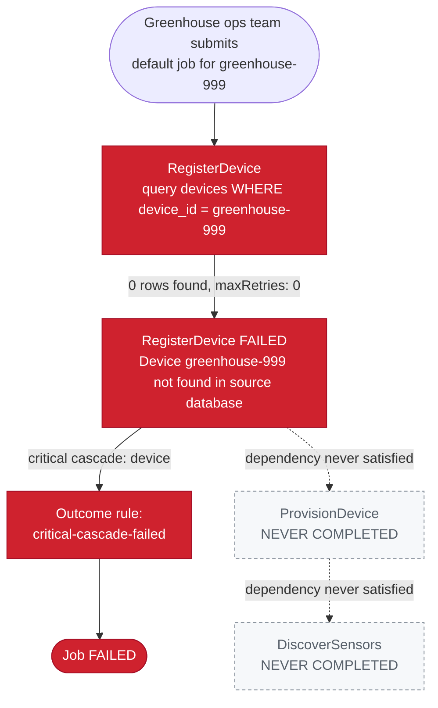

# SE-02: device not found

## Setpoint Eval Metadata
**Category**: error-handling · **Duration**: ~10-20s (typical — the Timeout below is a generous poll-loop safety ceiling, not the expected runtime) · **Timeout**: 330s · **Isolation**: parallel-safe

## Scenario
```gherkin
Feature: iot-sensor-pipeline fails fast when the device does not exist
  Scenario: a job for a device the greenhouse fleet has never registered fails cleanly
    Given "greenhouse-999" is the reserved not-found sentinel and is guaranteed
      absent from the iot_sensor_pipeline_db devices table
    When the greenhouse ops team submits a default iot-sensor-pipeline job for
      greenhouse-999, with RegisterDevice's retries disabled (maxRetries: 0)
    Then RegisterDevice fails immediately with "device not found in source database"
    And Device is a required (critical) cascade, so the job does not limp forward
    And ProvisionDevice and DiscoverSensors are never completed — their
      dependency (RegisterDevice) never succeeded
    Then the job reaches FAILED status
```

## Architecture


## Test Data
The not-found sentinel this SE relies on (`source-db/SEED-REGISTRY.md` →
"Not-found sentinel"), guaranteed absent — no device with this id is ever
inserted by `01-schema-and-seed.sql`, and `greenhouse-5`..`greenhouse-9` are
reserved for future SEs so nothing will ever collide with it:
```
| Entity    | Sentinel value  |
|-----------|-----------------|
| device_id | greenhouse-999  |
```

## Payload
The literal request body `initiate_job` POSTs to
`/api/v1/workflows/iot-sensor-pipeline/jobs` (from `test.sh`):
```json
{
  "variant": "default",
  "payload": {
    "deviceId": "greenhouse-999",
    "entityId": "greenhouse-999"
  },
  "testOptions": {
    "RegisterDevice":   { "simDelay": 300, "maxRetries": 0 },
    "ProvisionDevice":  { "simDelay": 300, "ackDelay": 1000 },
    "DiscoverSensors":  { "simDelay": 300 },
    "CalibrateSensor":  { "simDelay": 300 },
    "ActivateSensor":   { "simDelay": 300, "ackDelay": 1000 }
  }
}
```

## Artifacts
The literal error thrown by the worker (`workers/src/handlers/register-device.ts`,
`deviceId` substituted with this SE's payload value) when
`extractDeviceData` finds no matching row:
```
Device greenhouse-999 not found in source database
```
Expected verification targets (from `test.sh`'s checks):
```
verify_job_status                       → "FAILED"
verify_step_status "RegisterDevice"     → "FAILED"
extract_step_status "ProvisionDevice"   != "completed"
extract_step_status "DiscoverSensors"   != "completed"
```

## Assertions
<!-- one checkbox per verification call in test.sh — keep 1:1 -->
- [ ] Test 1: Job status should be FAILED
- [ ] Test 2: RegisterDevice should be FAILED
- [ ] Test 3: ProvisionDevice should NOT be COMPLETED (dependency failed)
- [ ] Test 4: DiscoverSensors should NOT be COMPLETED (depends on ProvisionDevice)

## Run
```bash
bash workflows/iot-sensor-pipeline/setpoint-evals/run-all.sh --se 02
```
