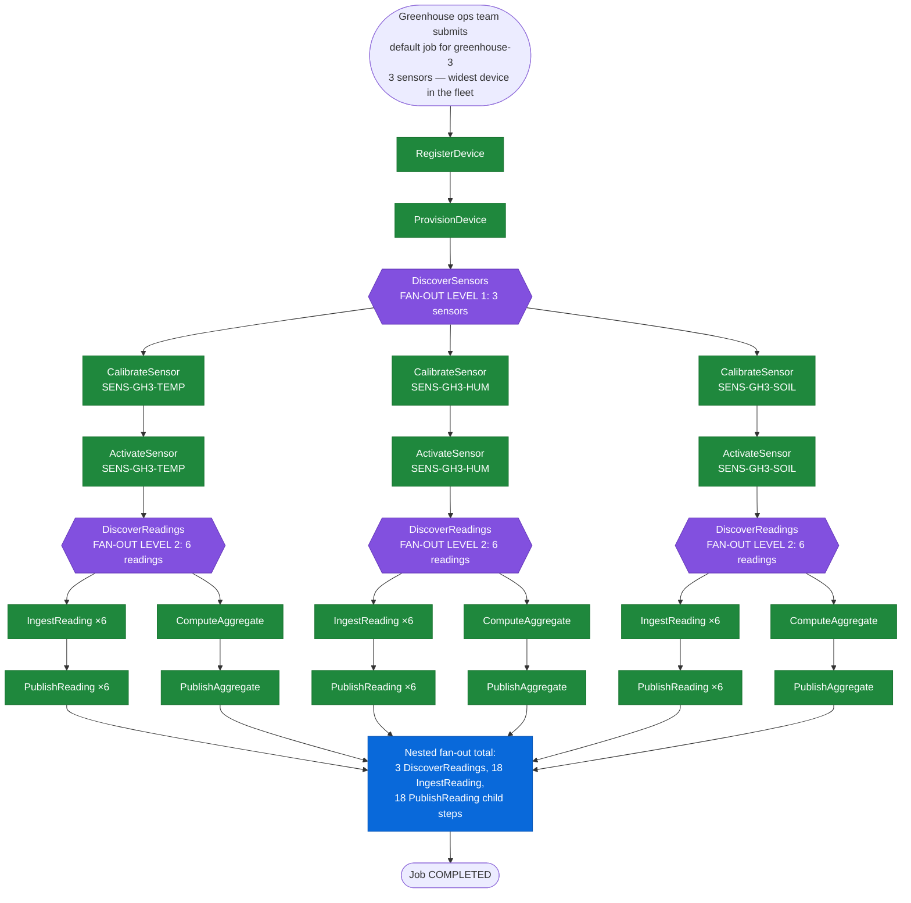

# SE-03: double fan-out

> **Demo pick.** This SE showcases the engine's widest nested fan-out in the
> greenhouse fleet: one device fanning out to 3 sensors, each of which fans
> out again to its own readings — 2 levels of fan-out from a single job.

## Setpoint Eval Metadata
**Category**: fan-out · **Duration**: ~40-90s (typical — the Timeout below is a generous poll-loop safety ceiling, not the expected runtime) · **Timeout**: 650s · **Isolation**: parallel-safe

## Scenario
```gherkin
Feature: iot-sensor-pipeline fans out twice — device to sensors, sensor to readings
  Scenario: greenhouse-3's 3 sensors each spawn their own reading fan-out
    Given greenhouse-3 is registered with 3 active sensors (temperature,
      humidity, soil_moisture), each with 6 seeded readings — the widest
      device in the greenhouse fleet
    When the greenhouse ops team submits a default iot-sensor-pipeline job
      for greenhouse-3, with deduplication disabled
    Then DiscoverSensors fans out into 3 CalibrateSensor and 3 ActivateSensor
      child steps — one per sensor
    And each sensor's DiscoverReadings step independently triggers its OWN
      nested fan-out: 3 DiscoverReadings steps in total, spawning 18
      IngestReading and 18 PublishReading child steps combined (6 per sensor)
    And every PublishReading child step reaches COMPLETED
    Then the job reaches COMPLETED status
```

## Architecture


## Test Data
Owned by this SE (`source-db/SEED-REGISTRY.md` → `SE-03-double-fan-out`):
the `greenhouse-3` device and its 3 sensors — deliberately wider than every
other device in the fleet (literal rows from
`source-db/init-scripts/01-schema-and-seed.sql`):
```sql
INSERT INTO dbo.devices (device_id, name, type, location, firmware_version, status, registered_at, last_seen_at) VALUES
('greenhouse-3', 'Greenhouse 3 — Herbs', 'multi-sensor', 'South Field - Bay 1', 'v3.1.0', 'active', '2025-02-10 08:00:00', '2025-06-20 09:15:00');

-- greenhouse-3 (SE-03 double-fan-out — 3 sensors, wider fan-out breadth)
INSERT INTO dbo.sensors (sensor_id, device_id, type, unit, min_threshold, max_threshold, calibrated_at, status) VALUES
('SENS-GH3-TEMP', 'greenhouse-3', 'temperature',   'celsius', 15.00, 30.00, '2025-06-01 11:00:00', 'active'),
('SENS-GH3-HUM',  'greenhouse-3', 'humidity',      'percent', 45.00, 85.00, '2025-06-01 11:15:00', 'active'),
('SENS-GH3-SOIL', 'greenhouse-3', 'soil_moisture', 'percent', 20.00, 80.00, '2025-06-01 11:30:00', 'active');
```
Each of the 3 sensors owns 6 seeded rows in `dbo.readings`
(`SENS-GH3-TEMP`, `SENS-GH3-HUM`, `SENS-GH3-SOIL` — 18 rows total,
`# … full 18 rows elided — see source-db/init-scripts/01-schema-and-seed.sql`),
which is what `DiscoverReadings` (`select readingId … where sensorId`) turns
into the 18 `IngestReading`/`PublishReading` child steps in the diagram above.

## Payload
The literal request body `initiate_job` POSTs to
`/api/v1/workflows/iot-sensor-pipeline/jobs` (from `test.sh`):
```json
{
  "enableDeduplication": false,
  "variant": "default",
  "payload": {
    "deviceId": "greenhouse-3",
    "entityId": "greenhouse-3"
  },
  "testOptions": {
    "RegisterDevice":      { "simDelay": 300 },
    "ProvisionDevice":     { "simDelay": 300, "ackDelay": 1000 },
    "DiscoverSensors":     { "simDelay": 300 },
    "CalibrateSensor":     { "simDelay": 300 },
    "ActivateSensor":      { "simDelay": 300, "ackDelay": 1000 },
    "DiscoverReadings":    { "simDelay": 300 },
    "IngestReading":       { "simDelay": 300 },
    "PublishReading":      { "simDelay": 300, "ackDelay": 1000 },
    "EvaluateAlert":       { "simDelay": 300 },
    "DispatchAlert":       { "simDelay": 300, "ackDelay": 1000 },
    "ComputeAggregate":    { "simDelay": 300 },
    "PublishAggregate":    { "simDelay": 300, "ackDelay": 1000 }
  }
}
```

## Artifacts
Expected fan-out counts (derived from the 3-sensor, 18-reading seed above —
`test.sh` asserts each is `> 0`, then polls `PublishReading` completions up
to the seeded total):
```
CalibrateSensor  child steps  → 3   (one per sensor)
ActivateSensor   child steps  → 3   (one per sensor)
DiscoverReadings steps        → 3   (one per sensor — nested fan-out trigger)
IngestReading    child steps  → 18  (6 per sensor × 3 sensors)
PublishReading   child steps  → 18  (6 per sensor × 3 sensors), all COMPLETED
```
Expected verification targets (from `test.sh`'s `verify_job_status` /
`verify_step_status` calls):
```
verify_job_status                       → "COMPLETED"
verify_step_status "DiscoverSensors"    → "COMPLETED"
```

## Assertions
<!-- one checkbox per verification call in test.sh — keep 1:1 -->
- [ ] Test 1: Job status should be COMPLETED
- [ ] Test 2: DiscoverSensors should be COMPLETED
- [ ] Test 3: At least 1 CalibrateSensor child step should exist
- [ ] Test 4: At least 1 DiscoverReadings step should exist (nested fan-out trigger)
- [ ] Test 5: At least 1 IngestReading child step should exist (nested children)
- [ ] Test 6: All PublishReading steps completed (retried up to 15× for the race condition)

## Run
```bash
bash workflows/iot-sensor-pipeline/setpoint-evals/run-all.sh --se 03
```
