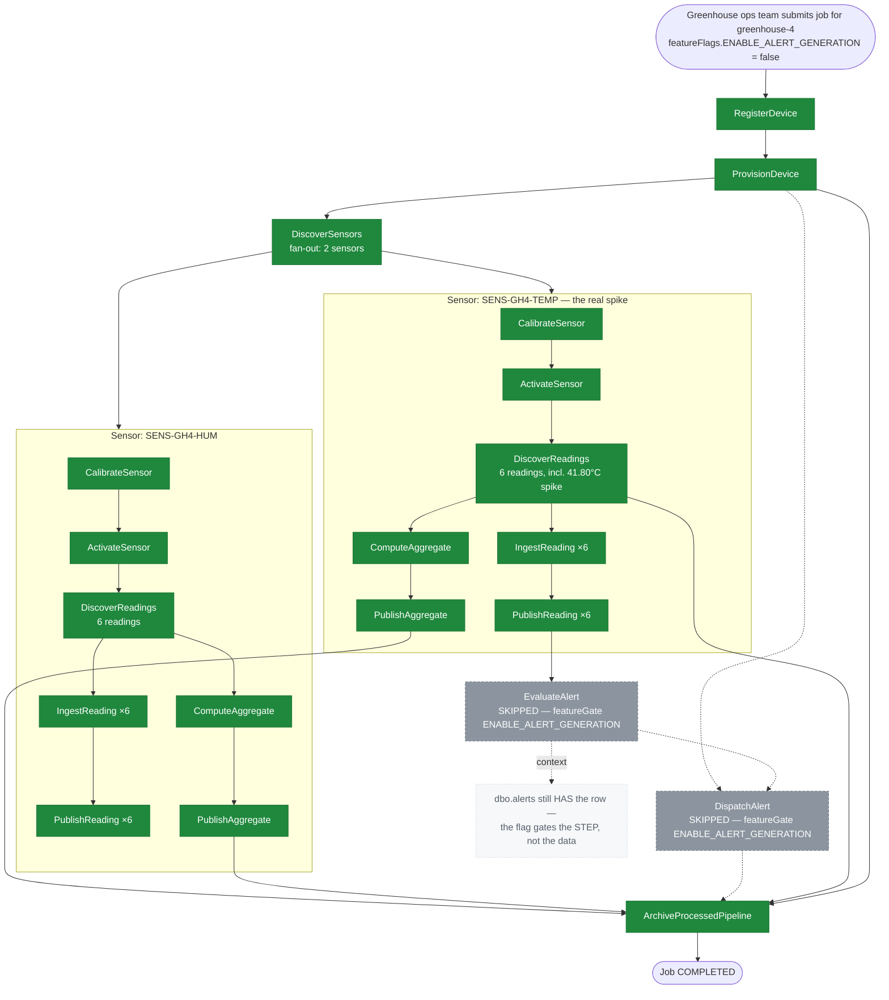

# SE-04: feature flag disable alerts

## Setpoint Eval Metadata
**Category**: feature-flags · **Duration**: ~25-55s (typical — the Timeout below is a generous poll-loop safety ceiling, not the expected runtime) · **Timeout**: 930s · **Isolation**: parallel-safe

## Scenario
```gherkin
Feature: iot-sensor-pipeline honors the ENABLE_ALERT_GENERATION feature flag
  Scenario: a real heat-spike alert is suppressed when alert generation is disabled
    Given greenhouse-4's SENS-GH4-TEMP sensor genuinely spikes to 41.80°C —
      past its 35.00°C max threshold — producing 1 real row in dbo.alerts
    When the greenhouse ops team submits a default iot-sensor-pipeline job
      for greenhouse-4 with featureFlags.ENABLE_ALERT_GENERATION set to false
    Then RegisterDevice, ProvisionDevice and DiscoverSensors complete normally
    And EvaluateAlert and DispatchAlert are SKIPPED by the feature gate —
      despite the alert being real, not absent
    And ComputeAggregate and PublishAggregate proceed normally, unaffected
      by the alert flag
    Then the job still reaches COMPLETED status
```

## Architecture


## Test Data
Owned by this SE (`source-db/SEED-REGISTRY.md` → `SE-04-feature-flag-disable-alerts`):
the `greenhouse-4` device, its 2 sensors, and the ONE alert row in the whole
seed — the real spike this SE proves gets suppressed at the step level, not
the data level (literal rows from `source-db/init-scripts/01-schema-and-seed.sql`):
```sql
INSERT INTO dbo.devices (device_id, name, type, location, firmware_version, status, registered_at, last_seen_at) VALUES
('greenhouse-4', 'Greenhouse 4 — Orchids', 'multi-sensor', 'South Field - Bay 2', 'v3.1.0', 'active', '2025-02-15 08:00:00', '2025-06-20 09:15:00');

-- greenhouse-4 (SE-04 feature-flag-disable-alerts — temp sensor spikes)
INSERT INTO dbo.sensors (sensor_id, device_id, type, unit, min_threshold, max_threshold, calibrated_at, status) VALUES
('SENS-GH4-TEMP', 'greenhouse-4', 'temperature', 'celsius', 15.00, 35.00, '2025-06-01 12:00:00', 'active'),
('SENS-GH4-HUM',  'greenhouse-4', 'humidity',    'percent', 40.00, 80.00, '2025-06-01 12:15:00', 'active');

-- Alerts (1 record — the greenhouse-4 heat spike; the ONLY row in dbo.alerts)
INSERT INTO dbo.alerts (device_id, sensor_id, severity, message, triggered_at, acknowledged_at, resolved_at) VALUES
('greenhouse-4', 'SENS-GH4-TEMP', 'critical', 'Temperature spike: 41.80°C exceeds max threshold 35.00°C — orchids at risk', '2025-06-20 09:15:00', NULL, NULL);
```
The final `SENS-GH4-TEMP` reading is `41.80` at `2025-06-20 09:15:00` —
exactly the value the alert message cites.

## Payload
The literal request body `initiate_job` POSTs to
`/api/v1/workflows/iot-sensor-pipeline/jobs` (from `test.sh`):
```json
{
  "enableDeduplication": false,
  "variant": "default",
  "payload": {
    "deviceId": "greenhouse-4",
    "entityId": "greenhouse-4"
  },
  "featureFlags": {
    "ENABLE_ALERT_GENERATION": false
  },
  "testOptions": {
    "RegisterDevice":      { "simDelay": 300 },
    "ProvisionDevice":     { "simDelay": 300, "ackDelay": 1000 },
    "DiscoverSensors":     { "simDelay": 300 },
    "CalibrateSensor":     { "simDelay": 300 },
    "ActivateSensor":      { "simDelay": 300, "ackDelay": 1000 },
    "DiscoverReadings":    { "simDelay": 300 },
    "IngestReading":       { "simDelay": 300 },
    "PublishReading":      { "simDelay": 300, "ackDelay": 1000 },
    "ComputeAggregate":    { "simDelay": 300 },
    "PublishAggregate":    { "simDelay": 300, "ackDelay": 1000 }
  }
}
```
Note: `testOptions` intentionally omits `EvaluateAlert`/`DispatchAlert` —
they are never expected to run.

## Artifacts
Expected verification targets (from `test.sh`'s checks — alert steps must
either not exist in the job's step list at all, or exist as `skipped`):
```
verify_job_status                       → "COMPLETED"
verify_step_status "RegisterDevice"     → "COMPLETED"
verify_step_status "ProvisionDevice"    → "COMPLETED"
verify_step_status "DiscoverSensors"    → "COMPLETED"
EvaluateAlert: count == 0  OR  status == "skipped"
DispatchAlert: count == 0  OR  status == "skipped"
```

## Assertions
<!-- one checkbox per verification call in test.sh — keep 1:1 -->
- [ ] Test 1: Job status should be COMPLETED
- [ ] Test 2: Core pipeline steps should be COMPLETED (RegisterDevice)
- [ ] Test 2: Core pipeline steps should be COMPLETED (ProvisionDevice)
- [ ] Test 2: Core pipeline steps should be COMPLETED (DiscoverSensors)
- [ ] Test 3: EvaluateAlert correctly skipped/absent
- [ ] Test 3: DispatchAlert correctly skipped/absent

## Run
```bash
bash workflows/iot-sensor-pipeline/setpoint-evals/run-all.sh --se 04
```
