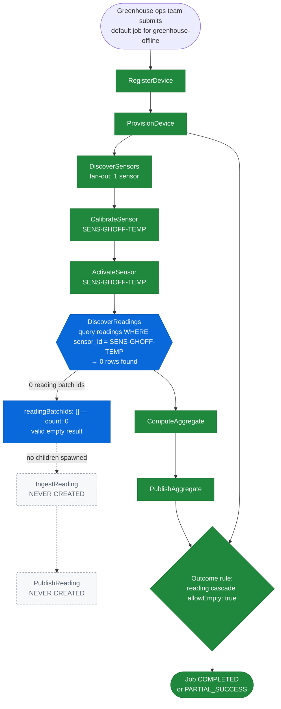

# SE-05: empty discovery

## Setpoint Eval Metadata
**Category**: edge-case · **Duration**: ~20-40s (typical — the Timeout below is a generous poll-loop safety ceiling, not the expected runtime) · **Timeout**: 630s · **Isolation**: parallel-safe

## Scenario
```gherkin
Feature: iot-sensor-pipeline handles a sensor with zero readings gracefully
  Scenario: greenhouse-offline's one sensor has never reported a reading
    Given greenhouse-offline is registered with exactly 1 active sensor
      (SENS-GHOFF-TEMP) that owns ZERO rows in dbo.readings — a real sensor,
      not a device with no sensors at all
    When the greenhouse ops team submits a default iot-sensor-pipeline job
      for greenhouse-offline
    Then DiscoverSensors fans out to the single sensor as normal
    And DiscoverReadings runs for that sensor and returns 0 reading batch
      ids — a valid empty result, not a failure
    And no IngestReading or PublishReading child steps are ever created
    Then the job reaches a terminal state of COMPLETED or PARTIAL_SUCCESS
      (the reading cascade is allowed to be empty)
```

## Architecture


## Test Data
Owned by this SE (`source-db/SEED-REGISTRY.md` → `SE-05-empty-discovery`):
the `greenhouse-offline` device and its single, reading-less sensor (literal
rows from `source-db/init-scripts/01-schema-and-seed.sql`). Per
`SEED-REGISTRY.md`'s "Worker behavior notes", this MUST stay a
sensor-with-zero-readings, not a device-with-zero-sensors — a device with no
sensors never even creates a `DiscoverReadings` step, which would prove a
different (outer fan-out) empty case, not this one:
```sql
INSERT INTO dbo.devices (device_id, name, type, location, firmware_version, status, registered_at, last_seen_at) VALUES
('greenhouse-offline', 'Greenhouse Offline — Spare Bay', 'multi-sensor', 'Storage Yard - Unwired', 'v1.0.0', 'active', '2025-03-01 00:00:00', NULL);

-- greenhouse-offline (SE-05 empty-discovery): ONE sensor, deliberately ZERO
-- readings — this exercises the NESTED fan-out's empty case (DiscoverReadings
-- returns 0 for an otherwise-real sensor), not the outer device->sensor one.
INSERT INTO dbo.sensors (sensor_id, device_id, type, unit, min_threshold, max_threshold, calibrated_at, status) VALUES
('SENS-GHOFF-TEMP', 'greenhouse-offline', 'temperature', 'celsius', 15.00, 35.00, NULL, 'active');
```
No `dbo.readings` rows reference `SENS-GHOFF-TEMP` anywhere in the seed file.

## Payload
The literal request body `initiate_job` POSTs to
`/api/v1/workflows/iot-sensor-pipeline/jobs` (from `test.sh`):
```json
{
  "variant": "default",
  "payload": {
    "deviceId": "greenhouse-offline",
    "entityId": "greenhouse-offline"
  },
  "testOptions": {
    "RegisterDevice":      { "simDelay": 300 },
    "ProvisionDevice":     { "simDelay": 300, "ackDelay": 1000 },
    "DiscoverSensors":     { "simDelay": 300 },
    "CalibrateSensor":     { "simDelay": 300 },
    "ActivateSensor":      { "simDelay": 300, "ackDelay": 1000 },
    "DiscoverReadings":    { "simDelay": 300 },
    "EvaluateAlert":       { "simDelay": 300 },
    "DispatchAlert":       { "simDelay": 300, "ackDelay": 1000 },
    "ComputeAggregate":    { "simDelay": 300 },
    "PublishAggregate":    { "simDelay": 300, "ackDelay": 1000 }
  }
}
```

## Artifacts
The discovery result `workers/src/handlers/discover-readings.ts` sends back
to the orchestrator for `SENS-GHOFF-TEMP` (lightweight query, `select
readingId … where sensorId`, 0 matching rows):
```json
{ "readingBatchIds": [], "count": 0 }
```
Expected verification targets (from `test.sh`'s checks):
```
extract_job_status                         → "completed" OR "partial_success"
verify_step_status "DiscoverSensors"       → "COMPLETED"
IngestReading   child step count           → 0
PublishReading  child step count           → 0
extract_step_status "DiscoverReadings"     → "completed" (with 0 results)
```

## Assertions
<!-- one checkbox per verification call in test.sh — keep 1:1 -->
- [ ] Test 1: Job should reach a terminal state (COMPLETED or PARTIAL_SUCCESS)
- [ ] Test 2: DiscoverSensors should be COMPLETED
- [ ] Test 3: No IngestReading child steps should exist (empty discovery)
- [ ] Test 3: No PublishReading child steps should exist (empty discovery)
- [ ] Test 4: DiscoverReadings should exist and be COMPLETED (even with 0 results)

## Run
```bash
bash workflows/iot-sensor-pipeline/setpoint-evals/run-all.sh --se 05
```
