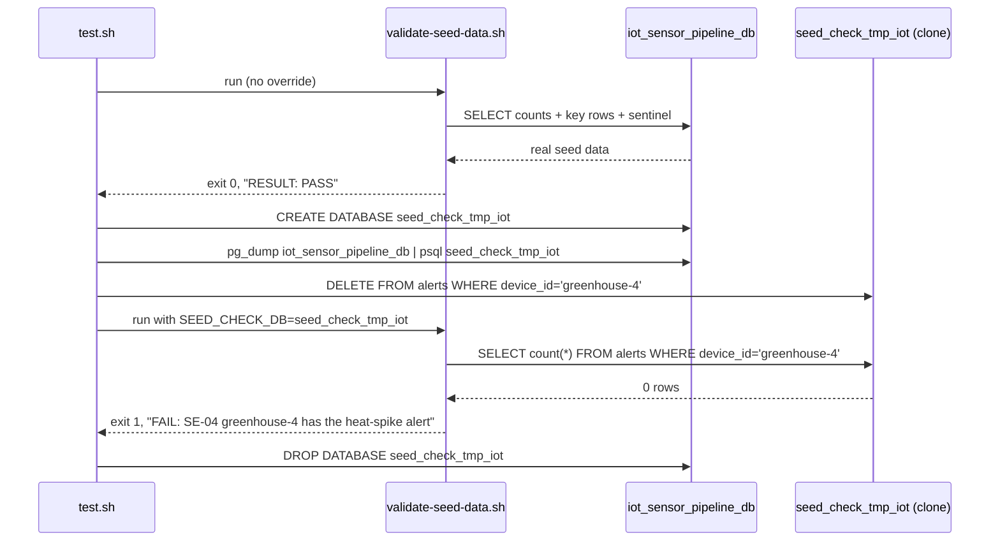

# SE-06: seed data integrity
**Category**: data-integrity · **Duration**: ~15s · **Timeout**: 120s

## Scenario
```gherkin
Feature: iot-sensor-pipeline seed data matches SEED-REGISTRY.md
  Scenario: the validator passes against the real seed and catches a deleted row
    Given the iot-sensor-pipeline source DB seeded from 01-schema-and-seed.sql
    When source-db/validate-seed-data.sh runs against the live database
    Then it exits 0 and reports RESULT: PASS
    And when the same validator is pointed at a throwaway clone with SE-04's
      heat-spike alert (device_id='greenhouse-4') deleted
    Then it exits 1 and names that exact row in a FAIL line
```

## Architecture


## Artifacts

### Seed / fixture
The row deleted for the negative control (from `01-schema-and-seed.sql`,
`SEED-REGISTRY.md` "SE-04-feature-flag-disable-alerts" ownership row):
```sql
INSERT INTO dbo.alerts (device_id, sensor_id, severity, message, triggered_at, acknowledged_at, resolved_at) VALUES
('greenhouse-4', 'SENS-GH4-TEMP', 'critical', 'Temperature spike: 41.80°C exceeds max threshold 35.00°C — orchids at risk', '2025-06-20 09:15:00', NULL, NULL);
```

### Input / payload
The clone-targeting override the validator already supports (from
`source-db/validate-seed-data.sh`):
```bash
SEED_CHECK_DB=seed_check_tmp_iot bash source-db/validate-seed-data.sh
```

### Expected output
Real seed run (excerpt):
```
PASS: devices count = 5
...
RESULT: PASS — seed matches SEED-REGISTRY.md
```
Clone run after the delete (excerpt):
```
FAIL: SE-04 greenhouse-4 has the heat-spike alert = '0' (expected '1')
...
RESULT: FAIL — seed drifted from SEED-REGISTRY.md (see FAIL lines above)
```

## Assertions
<!-- one checkbox per ck/ck_eq/ck_has call in test.sh — keep 1:1 -->
- [ ] validator exits 0 against the real, untouched seed
- [ ] validator reports PASS against the real seed
- [ ] clone database created for the negative control
- [ ] validator exits 1 against the clone with a deleted row (RED-proof)
- [ ] validator names the deleted row's FAIL in its own output

## Run
```bash
bash workflows/iot-sensor-pipeline/setpoint-evals/run-all.sh --se 06
```

Guards against the failure mode this whole Phase 2b closes: seed rows
silently drifting out of sync with what each SE's `test.sh` assumes (shared/
renamed/deleted rows), which reads green right up until the row an SE depends
on disappears. This SE proves the validator itself would catch that — not
just that it exists.
