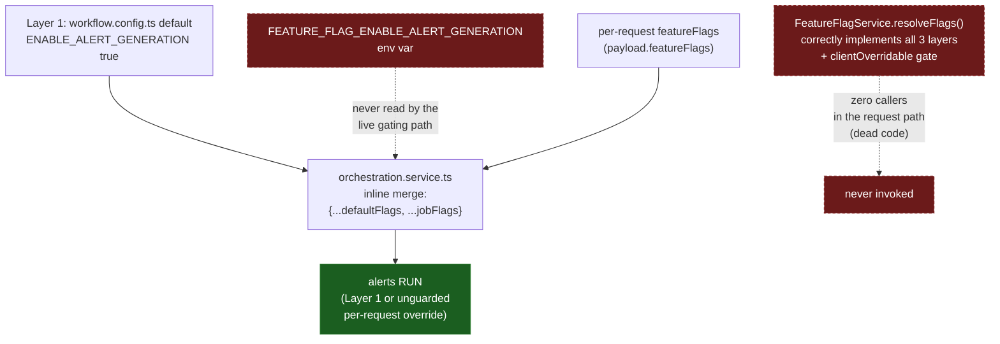

# SE-07: feature flag three-layer resolution [XFAIL]

## Setpoint Eval Metadata
**Category**: feature-flags · **Duration**: ~90-150s (2 orchestrator recreates + 3 jobs) · **Timeout**: 700s · **Isolation**: destructive
**Expected outcome:** EXPECTED-FAIL

**Why XFAIL, not descoped:** `CLAUDE.md` § "Feature Flags" documents a
3-layer resolution contract (default < env var < per-request, gated by
`clientOverridable`). The live step-gating code only implements 2 of the 3
layers — see Artifacts below. This SE drives the FULL documented contract
so the gap stays visible (a red anchor a future fix flips to green) instead
of quietly testing only what already works.

**DESTRUCTIVE**: this SE recreates the shared `dtm-orchestrator` container
twice (to set/clear a real env var — no runtime override endpoint exists)
— it MUST run alone, never concurrently with any other SE across any
workflow. `run-all.sh` sequences `**Isolation**: destructive` SEs after all
`parallel-safe` ones for exactly this reason. Restores `.env` and the
container on exit via a trap, even on failure.

## Scenario
```gherkin
Feature: iot-sensor-pipeline feature flags — 3-layer resolution
  Scenario: default -> env var -> per-request, in strict priority order
    Given greenhouse-4 (its real heat-spike alert row)

    When no env var is set and no per-request override is sent
    Then ENABLE_ALERT_GENERATION resolves to its workflow default (true)
    And EvaluateAlert/DispatchAlert RUN

    When FEATURE_FLAG_ENABLE_ALERT_GENERATION=false is set on the
      orchestrator (Layer 2) and no per-request override is sent
    Then the env var SHOULD override the default
    And EvaluateAlert/DispatchAlert SHOULD be SKIPPED
    But they are NOT — the live gating path never reads this env var
      (this is the failing assertion that anchors the XFAIL)

    When the SAME env var is still false, but the request carries
      featureFlags.ENABLE_ALERT_GENERATION=true (Layer 3)
    Then the per-request override is applied (unguarded — no
      clientOverridable/ENABLE_REQUEST_FEATURE_FLAGS enforcement exists in
      the live path either)
    And EvaluateAlert/DispatchAlert RUN
```

## Architecture


## Test Data
Reuses `greenhouse-4` (SE-04's dedicated device — its `SENS-GH4-TEMP`
sensor genuinely spikes past `max_threshold`, producing a real alert row),
read-only, distinguished by its own `entityId`s.

## Payload
Layer 1/2 (no per-request override):
```json
{ "variant": "default", "enableDeduplication": false, "payload": { "deviceId": "greenhouse-4", "entityId": "..." } }
```

Layer 3 (per-request override):
```json
{ "variant": "default", "enableDeduplication": false, "payload": { "deviceId": "greenhouse-4", "entityId": "..." }, "featureFlags": { "ENABLE_ALERT_GENERATION": true } }
```

## Artifacts
Two findings surfaced while building this SE, both left as **documentation,
not silent production fixes** — this is a public example repo and the
correct fix is a genuine feature implementation, not a one-liner:

1. **`feature-flag.service.ts`'s `toScreamingSnake()` had a real bug**
   (mangled already-SCREAMING_SNAKE_CASE keys like `ENABLE_ALERT_GENERATION`
   into `_E_N_A_B_L_E_..._`). It was fixed and unit-tested, then **reverted**
   once a repo-wide grep for `resolveFlags`/`getFlag`/`getBooleanFlag` showed
   `FeatureFlagService` has zero callers outside its own file and DI
   registration — it is never invoked in the request/orchestration path, so
   the fix changed no observable behavior. See the revert commit for detail.
2. **The actual step-gating logic** (`orchestration.service.ts`, "1b.
   Feature gate" block, ~line 690) does its own inline
   `{ ...defaultFlags, ...jobFlags }` merge: Layer 1 (workflow defaults) and
   Layer 3 (per-request), but **no Layer 2** (never reads
   `process.env.FEATURE_FLAG_*`) and **no `clientOverridable` /
   `ENABLE_REQUEST_FEATURE_FLAGS` enforcement** (that logic exists only
   inside the dead `FeatureFlagService`) — any per-request flag key is
   applied unconditionally, allowlisted or not.

Net: the documented 3-layer, allowlist-gated contract is actually a
2-layer, unguarded one in the live code path. Tracked in
`DIFFICULTIES-LOG.md`; decision needed on whether to implement the missing
layer/gate for real (wiring `orchestration.service.ts` to call
`FeatureFlagService.resolveFlags()`) or fix the docs to describe the
2-layer reality — out of scope for this SE lane.

## Assertions
<!-- one checkbox per verify/if call in test.sh — keep 1:1 -->
- [ ] Layer 1 (default, no overrides): alerts RUN
- [ ] Layer 2 (env var false, no per-request): alerts SKIPPED — **currently fails; this is the XFAIL anchor**
- [ ] Layer 3 (env var false, per-request true): alerts RUN

## Run
```bash
bash workflows/iot-sensor-pipeline/setpoint-evals/run-all.sh --se 07
```

Expected verdict: `XFAIL` (2/3 sub-assertions pass, Layer 2 fails as
anchored). A verdict of `UPASS` means Layer 2 started working — flip this
README's `**Expected outcome:**` line and remove the XFAIL framing when
that happens.
