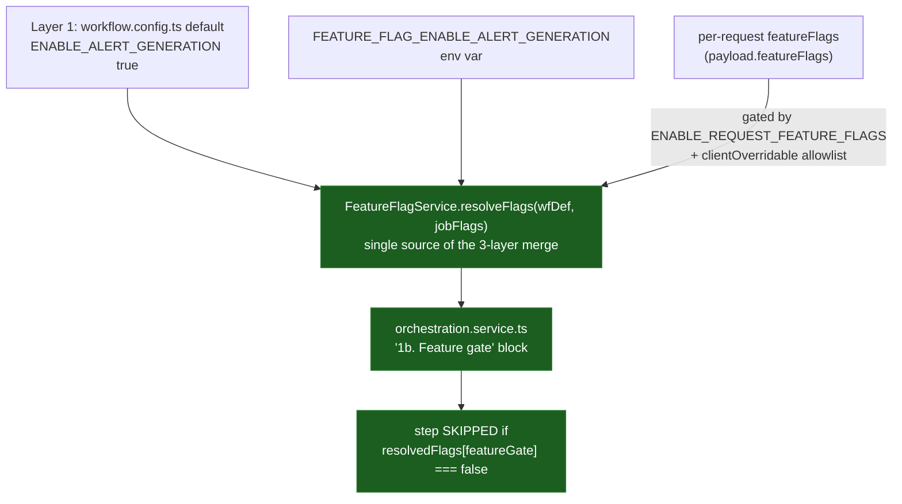

# SE-07: feature flag three-layer resolution

## Setpoint Eval Metadata
**Category**: feature-flags · **Duration**: ~120-180s (2 orchestrator recreates + 4 jobs) · **Timeout**: 700s · **Isolation**: destructive

**DESTRUCTIVE**: this SE recreates the shared `dtm-orchestrator` container
twice (to set/clear a real env var — no runtime override endpoint exists)
— it MUST run alone, never concurrently with any other SE across any
workflow. `run-all.sh` sequences `**Isolation**: destructive` SEs after all
`parallel-safe` ones for exactly this reason. Restores `.env` and the
container on exit via a trap, even on failure.

## Scenario
```gherkin
Feature: iot-sensor-pipeline feature flags — 3-layer resolution
  Scenario: default -> env var -> per-request, in strict priority order
    Given greenhouse-4 (its real heat-spike alert row)

    When no env var is set and no per-request override is sent
    Then ENABLE_ALERT_GENERATION resolves to its workflow default (true)
    And EvaluateAlert/DispatchAlert RUN

    When FEATURE_FLAG_ENABLE_ALERT_GENERATION=false is set on the
      orchestrator (Layer 2) and no per-request override is sent
    Then the env var overrides the default
    And EvaluateAlert/DispatchAlert are SKIPPED

    When the SAME env var is still false, but the request carries
      featureFlags.ENABLE_ALERT_GENERATION=true (Layer 3, allowlisted)
    Then the per-request override is applied
    And EvaluateAlert/DispatchAlert RUN

  Scenario: non-allowlisted per-request flag has no effect
    Given greenhouse-1
    When the request carries featureFlags.ENABLE_CASCADE_FK_INJECTION=false
      (a real default flag, but NOT in clientOverridable)
    Then the job still completes normally
    And the orchestrator logs that the override was rejected as
      non-client-overridable
```

## Architecture


## Test Data
Reuses `greenhouse-4` (SE-04's dedicated device — its `SENS-GH4-TEMP`
sensor genuinely spikes past `max_threshold`, producing a real alert row),
read-only, distinguished by its own `entityId`s. The GATE sub-test uses
`greenhouse-1` (any healthy device works — it doesn't need an alert to
fire, only to complete normally).

## Payload
Layer 1/2 (no per-request override):
```json
{ "variant": "default", "enableDeduplication": false, "payload": { "deviceId": "greenhouse-4", "entityId": "..." } }
```

Layer 3 (per-request override, allowlisted key):
```json
{ "variant": "default", "enableDeduplication": false, "payload": { "deviceId": "greenhouse-4", "entityId": "..." }, "featureFlags": { "ENABLE_ALERT_GENERATION": true } }
```

GATE (per-request override, NON-allowlisted key):
```json
{ "variant": "default", "enableDeduplication": false, "payload": { "deviceId": "greenhouse-1", "entityId": "..." }, "featureFlags": { "ENABLE_CASCADE_FK_INJECTION": false } }
```

## Artifacts
Fixed as part of `DIFFICULTIES-LOG.md`'s T1 finding (feature-flag 3-layer
contract vs. 2-layer/unguarded live code):

1. `orchestration.service.ts`'s "1b. Feature gate" block now calls
   `FeatureFlagService.resolveFlags(wfDef, jobFlags)` instead of its own
   inline `{ ...defaultFlags, ...jobFlags }` merge — the service (already
   correctly implementing all three layers + the allowlist gate) is now
   the single source of the merge, with zero duplicated logic.
2. `toScreamingSnake()`'s SCREAMING_SNAKE_CASE-key bug (previously found
   and reverted as a fix to dead code — see git history) is re-applied:
   idempotent for keys already in SCREAMING_SNAKE_CASE (all three shipped
   workflows' `featureFlags.defaults` keys are), so `FEATURE_FLAG_*` env
   vars now actually match.
3. `ENABLE_REQUEST_FEATURE_FLAGS=true` was added to `.env.example` — it was
   already documented in `CLAUDE.md` as the dev default but missing from
   the template, which would have silently closed the Layer 3 gate the
   moment it went live.

Net: the documented 3-layer, allowlist-gated contract now matches the live
code path. Unit tests for the layering/allowlist logic live in
`services/orchestrator/src/workflow-loader/feature-flag.service.spec.ts`.

The GATE sub-test's non-allowlisted key (`ENABLE_CASCADE_FK_INJECTION`)
isn't any step's `featureGate` in this workflow, so there's no step-skip
side effect to observe from the override being rejected — "job still
completes" alone would be vacuous (true regardless of enforcement). What
IS enforcement-specific: the orchestrator log line the allowlist check
emits only when it rejects a key, asserted directly via `docker logs`.

## Assertions
<!-- one checkbox per verify/if call in test.sh — keep 1:1 -->
- [ ] Layer 1 (default, no overrides): alerts RUN
- [ ] Layer 2 (env var false, no per-request): alerts SKIPPED
- [ ] Layer 3 (env var false, per-request true, allowlisted): alerts RUN
- [ ] GATE (non-allowlisted per-request override): job still COMPLETES normally
- [ ] GATE: orchestrator log confirms the allowlist check rejected the override

## Run
```bash
bash workflows/iot-sensor-pipeline/setpoint-evals/run-all.sh --se 07
```

Expected verdict: `PASS` (5/5 sub-assertions).
