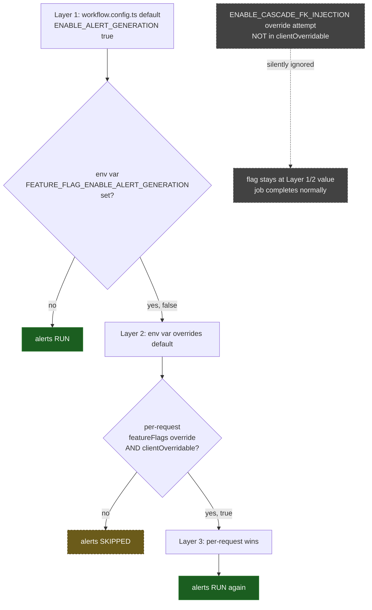

# SE-07: feature flag three-layer resolution

## Setpoint Eval Metadata
**Category**: feature-flags · **Duration**: ~90-150s (3 orchestrator recreates + 4 jobs) · **Timeout**: 700s · **Isolation**: destructive

**DESTRUCTIVE**: this SE recreates the shared `dtm-orchestrator` container
twice (to set/clear a real env var — no runtime override endpoint exists,
which is exactly what Layer 3 works around) — it MUST run alone, never
concurrently with any other SE across any workflow. `run-all.sh` sequences
`**Isolation**: destructive` SEs after all `parallel-safe` ones for exactly
this reason. Restores `.env` and the container on exit via a trap, even on
failure.

## Scenario
```gherkin
Feature: iot-sensor-pipeline feature flags — 3-layer resolution
  Scenario: default -> env var -> per-request, in strict priority order
    Given greenhouse-4 (its real heat-spike alert row)

    When no env var is set and no per-request override is sent
    Then ENABLE_ALERT_GENERATION resolves to its workflow default (true)
    And EvaluateAlert/DispatchAlert RUN

    When FEATURE_FLAG_ENABLE_ALERT_GENERATION=false is set on the
      orchestrator (Layer 2) and no per-request override is sent
    Then the env var overrides the default
    And EvaluateAlert/DispatchAlert are SKIPPED

    When the SAME env var is still false, but the request carries
      featureFlags.ENABLE_ALERT_GENERATION=true (Layer 3)
    Then the per-request override wins over the env var
    And EvaluateAlert/DispatchAlert RUN again

  Scenario: a non-clientOverridable flag override is silently ignored
    Given ENABLE_CASCADE_FK_INJECTION is NOT in iot's clientOverridable list
    When a request sends featureFlags.ENABLE_CASCADE_FK_INJECTION=false
    Then the override is ignored (logged as a warning server-side)
    And the job still completes normally
```

## Architecture


## Test Data
Reuses `greenhouse-4` (SE-04's dedicated device — its `SENS-GH4-TEMP` sensor
genuinely spikes past `max_threshold`, producing a real alert row) and
`greenhouse-1` (general happy-path device, used only for the gate check) —
both read-only, distinguished by their own `entityId`s.

## Payload
Layer 1/2 (no per-request override):
```json
{ "variant": "default", "enableDeduplication": false, "payload": { "deviceId": "greenhouse-4", "entityId": "..." } }
```

Layer 3 (per-request override):
```json
{ "variant": "default", "enableDeduplication": false, "payload": { "deviceId": "greenhouse-4", "entityId": "..." }, "featureFlags": { "ENABLE_ALERT_GENERATION": true } }
```

Gate (non-overridable flag attempt):
```json
{ "variant": "default", "enableDeduplication": false, "payload": { "deviceId": "greenhouse-1", "entityId": "..." }, "featureFlags": { "ENABLE_CASCADE_FK_INJECTION": false } }
```

## Artifacts
This SE was built alongside a real defect fix in
`services/orchestrator/src/workflow-loader/feature-flag.service.ts`:
`toScreamingSnake()` assumed camelCase flag keys
(`enableDeduplication` -> `ENABLE_DEDUPLICATION`) but iot's
`featureFlags.defaults` keys are ALREADY `SCREAMING_SNAKE_CASE`
(`ENABLE_ALERT_GENERATION`), and the old regex inserted `_` before every
already-uppercase letter — `FEATURE_FLAG_ENABLE_ALERT_GENERATION` never
matched, so Layer 2 was a silent no-op. Confirmed live before the fix: with
the env var set and no per-request override, `EvaluateAlert`/`DispatchAlert`
both completed instead of being skipped. Fixed (idempotent for both key
shapes) and unit-tested in `feature-flag.service.spec.ts` (7 tests, all 3
layers + priority order); this SE is the live end-to-end proof on top of
that unit coverage.

## Assertions
<!-- one checkbox per verify/if call in test.sh — keep 1:1 -->
- [ ] Layer 1 (default, no overrides): alerts RUN
- [ ] Layer 2 (env var false, no per-request): alerts SKIPPED
- [ ] Layer 3 (env var false, per-request true): alerts RUN again
- [ ] Gate: non-overridable flag attempt is ignored, job still COMPLETES

## Run
```bash
bash workflows/iot-sensor-pipeline/setpoint-evals/run-all.sh --se 07
```

Without this SE (and without the fix it's built on), Layer 2 of the
documented 3-layer feature-flag contract (`CLAUDE.md` § "Feature Flags") was
completely non-functional for every workflow whose flag keys are already
SCREAMING_SNAKE_CASE — a production env-var override would have silently
done nothing.
