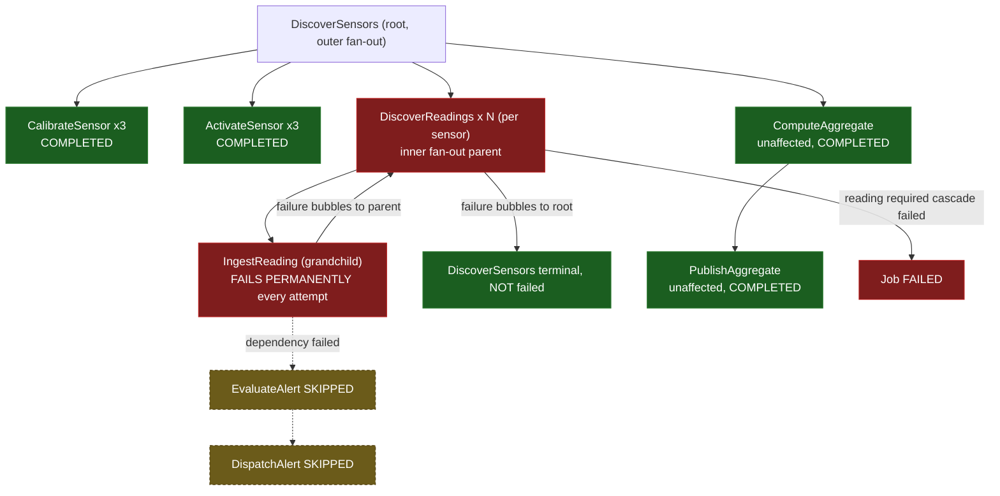

# SE-08: nested fan-out partial failure

## Setpoint Eval Metadata
**Category**: fan-out · **Duration**: ~40-90s (typical — the Timeout below is a generous poll-loop safety ceiling, not the expected runtime) · **Timeout**: 930s · **Isolation**: parallel-safe

## Scenario
```gherkin
Feature: iot-sensor-pipeline nested fan-out failure aggregation
  Scenario: a grandchild-level failure aggregates through both fan-out levels
    Given greenhouse-3 (3 sensors, each with real readings)
    When IngestReading is forced to fail on every attempt for every reading
    Then IngestReading (the grandchild) fails
    And DiscoverReadings (its parent, one per sensor) itself ends FAILED —
      not stuck forever waiting for children
    And DiscoverSensors (the ROOT discovery, one level further up) still
      reaches a terminal, non-failed state — the outer level absorbs the
      inner failure instead of failing wholesale
    And EvaluateAlert/DispatchAlert are SKIPPED (they depend on reading data)
    But CalibrateSensor/ActivateSensor (sensor-level siblings) remain
      COMPLETED — unaffected by the nested reading-level failure
    And reading is a required cascade, so the job reaches FAILED
```

## Architecture


## Test Data
Reuses `greenhouse-3` — SE-03's dedicated device (3 sensors, real readings) —
read-only, distinguished by its own `entityId`:
```sql
('greenhouse-3', 'Greenhouse 3 — Herbs', 'multi-sensor', 'South Field - Bay 1', 'v3.1.0', 'active', '2025-02-10 08:00:00', '2025-06-20 09:15:00'),
```
```sql
('SENS-GH3-TEMP', 'greenhouse-3', 'temperature', 'celsius', 15.00, 30.00, '2025-06-01 11:00:00', 'active'),
('SENS-GH3-HUM',  'greenhouse-3', 'humidity',    'percent', 45.00, 85.00, '2025-06-01 11:15:00', 'active'),
('SENS-GH3-SOIL', 'greenhouse-3', 'soil_moisture','percent', 20.00, 80.00, '2025-06-01 11:30:00', 'active'),
```
The failure is entirely `testOptions.IngestReading.failOnAttempts` — no seed
row is missing or changed.

## Payload
```json
{
  "variant": "default",
  "enableDeduplication": false,
  "payload": { "deviceId": "greenhouse-3", "entityId": "greenhouse-3-nested-failure" },
  "testOptions": {
    "IngestReading": { "simDelay": 300, "failOnAttempts": [1, 2, 3] }
  }
}
```

## Artifacts
Live final counts captured while building this SE (`GET /jobs/:id`, grouped
by `stepNumber`):
```json
{
  "status": "failed",
  "failedCounts": [
    {"step": "DiscoverReadings", "count": 6},
    {"step": "IngestReading", "count": 36},
    {"step": "PublishReading", "count": 36}
  ],
  "skippedCounts": [
    {"step": "ArchiveProcessedPipeline", "count": 1},
    {"step": "DispatchAlert", "count": 1},
    {"step": "EvaluateAlert", "count": 1}
  ]
}
```
`PublishReading` fails on its own retries independently of `IngestReading` —
the same "Submit phase dispatched in parallel with Validate, not gated on
its success" shape order-processing's `SubmitLineItem` shows (see
order-processing SE-09's Artifacts section). `ComputeAggregate` /
`PublishAggregate` are absent from both failed/skipped lists — they run
independently of the ingest pipeline and complete regardless (`count: 0` is
a valid result, per `SEED-REGISTRY.md`'s "Worker behavior notes").

## Assertions
<!-- one checkbox per verify_*/if call in test.sh — keep 1:1 -->
- [ ] Job status is FAILED
- [ ] At least one IngestReading (grandchild) is FAILED
- [ ] At least one DiscoverReadings (inner fan-out parent) is FAILED — level 1 aggregation
- [ ] DiscoverSensors (outer fan-out root) is terminal and NOT failed — level 2 aggregation
- [ ] EvaluateAlert and DispatchAlert are both SKIPPED
- [ ] CalibrateSensor and ActivateSensor both remain COMPLETED (siblings unaffected)

## Run
```bash
bash workflows/iot-sensor-pipeline/setpoint-evals/run-all.sh --se 08
```

SE-03 only pins the happy path of the nested fan-out; without this SE,
nothing proves a grandchild-level failure actually bubbles up cleanly
through BOTH levels (rather than, say, leaving `DiscoverReadings` stuck in
`WAITING_FOR_CHILDREN` forever, or incorrectly failing the whole
`DiscoverSensors` root and losing the other two healthy sensors' results).
