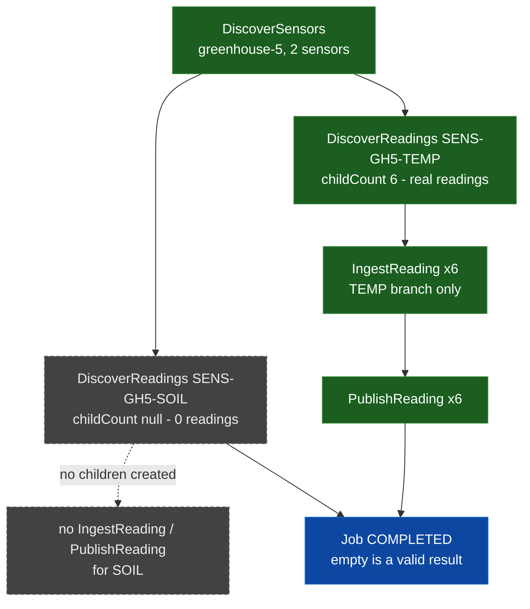

# SE-09: inner-empty discovery (mixed sensor set)

## Setpoint Eval Metadata
**Category**: edge-case · **Duration**: ~20-40s (typical — the Timeout below is a generous poll-loop safety ceiling, not the expected runtime) · **Timeout**: 630s · **Isolation**: parallel-safe

## Scenario
```gherkin
Feature: iot-sensor-pipeline inner-empty discovery — mixed sensor set
  Scenario: one sensor is empty while its sibling has real data
    Given greenhouse-5 has 2 sensors: SENS-GH5-TEMP (6 real readings) and
      SENS-GH5-SOIL (0 readings, deliberately)
    When a job is initiated for deviceId "greenhouse-5"
    Then DiscoverSensors fans out to both sensors
    And DiscoverReadings for SENS-GH5-SOIL completes with 0/null children —
      a valid empty result, not a failure
    And DiscoverReadings for SENS-GH5-TEMP completes with childCount=6
    And IngestReading/PublishReading children exist ONLY for the TEMP branch
    And the job reaches COMPLETED status
```

## Architecture


## Test Data
Rows dedicated to this SE (`source-db/SEED-REGISTRY.md`, "SE-09-inner-empty-discovery"):

| Table | Row(s) | Notes |
|---|---|---|
| devices | `greenhouse-5` | 2 sensors — mixed empty/non-empty |
| sensors | `SENS-GH5-TEMP` | 6 real readings |
| sensors | `SENS-GH5-SOIL` | **0** readings — the inner-empty case |

From `source-db/init-scripts/01-schema-and-seed.sql`:
```sql
('greenhouse-5', 'Greenhouse 5 — Citrus', 'multi-sensor', 'South Field - Bay 3', 'v3.1.0', 'active', '2025-08-01 08:00:00', '2025-08-01 09:15:00');
```
```sql
('SENS-GH5-TEMP', 'greenhouse-5', 'temperature',   'celsius', 15.00, 32.00, '2025-08-01 09:00:00', 'active'),
('SENS-GH5-SOIL', 'greenhouse-5', 'soil_moisture', 'percent', 20.00, 80.00, '2025-08-01 09:15:00', 'active');
```
Unlike `greenhouse-offline` (SE-05, whose ONLY sensor is empty — a
device-level "everything is empty" story), `greenhouse-5` mixes a real
sibling into the SAME fan-out set as the empty one, exercising a distinct
code path: partial emptiness WITHIN a fan-out, not total emptiness.

## Payload
```json
{
  "variant": "default",
  "enableDeduplication": false,
  "payload": { "deviceId": "greenhouse-5", "entityId": "greenhouse-5-inner-empty" }
}
```

## Artifacts
Live response captured while building this SE (`GET /jobs/:id`, filtered to
`DiscoverReadings`):
```json
{
  "status": "completed",
  "discoverReadings": [
    {"status": "completed", "childCount": null, "childItemId": "SENS-GH5-SOIL"},
    {"status": "completed", "childCount": 6,    "childItemId": "SENS-GH5-TEMP"}
  ],
  "ingestCounts": 12,
  "publishCounts": 12
}
```
(`DiscoverReadings` appears twice per sensor in the live response — a
pre-existing engine detail shared with SE-03/SE-08's evidence, not specific
to this SE; both entries per sensor carry the same `childItemId`/`childCount`,
so the assertions below use `select(...) | length >= 1`, not an exact count.)

## Assertions
<!-- one checkbox per verify/if call in test.sh — keep 1:1 -->
- [ ] Job status is COMPLETED
- [ ] DiscoverReadings for SENS-GH5-SOIL (empty sensor) is COMPLETED, not failed
- [ ] DiscoverReadings for SENS-GH5-SOIL reports childCount=null (the actual "0 readings" invariant)
- [ ] DiscoverReadings for SENS-GH5-TEMP (sibling WITH data) reports childCount=6
- [ ] At least one IngestReading child exists (from the TEMP sibling)
- [ ] DiscoverSensors is COMPLETED

## Run
```bash
bash workflows/iot-sensor-pipeline/setpoint-evals/run-all.sh --se 09
```

Without this SE, nothing proves the empty-discovery handling still works
correctly when it's ONE OF SEVERAL siblings rather than the device's only
sensor — a regression that special-cased "device has exactly one sensor and
it's empty" could pass SE-05 while still mishandling a mixed fan-out set
(e.g. one empty sensor accidentally suppressing or corrupting its siblings'
results).
