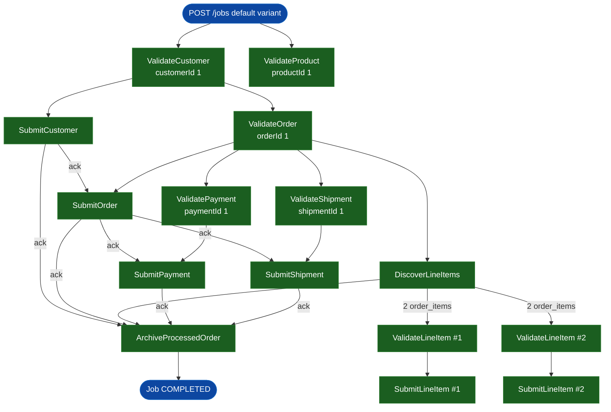

# SE-01: happy path

## Setpoint Eval Metadata
**Category**: correctness · **Duration**: ~10s · **Timeout**: 650s · **Isolation**: parallel-safe

## Scenario
```gherkin
Feature: order-processing default variant end-to-end at Ada's Beans Cafe
  Scenario: Ada Lovelace's order flows through every step and the job completes
    Given customer_id=1 (Ada Lovelace) and order_id=1 exist in the source
      database, order 1 owning 2 order_items, 1 payment and 1 shipment — all
      healthy, dedicated rows (see source-db/SEED-REGISTRY.md)
    When a "default" variant job is initiated with customerId=1, productId=1,
      orderId=1, paymentId=1, shipmentId=1
    Then every Validate/Submit step for customer, product, order, line items,
      payment and shipment completes
    And the job reaches COMPLETED status
```

## Architecture


## Test Data
Rows dedicated to this SE (`source-db/SEED-REGISTRY.md`, "SE-01-happy-path"):

| Table | Row(s) | Notes |
|---|---|---|
| customers | `customer_id=1` (Ada Lovelace) | full default-variant run |
| orders | `order_id=1` | 2 order_items, 1 payment, 1 shipment — all healthy |

From `source-db/init-scripts/01-schema-and-seed.sql`:
```sql
(1, 'Ada',      'Lovelace',   'ada@adasbeanscafe.example',      '(415) 555-0101', '1 Analytical Engine Way, San Francisco, CA 94102', '2025-01-15 09:30:00'),
```
```sql
(1, 1, '2025-06-01 10:23:00', 'delivered', 39.50,  '1 Analytical Engine Way, San Francisco, CA 94102'),
```
```sql
-- Order 1 (Ada, SE-01 happy-path): 21.50 + 18.00 = 39.50
(1,  1, 1, 1, 21.50, 21.50),
(2,  1, 3, 1, 18.00, 18.00),
```
```sql
(1, 1, 'credit_card',   39.50,  '2025-06-01 10:25:00', 'completed', 'TXN-CC-20250601-0001'),
```
```sql
(1, 1, 'ups',   '1Z999AA10123456784',  '2025-06-02 08:00:00', '2025-06-05 18:00:00', 'delivered'),
```

## Payload
```json
{
  "variant": "default",
  "payload": {
    "customerId": 1,
    "productId": 1,
    "orderId": 1,
    "orderItemId": 1,
    "paymentId": 1,
    "shipmentId": 1,
    "entityId": "ada-lovelace"
  },
  "testOptions": {
    "ValidateCustomer":    { "simDelay": 300 },
    "ValidateProduct":     { "simDelay": 300 },
    "SubmitCustomer":      { "simDelay": 300, "ackDelay": 1000 },
    "ValidateOrder":       { "simDelay": 300 },
    "SubmitOrder":         { "simDelay": 300, "ackDelay": 1000 },
    "DiscoverLineItems":   { "simDelay": 300 },
    "ValidateLineItem":    { "simDelay": 300 },
    "SubmitLineItem":      { "simDelay": 300, "ackDelay": 1000 },
    "ValidatePayment":     { "simDelay": 300 },
    "SubmitPayment":       { "simDelay": 300, "ackDelay": 1000 },
    "ValidateShipment":    { "simDelay": 300 },
    "SubmitShipment":      { "simDelay": 300, "ackDelay": 1000 }
  }
}
```

## Artifacts
Expected step outcomes this SE verifies (from `test.sh`'s own verification block —
job status plus every step it names):
```bash
verify_job_status "$JOB_ID" "COMPLETED"
verify_step_status "$JOB_ID" "ValidateCustomer" "COMPLETED"
verify_step_status "$JOB_ID" "ValidateProduct" "COMPLETED"
verify_step_status "$JOB_ID" "SubmitCustomer" "COMPLETED"
verify_step_status "$JOB_ID" "ValidateOrder" "COMPLETED"
verify_step_status "$JOB_ID" "SubmitOrder" "COMPLETED"
```

## Assertions
<!-- one checkbox per verify_*/if call in test.sh — keep 1:1 -->
- [ ] Job status is COMPLETED
- [ ] ValidateCustomer is COMPLETED
- [ ] ValidateProduct is COMPLETED
- [ ] SubmitCustomer is COMPLETED
- [ ] ValidateOrder is COMPLETED
- [ ] SubmitOrder is COMPLETED

## Run
```bash
bash workflows/order-processing/setpoint-evals/run-all.sh --se 01
```
