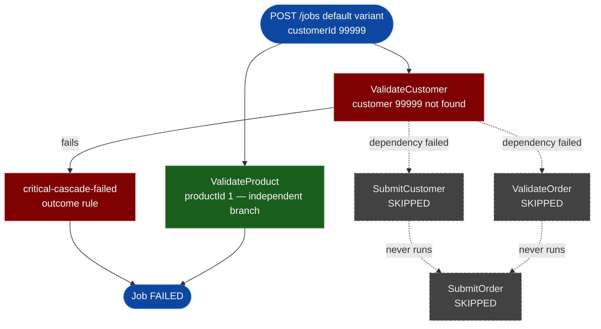

# SE-02: customer not found

## Setpoint Eval Metadata
**Category**: correctness · **Duration**: ~5s · **Timeout**: 350s · **Isolation**: parallel-safe

## Scenario
```gherkin
Feature: order-processing rejects a job for a non-existent customer
  Scenario: the not-found sentinel customer fails the critical entity check
    Given customer_id=99999 is the reserved not-found sentinel — guaranteed
      ABSENT from the source database (source-db/SEED-REGISTRY.md)
    When a "default" variant job is initiated with customerId=99999
    Then ValidateCustomer fails
    And Customer is a required cascade, so the "critical-cascade-failed"
      outcome rule fires
    And the job reaches FAILED status
    And SubmitCustomer and ValidateOrder are never completed
```

## Architecture


## Test Data
Sentinel used by this SE (`source-db/SEED-REGISTRY.md`, "Not-found sentinels"):

| Entity | Sentinel value |
|---|---|
| customer_id | `99999` |

> No corresponding `INSERT` exists for `customer_id=99999` anywhere in
> `source-db/init-scripts/01-schema-and-seed.sql` — that absence IS the fixture.
> `productId=1` in the payload is a real row (Midnight Roast 1kg) and its
> `ValidateProduct` step runs independently of the customer failure (no
> dependency between the two root steps).

## Payload
```json
{
  "variant": "default",
  "payload": {
    "customerId": 99999,
    "productId": 1,
    "entityId": "nobody-orders-here-99999"
  },
  "testOptions": {
    "ValidateCustomer":    { "simDelay": 300 },
    "ValidateProduct":     { "simDelay": 300 },
    "SubmitCustomer":      { "simDelay": 300, "ackDelay": 1000 },
    "ValidateOrder":       { "simDelay": 300 },
    "SubmitOrder":         { "simDelay": 300, "ackDelay": 1000 }
  }
}
```

## Artifacts
Expected step outcomes this SE verifies (from `test.sh`'s own verification block):
```bash
verify_job_status "$JOB_ID" "FAILED"
verify_step_status "$JOB_ID" "ValidateCustomer" "FAILED"
# SubmitCustomer must NOT be "completed" (dependency failed)
# ValidateOrder must NOT be "completed" (dependency failed)
```

## Assertions
<!-- one checkbox per verify_*/if call in test.sh — keep 1:1 -->
- [ ] Job status is FAILED
- [ ] ValidateCustomer is FAILED
- [ ] SubmitCustomer is NOT completed (dependency ValidateCustomer failed)
- [ ] ValidateOrder is NOT completed (dependency ValidateCustomer failed)

## Run
```bash
bash workflows/order-processing/setpoint-evals/run-all.sh --se 02
```
