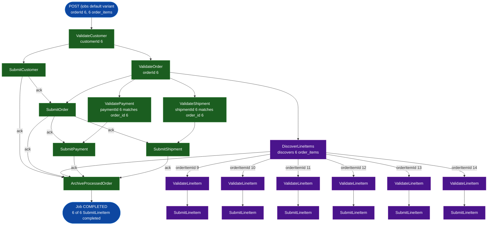

# SE-03: fan-out order items

## Setpoint Eval Metadata
**Category**: fan-out · **Duration**: ~10s · **Timeout**: 650s · **Isolation**: parallel-safe

## Scenario
```gherkin
Feature: order-processing Discovery plus Fan-Out for line items
  Scenario: Donald Knuth's 6-item order spawns 6 child validate/submit chains
    Given customer_id=6 (Donald Knuth) and order_id=6 exist, order 6 owning 6
      order_items across 6 distinct products — SE-03's own fan-out breadth
      fixture (source-db/SEED-REGISTRY.md)
    When a "default" variant job is initiated with customerId=6, orderId=6,
      paymentId=6, shipmentId=6
    Then DiscoverLineItems completes and spawns one ValidateLineItem child
      step per order_item
    And every ValidateLineItem child chains into its own SubmitLineItem
      child step
    And all SubmitLineItem child steps complete
    And the job reaches COMPLETED status
```

## Architecture


## Test Data
Rows dedicated to this SE (`source-db/SEED-REGISTRY.md`, "SE-03-fan-out-order-items"):

| Table | Row(s) | Notes |
|---|---|---|
| customers | `customer_id=6` (Donald Knuth) | |
| orders | `order_id=6` | 6 order_items across 6 products — fan-out breadth |

From `source-db/init-scripts/01-schema-and-seed.sql`:
```sql
(6, 'Donald',   'Knuth',      'donald.knuth@example.com',       '(650) 555-0106', '1 TeX Terrace, Palo Alto, CA 94301',                '2025-05-10 08:15:00'),
```
```sql
(6, 6, '2025-07-02 08:40:00', 'shipped',   163.50, '1 TeX Terrace, Palo Alto, CA 94301'),
```
```sql
-- Order 6 (Donald Knuth, SE-03 fan-out — 6 items): 43.00+28.50+18.00+33.00+12.00+29.00 = 163.50
(9,  6, 1, 2, 21.50, 43.00),
(10, 6, 2, 3,  9.50, 28.50),
(11, 6, 3, 1, 18.00, 18.00),
(12, 6, 4, 2, 16.50, 33.00),
(13, 6, 6, 1, 12.00, 12.00),
(14, 6, 7, 1, 29.00, 29.00),
```
```sql
(5, 6, 'credit_card',   163.50, '2025-07-02 08:42:00', 'completed', 'TXN-CC-20250702-0005');
```
```sql
(4, 6, 'fedex', '794644790302',        '2025-07-03 09:15:00', '2025-07-06 18:00:00', 'shipped'),
```

Payment/shipment lookup quirk (`source-db/SEED-REGISTRY.md`): `ValidatePayment`
and `ValidateShipment` filter by `order_id`, using the numeric value in
`payload.paymentId`/`payload.shipmentId` — so `paymentId: 6` matches
`payment_id=5` (its `order_id` is 6) and `shipmentId: 6` matches
`shipment_id=4` (its `order_id` is 6), not the row whose own PK is 6.

## Payload
```json
{
  "variant": "default",
  "payload": {
    "customerId": 6,
    "productId": 1,
    "orderId": 6,
    "paymentId": 6,
    "shipmentId": 6,
    "entityId": "donald-knuth"
  },
  "testOptions": {
    "ValidateCustomer":    { "simDelay": 300 },
    "ValidateProduct":     { "simDelay": 300 },
    "SubmitCustomer":      { "simDelay": 300, "ackDelay": 1000 },
    "ValidateOrder":       { "simDelay": 300 },
    "SubmitOrder":         { "simDelay": 300, "ackDelay": 1000 },
    "DiscoverLineItems":   { "simDelay": 300 },
    "ValidateLineItem":    { "simDelay": 300 },
    "SubmitLineItem":      { "simDelay": 300, "ackDelay": 1000 },
    "ValidatePayment":     { "simDelay": 300 },
    "SubmitPayment":       { "simDelay": 300, "ackDelay": 1000 },
    "ValidateShipment":    { "simDelay": 300 },
    "SubmitShipment":      { "simDelay": 300, "ackDelay": 1000 }
  }
}
```

## Artifacts
Expected step outcomes this SE verifies (from `test.sh`'s own verification block —
job status, DiscoverLineItems, then the fan-out counts and completion check):
```bash
verify_job_status "$JOB_ID" "COMPLETED"
verify_step_status "$JOB_ID" "DiscoverLineItems" "COMPLETED"

# VALIDATE_ITEM_COUNT = count of steps where stepNumber == "ValidateLineItem"
# SUBMIT_ITEM_COUNT   = count of steps where stepNumber == "SubmitLineItem"
# both must be > 0

# retried up to 15x/1s: count of SubmitLineItem steps with status == "completed"
# must reach SUBMIT_ITEM_COUNT
```

## Assertions
<!-- one checkbox per verify_*/if call in test.sh — keep 1:1 -->
- [ ] Job status is COMPLETED
- [ ] DiscoverLineItems is COMPLETED
- [ ] At least 1 ValidateLineItem child step exists
- [ ] At least 1 SubmitLineItem child step exists
- [ ] All SubmitLineItem child steps reach completed (retried for race condition)

## Run
```bash
bash workflows/order-processing/setpoint-evals/run-all.sh --se 03
```
