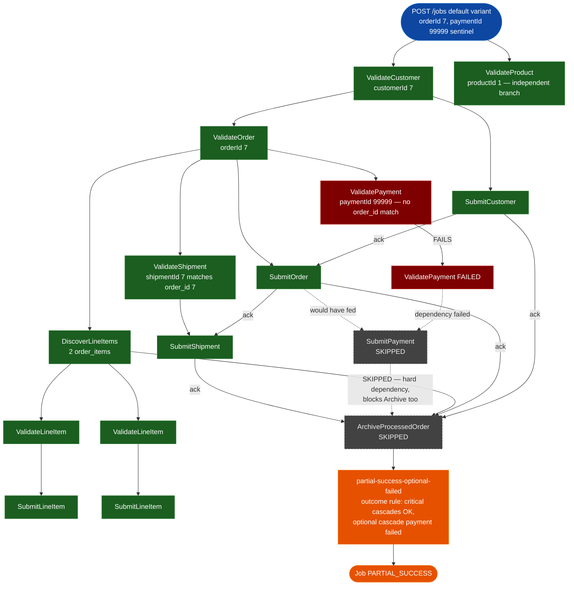

# SE-04: partial payment failure

## Setpoint Eval Metadata
**Category**: outcome-rules · **Duration**: ~10s · **Timeout**: 950s · **Isolation**: parallel-safe

## Scenario
```gherkin
Feature: order-processing PARTIAL_SUCCESS when an optional cascade fails
  Scenario: Barbara Liskov's order ships before the card finishes processing
    Given customer_id=7 (Barbara Liskov) and order_id=7 exist, order 7 owning
      2 order_items and 1 shipment, but ZERO payment rows for order_id=7
      (source-db/SEED-REGISTRY.md)
    And Customer and Order are required cascades; Payment is optional
    When a "default" variant job is initiated with customerId=7, orderId=7,
      paymentId=99999 (the reserved not-found sentinel), shipmentId=7
    Then ValidateCustomer, SubmitCustomer, ValidateOrder and SubmitOrder all
      complete
    And ValidatePayment fails (no payment row matches order_id=99999)
    And SubmitPayment is SKIPPED (its dependency ValidatePayment failed)
    And ValidateShipment and SubmitShipment both complete
    And ArchiveProcessedOrder is SKIPPED too (SubmitPayment is one of its
      hard dependencies, and a SKIPPED dependency never satisfies one)
    And the "partial-success-optional-failed" outcome rule fires
    And the job reaches PARTIAL_SUCCESS status
```

## Architecture


## Test Data
Rows dedicated to this SE (`source-db/SEED-REGISTRY.md`, "SE-04-partial-payment-failure"):

| Table | Row(s) | Notes |
|---|---|---|
| customers | `customer_id=7` (Barbara Liskov) | |
| orders | `order_id=7` | 2 order_items, 1 shipment, **0 payments** |

From `source-db/init-scripts/01-schema-and-seed.sql`:
```sql
(7, 'Barbara',  'Liskov',     'barbara.liskov@example.com',     '(617) 555-0107', '1 Substitution Street, Cambridge, MA 02139',        '2025-05-18 13:40:00'),
```
```sql
(7, 7, '2025-07-08 13:20:00', 'shipped',   35.50,  '1 Substitution Street, Cambridge, MA 02139'),
```
```sql
-- Order 7 (Barbara Liskov, SE-04 partial-payment-failure): 21.50 + 14.00 = 35.50
(15, 7, 1, 1, 21.50, 21.50),
(16, 7, 5, 1, 14.00, 14.00),
```
```sql
-- Order 7 (Barbara Liskov / SE-04) has NO payment row on purpose — the
-- beans left the roastery before the card finished processing. ValidatePayment
-- filters payments by order_id, so payload.paymentId=7 legitimately finds zero
-- rows, driving the PARTIAL_SUCCESS outcome.
```
```sql
(5, 7, 'dhl',   '3S9999999999',        '2025-07-09 07:30:00', '2025-07-12 18:00:00', 'shipped');
```

Payment/shipment lookup quirk (`source-db/SEED-REGISTRY.md`): since order 7
legitimately has zero payment rows, `paymentId: 7` and `paymentId: 99999`
would BOTH fail the `order_id` lookup — this SE uses `99999` to keep the
sentinel convention uniform across every not-found case. `shipmentId: 7`
matches `shipment_id=5` (its `order_id` is 7).

## Payload
```json
{
  "enableDeduplication": false,
  "variant": "default",
  "payload": {
    "customerId": 7,
    "productId": 1,
    "orderId": 7,
    "paymentId": 99999,
    "shipmentId": 7,
    "entityId": "barbara-liskov"
  },
  "testOptions": {
    "ValidateCustomer":    { "simDelay": 300 },
    "ValidateProduct":     { "simDelay": 300 },
    "SubmitCustomer":      { "simDelay": 300, "ackDelay": 1000 },
    "ValidateOrder":       { "simDelay": 300 },
    "SubmitOrder":         { "simDelay": 300, "ackDelay": 1000 },
    "DiscoverLineItems":   { "simDelay": 300 },
    "ValidateLineItem":    { "simDelay": 300 },
    "SubmitLineItem":      { "simDelay": 300, "ackDelay": 1000 },
    "ValidatePayment":     { "simDelay": 300 },
    "SubmitPayment":       { "simDelay": 300, "ackDelay": 1000 },
    "ValidateShipment":    { "simDelay": 300 },
    "SubmitShipment":      { "simDelay": 300, "ackDelay": 1000 }
  }
}
```

## Artifacts
Expected step outcomes this SE verifies (from `test.sh`'s own verification block):
```bash
verify_job_status "$JOB_ID" "PARTIAL_SUCCESS"
verify_step_status "$JOB_ID" "ValidateCustomer" "COMPLETED"
verify_step_status "$JOB_ID" "SubmitCustomer" "COMPLETED"
verify_step_status "$JOB_ID" "ValidateOrder" "COMPLETED"
verify_step_status "$JOB_ID" "SubmitOrder" "COMPLETED"
verify_step_status "$JOB_ID" "ValidatePayment" "FAILED"
verify_step_status "$JOB_ID" "SubmitPayment" "SKIPPED"
verify_step_status "$JOB_ID" "ArchiveProcessedOrder" "SKIPPED"
```

## Assertions
<!-- one checkbox per verify_* call in test.sh — keep 1:1 -->
- [ ] Job status is PARTIAL_SUCCESS
- [ ] ValidateCustomer is COMPLETED
- [ ] SubmitCustomer is COMPLETED
- [ ] ValidateOrder is COMPLETED
- [ ] SubmitOrder is COMPLETED
- [ ] ValidatePayment is FAILED (non-existent paymentId)
- [ ] SubmitPayment is SKIPPED (dependency ValidatePayment failed)
- [ ] ArchiveProcessedOrder is SKIPPED (SubmitPayment is a hard dependency)

## Run
```bash
bash workflows/order-processing/setpoint-evals/run-all.sh --se 04
```
