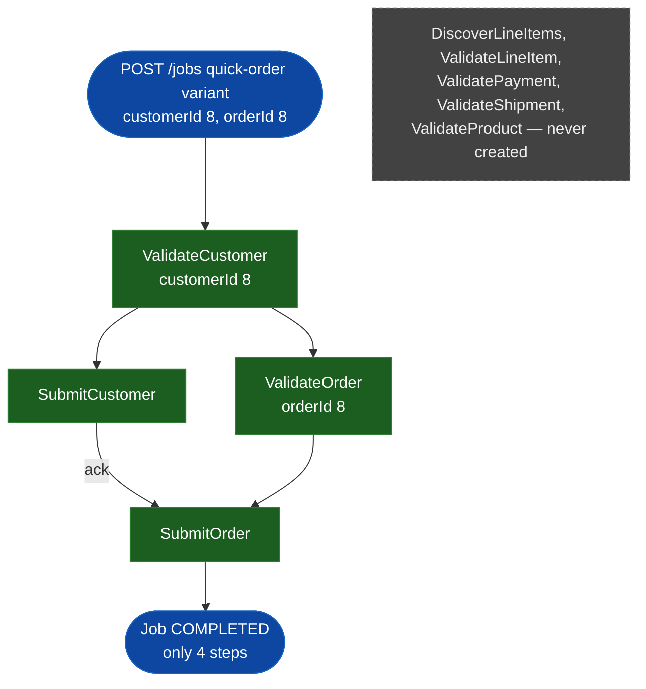

# SE-05: quick-order variant

## Setpoint Eval Metadata
**Category**: variant · **Duration**: ~5s · **Timeout**: 90s · **Isolation**: parallel-safe

## Scenario
```gherkin
Feature: order-processing quick-order variant — simplified fast path
  Scenario: Radia Perlman's order uses the 4-step variant with no fan-out
    Given customer_id=8 (Radia Perlman) and order_id=8 exist, intentionally
      with NO order_items, payments or shipments rows — the quick-order
      variant never touches those tables (source-db/SEED-REGISTRY.md)
    When a "quick-order" variant job is initiated with customerId=8,
      orderId=8
    Then only ValidateCustomer, SubmitCustomer, ValidateOrder and SubmitOrder
      execute
    And no DiscoverLineItems, ValidateLineItem, ValidatePayment,
      ValidateShipment or ValidateProduct steps are created
    And the job reaches COMPLETED status
```

## Architecture


## Test Data
Rows dedicated to this SE (`source-db/SEED-REGISTRY.md`, "SE-05-batch-import-variant"):

| Table | Row(s) | Notes |
|---|---|---|
| customers | `customer_id=8` (Radia Perlman) | quick-order variant |
| orders | `order_id=8` | **0** order_items/payments/shipments — quick-order never reads those tables |

From `source-db/init-scripts/01-schema-and-seed.sql`:
```sql
(8, 'Radia',    'Perlman',    'radia.perlman@example.com',      '(781) 555-0108', '1 Spanning Tree Blvd, Burlington, MA 01803',        '2025-05-22 09:05:00'),
```
```sql
(8, 8, '2025-07-10 17:05:00', 'confirmed', 45.00,  '1 Spanning Tree Blvd, Burlington, MA 01803'),
```
No `order_items`, `payments` or `shipments` rows exist for `order_id=8` — the
`quick-order` variant's step DAG (`ValidateCustomer -> SubmitCustomer ->
ValidateOrder -> SubmitOrder`, see `workflow.config.ts` `QUICK_ORDER_STEPS`)
never queries those tables, so their absence is intentional, not an
oversight.

## Payload
```json
{
  "enableDeduplication": false,
  "variant": "quick-order",
  "payload": {
    "customerId": 8,
    "orderId": 8,
    "entityId": "radia-perlman"
  },
  "testOptions": {
    "ValidateCustomer":  { "simDelay": 300 },
    "SubmitCustomer":    { "simDelay": 300, "ackDelay": 1000 },
    "ValidateOrder":     { "simDelay": 300 },
    "SubmitOrder":       { "simDelay": 300, "ackDelay": 1000 }
  }
}
```

## Artifacts
Expected step outcomes this SE verifies (from `test.sh`'s own verification block):
```bash
verify_job_status "$JOB_ID" "COMPLETED"
verify_step_status "$JOB_ID" "ValidateCustomer" "COMPLETED"
verify_step_status "$JOB_ID" "SubmitCustomer" "COMPLETED"
verify_step_status "$JOB_ID" "ValidateOrder" "COMPLETED"
verify_step_status "$JOB_ID" "SubmitOrder" "COMPLETED"

# DISCOVER_COUNT / VALIDATE_ITEM_COUNT / PAYMENT_COUNT / SHIPMENT_COUNT /
# PRODUCT_COUNT — counts of steps with those stepNumber values — must all be 0
```

## Assertions
<!-- one checkbox per verify_*/if call in test.sh — keep 1:1 -->
- [ ] Job status is COMPLETED
- [ ] ValidateCustomer is COMPLETED
- [ ] SubmitCustomer is COMPLETED
- [ ] ValidateOrder is COMPLETED
- [ ] SubmitOrder is COMPLETED
- [ ] No DiscoverLineItems, ValidateLineItem, ValidatePayment, ValidateShipment
      or ValidateProduct steps exist (quick-order variant confirmed)

## Run
```bash
bash workflows/order-processing/setpoint-evals/run-all.sh --se 05
```
