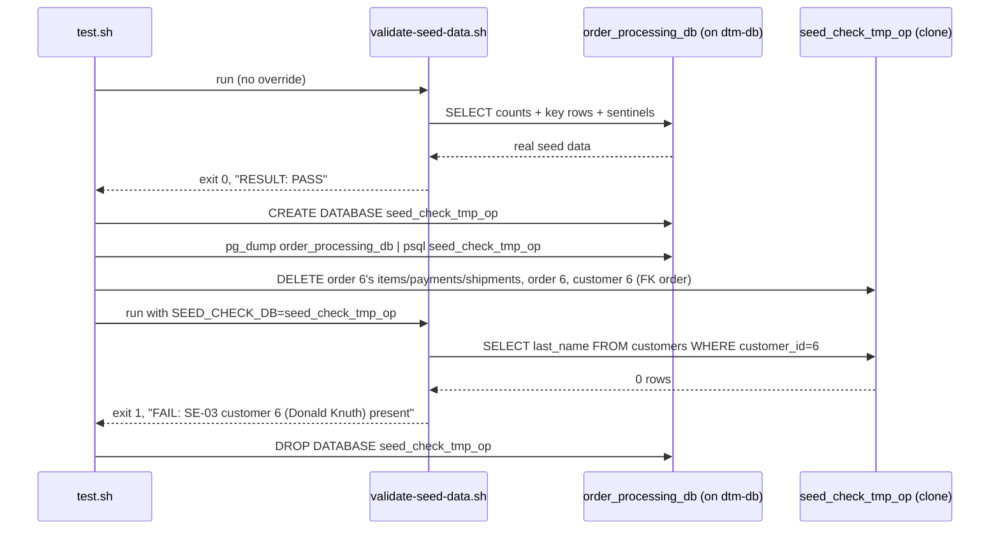

# SE-06: seed data integrity
**Category**: data-integrity · **Duration**: ~15s · **Timeout**: 120s

## Scenario
```gherkin
Feature: order-processing seed data matches SEED-REGISTRY.md
  Scenario: the validator passes against the real seed and catches a deleted row
    Given the worker-facing order_processing_db on dtm-db (the copy the
      Lambda workers read), seeded from the canonical 01-schema-and-seed.sql
    When source-db/validate-seed-data.sh runs against the live database
    Then it exits 0 and reports RESULT: PASS
    And when the same validator is pointed at a throwaway clone with SE-03's
      dedicated customer (Donald Knuth, customer_id=6) deleted — FK chain
      first (order 6's items/payments/shipments, then order 6, then customer)
    Then it exits 1 and names that exact row in a FAIL line
```

## Architecture


## Artifacts

### Seed / fixture
The row deleted for the negative control (from `01-schema-and-seed.sql`,
`SEED-REGISTRY.md` "SE-03-fan-out-order-items" ownership row). Its FK
dependents (order 6 with its order_items) are deleted first — a bare DELETE
of the customer is an FK violation that silently leaves the row in place and
turns the negative control into a vacuous pass:
```sql
INSERT INTO ecommerce.customers (customer_id, first_name, last_name, email, phone, address, created_at) VALUES
(6, 'Donald',   'Knuth',      'donald.knuth@example.com',       '(650) 555-0106', '1 TeX Terrace, Palo Alto, CA 94301',                '2025-05-10 08:15:00'),
```

### Input / payload
The clone-targeting override the validator already supports (from
`source-db/validate-seed-data.sh`):
```bash
SEED_CHECK_DB=seed_check_tmp_op bash source-db/validate-seed-data.sh
```

### Expected output
Real seed run (excerpt):
```
PASS: customers count = 9
...
RESULT: PASS — seed matches SEED-REGISTRY.md
```
Clone run after the delete (excerpt):
```
FAIL: SE-03 customer 6 (Donald Knuth) present = '' (expected 'Knuth')
...
RESULT: FAIL — seed drifted from SEED-REGISTRY.md (see FAIL lines above)
```

## Assertions
<!-- one checkbox per ck/ck_eq/ck_has call in test.sh — keep 1:1 -->
- [ ] validator exits 0 against the real, untouched seed
- [ ] validator reports PASS against the real seed
- [ ] clone database created for the negative control
- [ ] validator exits 1 against the clone with a deleted row (RED-proof)
- [ ] validator names the deleted row's FAIL in its own output

## Run
```bash
bash workflows/order-processing/setpoint-evals/run-all.sh --se 06
```

Guards against the failure mode this whole Phase 2b closes: seed rows silently
drifting out of sync with what each SE's `test.sh` assumes (shared/renamed/
deleted rows), which reads green right up until the row an SE depends on
disappears. This SE proves the validator itself would catch that — not just
that it exists.
