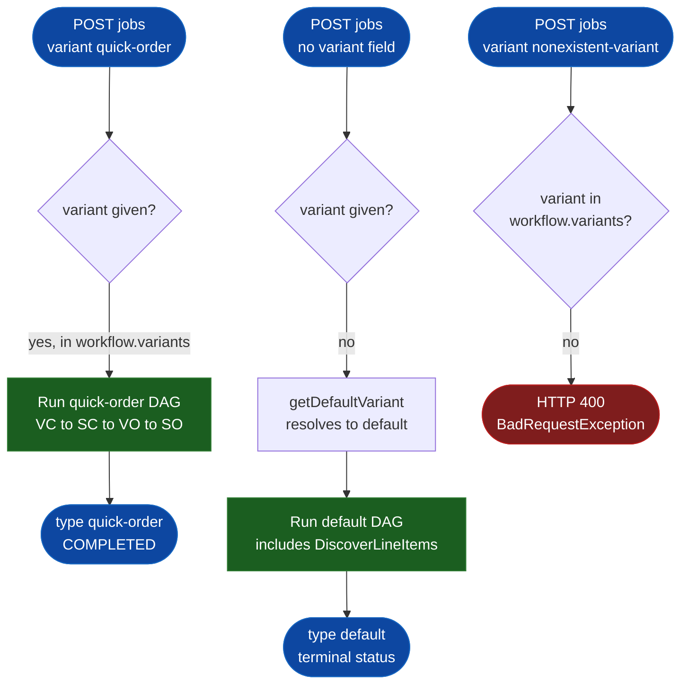

# SE-07: variant selection + outcome rules

## Setpoint Eval Metadata
**Category**: variant · **Duration**: ~15-40s · **Timeout**: 300s · **Isolation**: parallel-safe

## Scenario
```gherkin
Feature: order-processing variant selection (workflow.controller.ts)
  Scenario: explicit quick-order variant is accepted and runs the short DAG
    Given customer_id=10 (Katherine Johnson) and order_id=10 exist
    When a job is initiated with variant="quick-order"
    Then the job resolves type="quick-order"
    And no DiscoverLineItems step is created

  Scenario: omitted variant resolves to the workflow's default, not quick-order
    Given customer_id=10 (Katherine Johnson) and order_id=10 exist
    When a job is initiated with no "variant" field at all
    Then the job resolves type="default"
    And a DiscoverLineItems step IS created — proving the full DAG was
      selected, not the quick-order short-circuit

  Scenario: an unknown variant name is rejected before any job is created
    When a job is initiated with variant="nonexistent-variant"
    Then the API responds HTTP 400
    And the error message names both real variants: "[default, quick-order]"
```

## Architecture


## Test Data
Rows dedicated to this SE (`source-db/SEED-REGISTRY.md`, "SE-07-quick-order-variant"):

| Table | Row(s) | Notes |
|---|---|---|
| customers | `customer_id=10` (Katherine Johnson) | own dedicated rows, not SE-05's |
| orders | `order_id=10` | **0** order_items/payments/shipments |

From `source-db/init-scripts/01-schema-and-seed.sql`:
```sql
(10, 'Katherine', 'Johnson',  'katherine.johnson@example.com',  '(757) 555-0110', '1 Trajectory Trail, Hampton, VA 23666',             '2025-08-01 09:00:00'),
```
```sql
(10, 10, '2025-08-01 09:15:00', 'confirmed', 28.00, '1 Trajectory Trail, Hampton, VA 23666'),
```
Both sub-tests A and B reuse these same rows (read-only lookups) with different
`entityId` values — no dedup key is set, so no collision. Sub-test B runs the
FULL default DAG against these quick-order-shaped rows deliberately: it only
needs a real job that reaches a terminal state to prove the DAG shape, so
ValidatePayment/ValidateShipment failing naturally (no payment/shipment rows
for order 10) and the job landing on PARTIAL_SUCCESS is expected and fine —
that outcome-rule behavior is SE-04/SE-09's concern, not this SE's.

## Payload
Sub-test A (explicit quick-order):
```json
{
  "variant": "quick-order",
  "enableDeduplication": false,
  "payload": { "customerId": 10, "orderId": 10, "entityId": "katherine-johnson-explicit" },
  "testOptions": {
    "ValidateCustomer": { "simDelay": 300 },
    "SubmitCustomer":   { "simDelay": 300, "ackDelay": 1000 },
    "ValidateOrder":    { "simDelay": 300 },
    "SubmitOrder":      { "simDelay": 300, "ackDelay": 1000 }
  }
}
```

Sub-test C (nonexistent variant):
```json
{
  "variant": "nonexistent-variant",
  "enableDeduplication": false,
  "payload": { "customerId": 10, "orderId": 10, "entityId": "katherine-johnson-bad-variant" }
}
```

## Artifacts
Live response captured while building this SE (`POST /workflows/order-processing/jobs`, sub-test C):
```json
{"code":"VALIDATION","message":"Variant 'nonexistent-variant' not found in workflow 'order-processing'. Available variants: [default, quick-order]","details":{"message":"Variant 'nonexistent-variant' not found in workflow 'order-processing'. Available variants: [default, quick-order]","error":"Bad Request","statusCode":400}}
```

## Assertions
<!-- one checkbox per verify/if call in test.sh — keep 1:1 -->
- [ ] Job A resolves `type="quick-order"` (explicit variant honored)
- [ ] Job A reaches COMPLETED
- [ ] Job A has zero `DiscoverLineItems` steps (quick-order DAG confirmed)
- [ ] Job B (variant omitted) resolves `type="default"` — NOT quick-order
- [ ] Job B reaches a terminal success-family status (completed/partial_success)
- [ ] Job B has at least one `DiscoverLineItems` step (default DAG confirmed)
- [ ] Sub-test C: nonexistent variant rejected with HTTP 400
- [ ] Sub-test C: error message names both real variants `[default, quick-order]`

## Run
```bash
bash workflows/order-processing/setpoint-evals/run-all.sh --se 07
```

Pins `workflow.controller.ts`'s variant-resolution contract directly (explicit
/ default-fallback / reject-unknown) — a regression here (e.g. silently
falling back to quick-order instead of erroring, or accepting an unknown
variant) would misroute production traffic without any error surfaced to the
caller.
