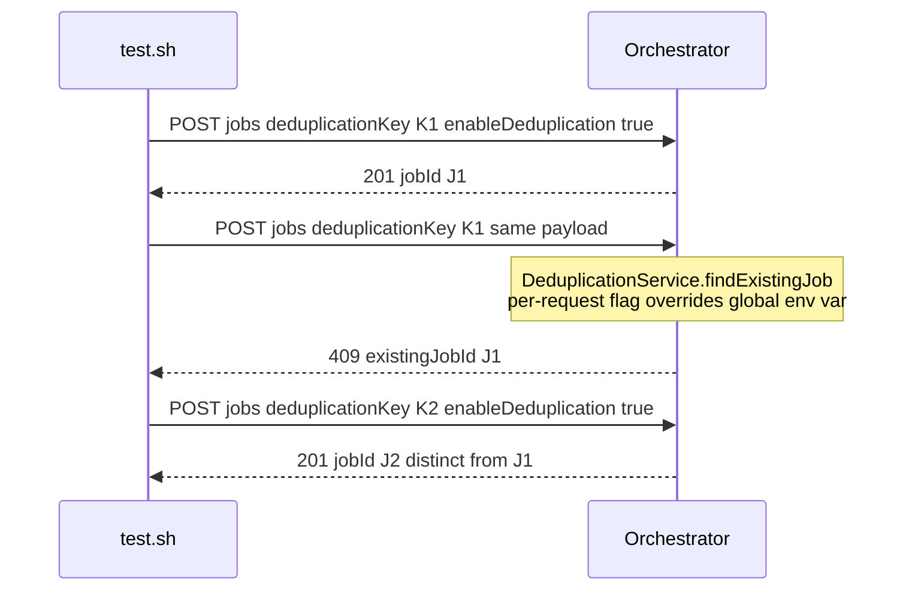

# SE-08: request deduplication

## Setpoint Eval Metadata
**Category**: deduplication · **Duration**: ~10-25s · **Timeout**: 180s · **Isolation**: parallel-safe

## Scenario
```gherkin
Feature: order-processing per-request deduplication (docs/guides/PER-REQUEST-DEDUPLICATION.md)
  Scenario: a second, identical request is deduped
    Given customer_id=11 (Hedy Lamarr) and order_id=11 exist
    And a fresh deduplicationKey and testOptions.enableDeduplication=true
    When the first request is submitted
    Then the API responds HTTP 201 and a real job is created
    When the SAME request is submitted again with the SAME deduplicationKey
    Then the API responds HTTP 409 Conflict
    And the 409 body's existingJobId equals the first job's id — no second
      job was created

  Scenario: a different deduplicationKey is not affected by the first
    When a request with a DIFFERENT deduplicationKey is submitted
    Then the API responds HTTP 201 with a distinct jobId — deduplication is
      scoped to the key, not a blanket lock on the endpoint
```

## Architecture


## Test Data
Rows dedicated to this SE (`source-db/SEED-REGISTRY.md`, "SE-08-request-deduplication"):

| Table | Row(s) | Notes |
|---|---|---|
| customers | `customer_id=11` (Hedy Lamarr) | quick-order variant, generic workflow endpoint dedup |
| orders | `order_id=11` | **0** order_items/payments/shipments |

From `source-db/init-scripts/01-schema-and-seed.sql`:
```sql
(11, 'Hedy',    'Lamarr',     'hedy.lamarr@example.com',        '(310) 555-0111', '1 Frequency Hop Lane, Los Angeles, CA 90028',       '2025-08-04 10:30:00'),
```
```sql
(11, 11, '2025-08-04 11:00:00', 'confirmed', 32.00, '1 Frequency Hop Lane, Los Angeles, CA 90028'),
```
Both requests reuse these read-only rows; the deduplicationKey (a fresh
`uuidgen` per test run) is what's actually being deduped on, per
`DeduplicationService.findExistingJob`.

## Payload
First request (identical payload resubmitted for the dedupe check):
```json
{
  "deduplicationKey": "<uuidgen>",
  "variant": "quick-order",
  "enableDeduplication": true,
  "payload": { "customerId": 11, "orderId": 11, "entityId": "<uuidgen>" },
  "testOptions": {
    "ValidateCustomer": { "simDelay": 1000 },
    "SubmitCustomer":   { "simDelay": 1000, "ackDelay": 500 },
    "ValidateOrder":    { "simDelay": 1000 },
    "SubmitOrder":      { "simDelay": 1000, "ackDelay": 500 }
  }
}
```

## Artifacts
Live 409 response captured while building this SE (note the envelope shape —
`existingJobId` is nested under `.details`, not top-level):
```json
{
  "code": "CONFLICT",
  "message": "Duplicate job detected for workflow 'order-processing' today",
  "details": {
    "message": "Duplicate job detected for workflow 'order-processing' today",
    "existingJobId": "9e30748e-51de-4c2e-b3f3-17be1bb84103",
    "status": "processing",
    "submittedAt": "2026-07-16T08:00:04.824Z"
  }
}
```

## Assertions
<!-- one checkbox per verify/if call in test.sh — keep 1:1 -->
- [ ] First request accepted (HTTP 201)
- [ ] Identical (same deduplicationKey) request rejected (HTTP 409)
- [ ] 409 body's `details.existingJobId` equals the first job's id
- [ ] A different deduplicationKey is still accepted (HTTP 201)
- [ ] The second accepted request produces a distinct jobId from the first

## Run
```bash
bash workflows/order-processing/setpoint-evals/run-all.sh --se 08
```

Pins the per-request deduplication override that lets deduplication be tested
(and used for production A/B rollout) WITHOUT flipping the global
`ENABLE_DEDUPLICATION` env var or restarting the orchestrator — see
`docs/guides/PER-REQUEST-DEDUPLICATION.md`. A regression here (e.g. dedup
falling back to global-only, or keying on the wrong field) would either let
duplicate orders through or wrongly block distinct ones.
