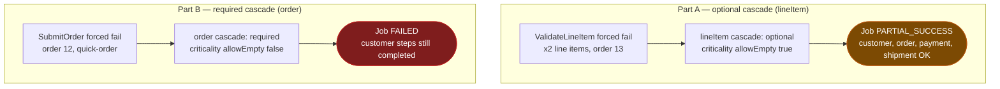

# SE-09: optional vs required cascade boundary

## Setpoint Eval Metadata
**Category**: outcome-rules · **Duration**: ~40-90s · **Timeout**: 550s · **Isolation**: parallel-safe

## Scenario
```gherkin
Feature: order-processing CRITICALITY_RULES / OUTCOME_RULES boundary
  Scenario: an OPTIONAL cascade failing yields PARTIAL_SUCCESS (Part A)
    Given order_id=13 (Mary Jackson), default variant, with healthy customer,
      order, payment and shipment rows and 2 order_items
    When ValidateLineItem is forced to fail on every attempt for both
      line items (testOptions.failOnAttempts)
    Then the job reaches PARTIAL_SUCCESS
    And customer/order/payment/shipment cascades still COMPLETE
    And ValidateLineItem is FAILED

  Scenario: a REQUIRED cascade failing yields FAILED (Part B)
    Given order_id=12 (Dorothy Vaughan), quick-order variant
    When SubmitOrder is forced to fail on every attempt
    Then the job reaches FAILED
    And ValidateCustomer/SubmitCustomer/ValidateOrder still COMPLETE
    And SubmitOrder is FAILED
```

## Architecture


## Test Data
Rows dedicated to this SE (`source-db/SEED-REGISTRY.md`, "SE-09-optional-cascade-boundary"):

| Table | Row(s) | Notes |
|---|---|---|
| customers | `customer_id=13` (Mary Jackson) | Part A — default variant |
| orders | `order_id=13` | 2 order_items, 1 payment, 1 shipment — all healthy; only lineItem forced to fail |
| customers | `customer_id=12` (Dorothy Vaughan) | Part B — quick-order variant |
| orders | `order_id=12` | **0** order_items/payments/shipments (quick-order) |

From `source-db/init-scripts/01-schema-and-seed.sql`:
```sql
(12, 'Dorothy', 'Vaughan',    'dorothy.vaughan@example.com',    '(757) 555-0112', '1 Fortran Fields, Hampton, VA 23666',                '2025-08-07 08:45:00'),
(13, 'Mary',    'Jackson',    'mary.jackson@example.com',       '(757) 555-0113', '1 Wind Tunnel Way, Hampton, VA 23666',              '2025-08-10 11:15:00');
```
```sql
(12, 12, '2025-08-07 09:10:00', 'confirmed', 21.50, '1 Fortran Fields, Hampton, VA 23666'),
(13, 13, '2025-08-10 11:30:00', 'confirmed', 46.00, '1 Wind Tunnel Way, Hampton, VA 23666');
```
Order 13's 2 line items, 1 payment and 1 shipment are all real, healthy rows —
unlike SE-04 (which uses a not-found `paymentId` sentinel to fail
ValidatePayment naturally), this SE forces the failure directly via
`testOptions.failOnAttempts` so the assertion is about the OUTCOME RULE
(criticality boundary), not about a missing row.

## Payload
Part A (optional cascade forced failure):
```json
{
  "variant": "default",
  "enableDeduplication": false,
  "payload": { "customerId": 13, "orderId": 13, "productId": 1, "paymentId": 13, "shipmentId": 13, "entityId": "mary-jackson-optional-cascade" },
  "testOptions": {
    "ValidateLineItem": { "simDelay": 300, "failOnAttempts": [1, 2, 3] }
  }
}
```

Part B (required cascade forced failure):
```json
{
  "variant": "quick-order",
  "enableDeduplication": false,
  "payload": { "customerId": 12, "orderId": 12, "entityId": "dorothy-vaughan-required-cascade" },
  "testOptions": {
    "SubmitOrder": { "simDelay": 300, "failOnAttempts": [1, 2, 3] }
  }
}
```

## Artifacts
Live final step snapshot captured while building this SE, Part A (both
`ValidateLineItem` AND `SubmitLineItem` end up FAILED — order-processing's
line-item Submit phase is delegated independently rather than gated on
Validate's success, unlike the payment/shipment cascades):
```json
{"status":"partial_success","type":"default","steps":[
  {"s":"ValidateLineItem","status":"failed"},{"s":"ValidateLineItem","status":"failed"},
  {"s":"SubmitLineItem","status":"failed"},{"s":"SubmitLineItem","status":"failed"},
  {"s":"SubmitCustomer","status":"completed"},{"s":"SubmitOrder","status":"completed"},
  {"s":"SubmitPayment","status":"completed"},{"s":"SubmitShipment","status":"completed"}
]}
```

## Assertions
<!-- one checkbox per verify/if call in test.sh — keep 1:1 -->
- [ ] Part A: job reaches PARTIAL_SUCCESS
- [ ] Part A: SubmitCustomer/SubmitOrder/SubmitPayment/SubmitShipment all COMPLETED
- [ ] Part A: at least one ValidateLineItem is FAILED
- [ ] Part B: job reaches FAILED
- [ ] Part B: SubmitOrder is FAILED
- [ ] Part B: ValidateCustomer/SubmitCustomer/ValidateOrder all COMPLETED

## Run
```bash
bash workflows/order-processing/setpoint-evals/run-all.sh --se 09
```

Pins the exact criticality boundary between `OPTIONAL_CASCADES` and
`CRITICAL_CASCADES` in `workflow.config.ts`'s `CRITICALITY_RULES` — a
regression that flips which cascades are required (e.g. lineItem
accidentally becoming required, or order accidentally becoming optional)
would silently change which failures block an order vs which only degrade
it, with no other SE pinning both sides of that boundary via forced failure.
